# RTE组件生命周期管理

<cite>
**本文档引用的文件**
- [Rte.h](file://src/bsw/rte/include/Rte.h)
- [Rte.c](file://src/bsw/rte/src/Rte.c)
- [Rte_Type.h](file://src/bsw/rte/include/Rte_Type.h)
- [Rte_Cfg.h](file://src/bsw/rte/include/Rte_Cfg.h)
- [Rte_Scheduler.c](file://src/bsw/rte/src/Rte_Scheduler.c)
- [Rte_ComInterface.c](file://src/bsw/rte/src/Rte_ComInterface.c)
- [Rte_NvMInterface.c](file://src/bsw/rte/src/Rte_NvMInterface.c)
- [Swc_EngineControl.c](file://src/asw/engine_control/src/Swc_EngineControl.c)
- [Swc_DiagnosticManager.c](file://src/asw/diagnostic_manager/src/Swc_DiagnosticManager.c)
- [EcuM.c](file://src/bsw/integration/EcuM.c)
- [main.c](file://examples/can_demo/main.c)
</cite>

## 目录
1. [简介](#简介)
2. [项目结构](#项目结构)
3. [核心组件](#核心组件)
4. [架构概览](#架构概览)
5. [详细组件分析](#详细组件分析)
6. [依赖关系分析](#依赖关系分析)
7. [性能考虑](#性能考虑)
8. [故障排除指南](#故障排除指南)
9. [结论](#结论)

## 简介

本文档深入解析YuleASR项目的RTE（运行时环境）组件生命周期管理系统。该系统遵循AUTOSAR经典平台4.x标准，提供了完整的软件组件生命周期管理机制，包括组件初始化、去初始化、端口连接、资源分配、启动顺序控制等功能。

RTE组件生命周期管理是AUTOSAR架构中的关键模块，负责协调各个应用软件组件（ASW）之间的通信和协作。系统通过统一的接口抽象，实现了组件间的松耦合通信，支持多种数据类型和通信模式。

## 项目结构

项目采用分层架构设计，RTE模块位于底层基础软件层（BSW），向上为应用软件层（ASW），向下为微控制器抽象层（MCAL）。整体架构如下：

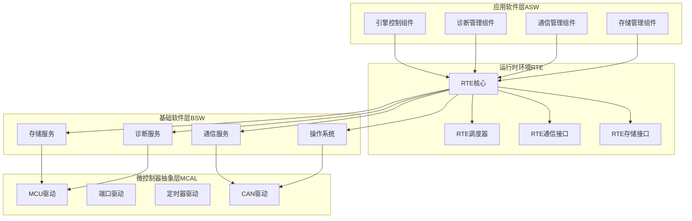

**图表来源**
- [Rte.h:1-441](file://src/bsw/rte/include/Rte.h#L1-L441)
- [Rte.c:1-792](file://src/bsw/rte/src/Rte.c#L1-L792)
- [EcuM.c:1-518](file://src/bsw/integration/EcuM.c#L1-L518)

**章节来源**
- [Rte.h:1-441](file://src/bsw/rte/include/Rte.h#L1-L441)
- [Rte.c:1-792](file://src/bsw/rte/src/Rte.c#L1-L792)
- [Rte_Type.h:1-361](file://src/bsw/rte/include/Rte_Type.h#L1-L361)

## 核心组件

### RTE核心模块

RTE核心模块是整个生命周期管理系统的中枢，负责维护系统状态、管理组件实例、处理端口连接和执行周期性任务。

#### 主要数据结构

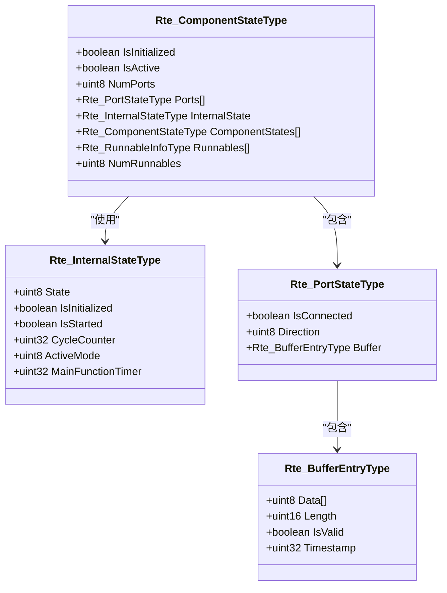

**图表来源**
- [Rte.c:46-92](file://src/bsw/rte/src/Rte.c#L46-L92)

#### 关键API功能

RTE提供了完整的生命周期管理API，包括：

1. **初始化管理**：`Rte_Init()`、`Rte_InitComponent()`
2. **组件管理**：`Rte_ComponentInit()`、`Rte_ComponentDeinit()`
3. **端口管理**：`Rte_ConnectPort()`、`Rte_Read()`、`Rte_Write()`
4. **运行时管理**：`Rte_Start()`、`Rte_Stop()`、`Rte_MainFunction()`

**章节来源**
- [Rte.h:247-262](file://src/bsw/rte/include/Rte.h#L247-L262)
- [Rte.c:208-287](file://src/bsw/rte/src/Rte.c#L208-L287)

### 调度器模块

RTE调度器实现了基于优先级的任务调度机制，支持周期性和事件驱动的任务执行。

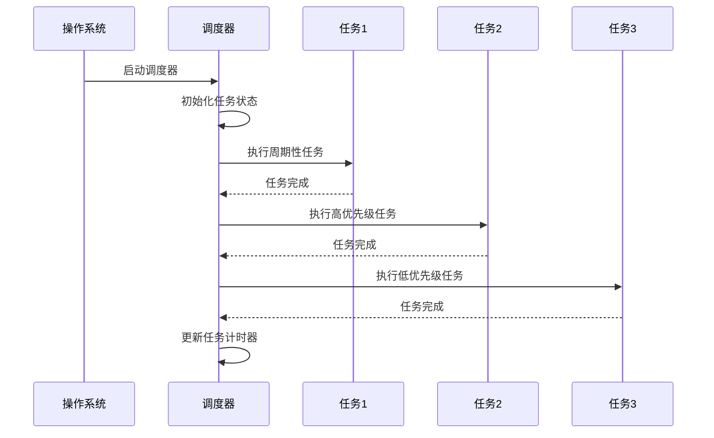

**图表来源**
- [Rte_Scheduler.c:266-354](file://src/bsw/rte/src/Rte_Scheduler.c#L266-L354)

**章节来源**
- [Rte_Scheduler.c:1-590](file://src/bsw/rte/src/Rte_Scheduler.c#L1-L590)

### 接口适配器模块

RTE提供了多个接口适配器，用于与外部服务进行通信：

1. **COM接口**：处理AUTOSAR通信服务
2. **NVM接口**：管理非易失性存储
3. **诊断接口**：提供诊断服务支持

**章节来源**
- [Rte_ComInterface.c:1-283](file://src/bsw/rte/src/Rte_ComInterface.c#L1-L283)
- [Rte_NvMInterface.c:1-429](file://src/bsw/rte/src/Rte_NvMInterface.c#L1-L429)

## 架构概览

### 生命周期管理架构

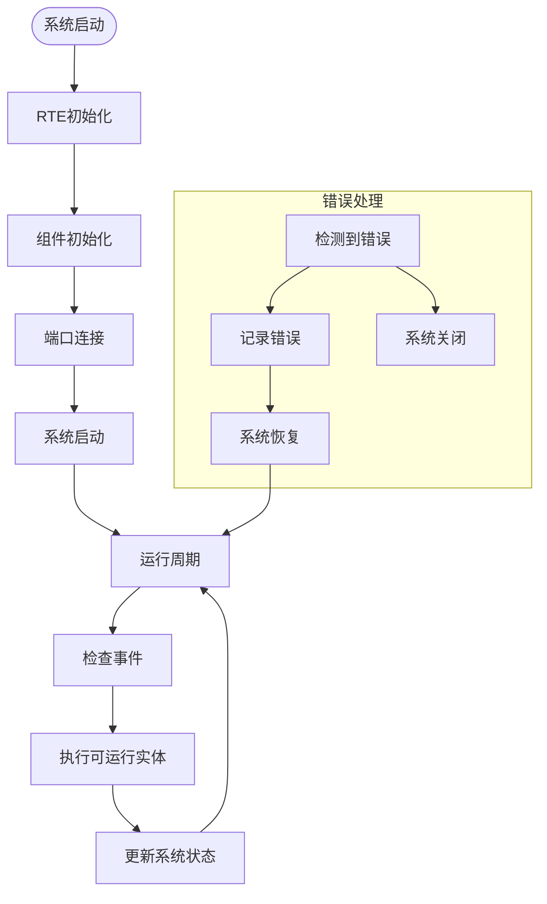

**图表来源**
- [Rte.c:208-397](file://src/bsw/rte/src/Rte.c#L208-L397)
- [Rte_Scheduler.c:530-558](file://src/bsw/rte/src/Rte_Scheduler.c#L530-L558)

### 组件交互流程

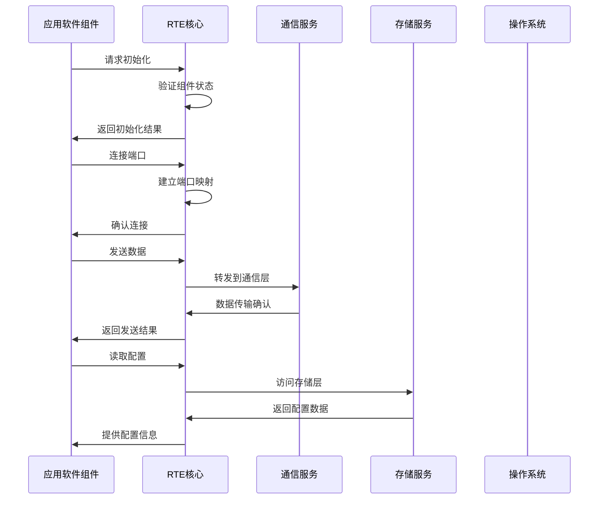

**图表来源**
- [Rte.c:292-517](file://src/bsw/rte/src/Rte.c#L292-L517)
- [Rte_ComInterface.c:155-197](file://src/bsw/rte/src/Rte_ComInterface.c#L155-L197)

**章节来源**
- [Rte.h:76-98](file://src/bsw/rte/include/Rte.h#L76-L98)
- [Rte.c:1-792](file://src/bsw/rte/src/Rte.c#L1-L792)

## 详细组件分析

### 组件生命周期管理

#### 初始化流程

组件初始化是生命周期管理的第一步，涉及多个层次的初始化操作：

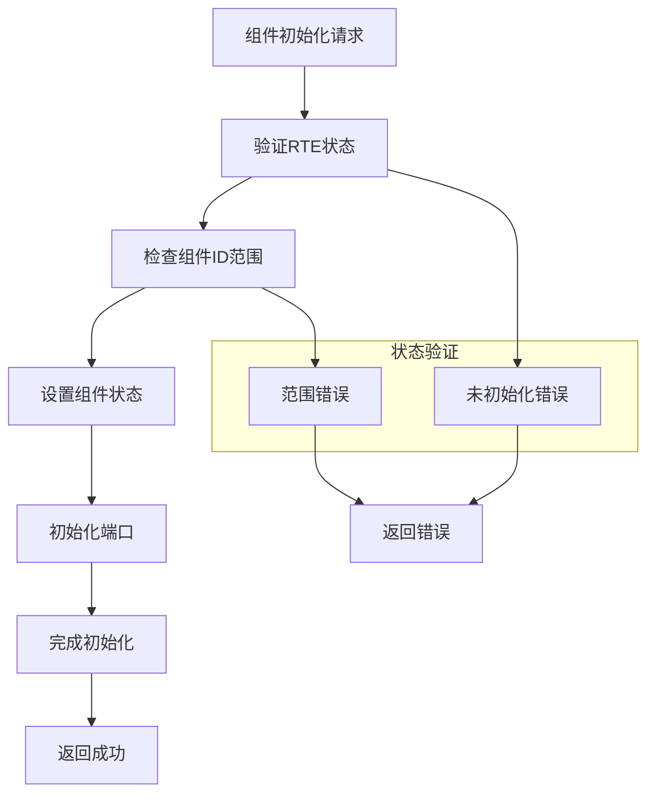

**图表来源**
- [Rte.c:260-287](file://src/bsw/rte/src/Rte.c#L260-L287)

#### 去初始化流程

组件去初始化过程需要确保资源的正确释放和状态的清理：

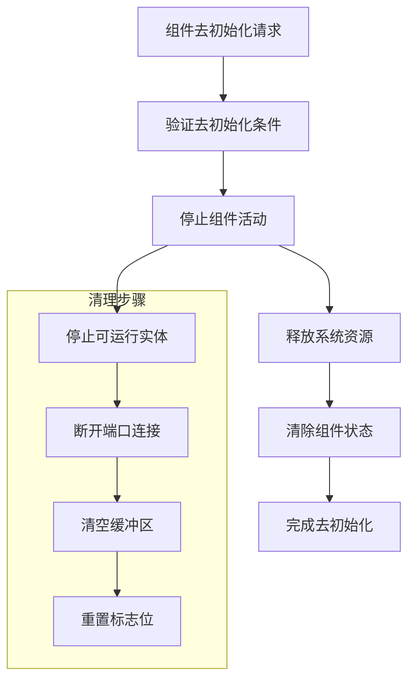

**图表来源**
- [Rte.c:260-287](file://src/bsw/rte/src/Rte.c#L260-L287)

**章节来源**
- [Rte.h:250-262](file://src/bsw/rte/include/Rte.h#L250-L262)
- [Rte.c:257-287](file://src/bsw/rte/src/Rte.c#L257-L287)

### 端口连接管理

端口连接是组件间通信的基础，RTE提供了灵活的端口管理机制：

#### 端口连接状态机

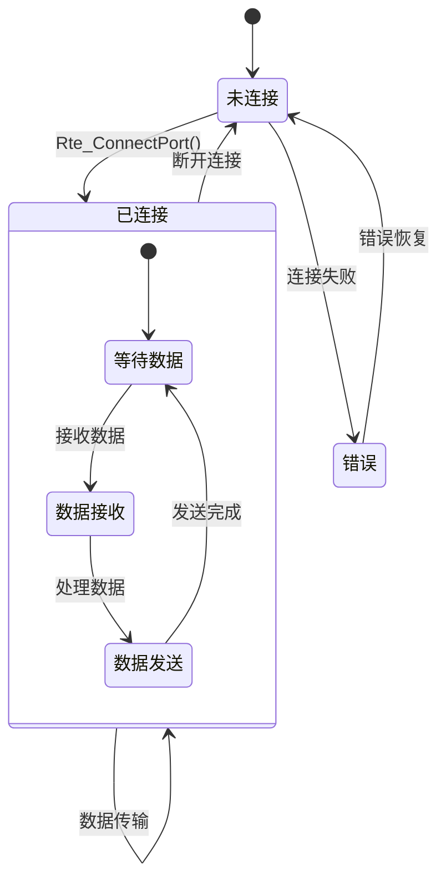

**图表来源**
- [Rte.c:292-326](file://src/bsw/rte/src/Rte.c#L292-L326)

#### 数据传输机制

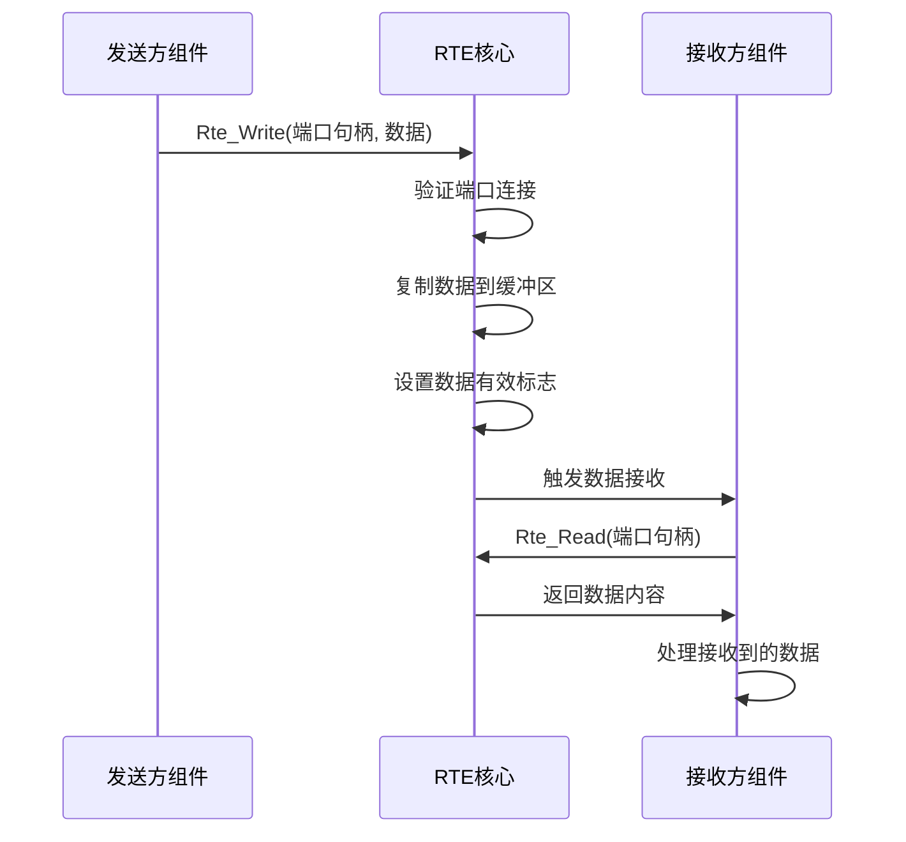

**图表来源**
- [Rte.c:425-465](file://src/bsw/rte/src/Rte.c#L425-L465)

**章节来源**
- [Rte.c:292-517](file://src/bsw/rte/src/Rte.c#L292-L517)

### 资源分配策略

RTE采用了静态资源分配策略，通过配置文件定义各种资源的大小和数量：

#### 资源配置参数

| 资源类型 | 默认值 | 描述 |
|---------|--------|------|
| 组件数量 | 16 | 支持的最大组件实例数 |
| 可运行实体 | 64 | 支持的可运行实体数量 |
| 端口数量 | 128 | 支持的端口总数 |
| 缓冲区大小 | 4096字节 | 单个缓冲区最大容量 |
| 事件数量 | 32 | 支持的事件总数 |

**章节来源**
- [Rte_Cfg.h:23-64](file://src/bsw/rte/include/Rte_Cfg.h#L23-L64)

### 启动顺序和依赖关系

系统采用分阶段启动策略，确保各模块按正确的顺序初始化：

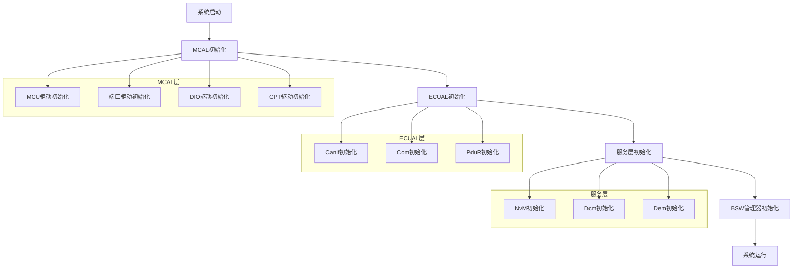

**图表来源**
- [EcuM.c:140-342](file://src/bsw/integration/EcuM.c#L140-L342)

**章节来源**
- [EcuM.c:1-518](file://src/bsw/integration/EcuM.c#L1-L518)

## 依赖关系分析

### 组件间依赖关系

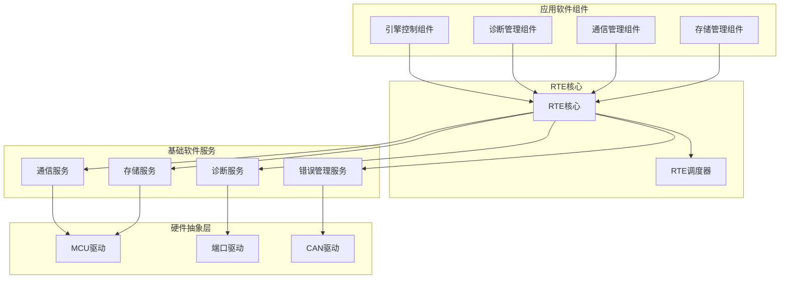

**图表来源**
- [Swc_EngineControl.c:1-540](file://src/asw/engine_control/src/Swc_EngineControl.c#L1-L540)
- [Swc_DiagnosticManager.c:1-686](file://src/asw/diagnostic_manager/src/Swc_DiagnosticManager.c#L1-L686)

### 错误检测和恢复

RTE实现了完善的错误检测和恢复机制：

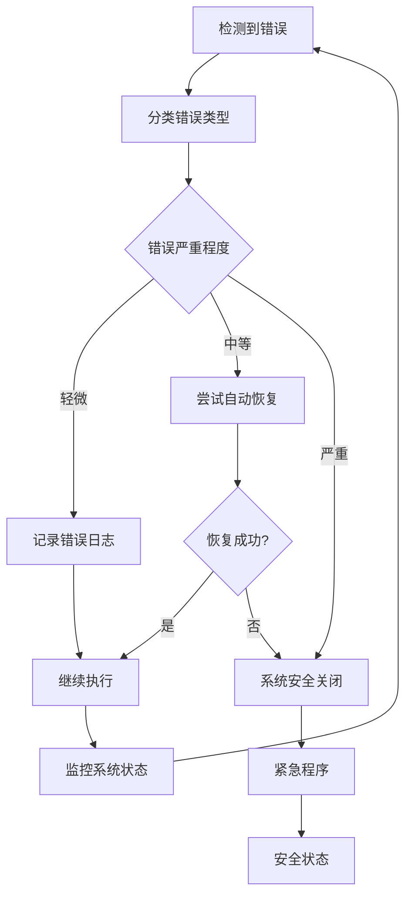

**图表来源**
- [Rte.c:36-41](file://src/bsw/rte/src/Rte.c#L36-L41)

**章节来源**
- [Rte.c:36-41](file://src/bsw/rte/src/Rte.c#L36-L41)
- [Rte_Type.h:38-67](file://src/bsw/rte/include/Rte_Type.h#L38-L67)

## 性能考虑

### 内存管理优化

RTE采用了静态内存分配策略，通过编译时常量定义资源大小，避免了动态内存分配带来的性能开销：

1. **固定大小缓冲区**：每个端口都有固定大小的缓冲区，避免了频繁的内存分配和释放
2. **预分配资源池**：所有组件、端口、可运行实体在编译时确定大小，运行时无需额外的内存管理
3. **零拷贝优化**：在可能的情况下，RTE直接使用指向数据的指针，避免不必要的数据复制

### 实时性能保证

```mermaid
gantt
title RTE实时性能分析
dateFormat X
axisFormat %s
section 系统启动
MCAL初始化 : milestone, 0, 100
ECUAL初始化 : milestone, 100, 200
服务层初始化 : milestone, 200, 300
BSW管理器初始化 : milestone, 300, 400
section 运行时处理
RTE主循环 : 400, 10
调度器处理 : 410, 5
通信处理 : 415, 8
存储处理 : 423, 7
诊断处理 : 430, 6
```

### 并发处理机制

RTE通过以下机制保证并发访问的安全性：

1. **互斥保护**：关键数据结构访问时使用互斥锁保护
2. **原子操作**：重要的状态更新使用原子操作确保一致性
3. **无锁设计**：对于读多写少的数据，采用无锁设计提高性能

## 故障排除指南

### 常见错误类型和处理方法

| 错误代码 | 错误含义 | 可能原因 | 解决方案 |
|---------|---------|---------|---------|
| RTE_E_UNINIT | 未初始化 | 在RTE未初始化时调用API | 确保先调用Rte_Init() |
| RTE_E_OUT_OF_RANGE | 超出范围 | 组件ID或端口号超出限制 | 检查配置参数和边界条件 |
| RTE_E_UNCONNECTED | 未连接 | 端口未正确连接 | 调用Rte_ConnectPort()建立连接 |
| RTE_E_TIMEOUT | 超时 | 操作在规定时间内未完成 | 增加超时时间或检查硬件状态 |
| RTE_E_NO_DATA | 无数据 | 读取端口没有可用数据 | 检查发送方是否正确发送数据 |

### 调试技巧

1. **启用详细错误报告**：通过配置`RTE_DEV_ERROR_DETECT`宏启用详细的错误检测和报告
2. **使用状态监控**：定期检查RTE内部状态变量，如`IsInitialized`、`IsStarted`
3. **端口状态检查**：使用`Rte_ValidatePortHandle()`函数验证端口连接状态
4. **内存泄漏检测**：由于采用静态分配，主要关注缓冲区溢出问题

### 日志和监控

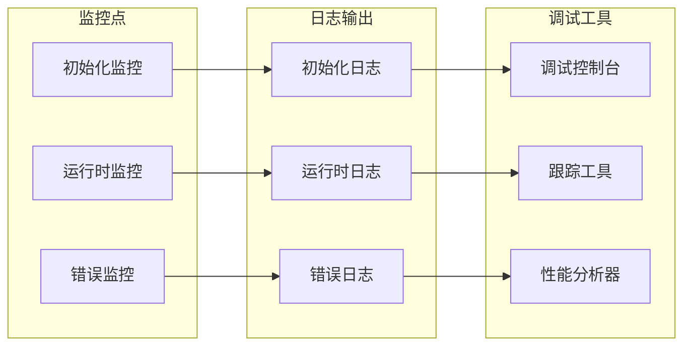

**章节来源**
- [Rte_Type.h:38-67](file://src/bsw/rte/include/Rte_Type.h#L38-L67)
- [Rte.c:36-41](file://src/bsw/rte/src/Rte.c#L36-L41)

## 结论

YuleASR项目的RTE组件生命周期管理系统展现了AUTOSAR架构的完整实现。系统通过精心设计的模块化架构，提供了可靠的组件生命周期管理、灵活的端口连接机制和高效的资源分配策略。

### 主要优势

1. **模块化设计**：清晰的分层架构便于维护和扩展
2. **实时性能**：静态资源分配确保确定性的响应时间
3. **错误处理**：完善的错误检测和恢复机制提高系统可靠性
4. **标准化接口**：遵循AUTOSAR标准，便于集成和移植

### 技术特点

- 支持16个组件实例，满足复杂系统的组件管理需求
- 提供64个可运行实体，支持丰富的功能实现
- 采用4KB缓冲区大小，平衡内存使用和性能
- 实现了完整的生命周期管理，从初始化到去初始化的全过程覆盖

### 未来发展方向

1. **动态资源管理**：考虑引入动态资源分配以适应更复杂的场景
2. **网络通信支持**：增强对现代网络协议的支持
3. **安全性增强**：增加更多的安全机制和防护措施
4. **云集成**：支持与云端服务的集成和远程管理

该RTE系统为YuleASR项目提供了坚实的基础，确保了各个组件间的可靠通信和协调工作，为整个AUTOSAR架构的成功实施奠定了重要基础。