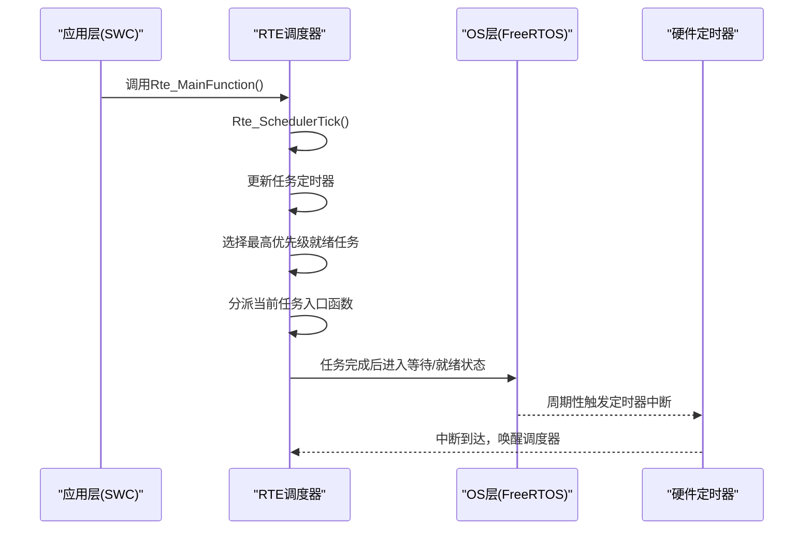
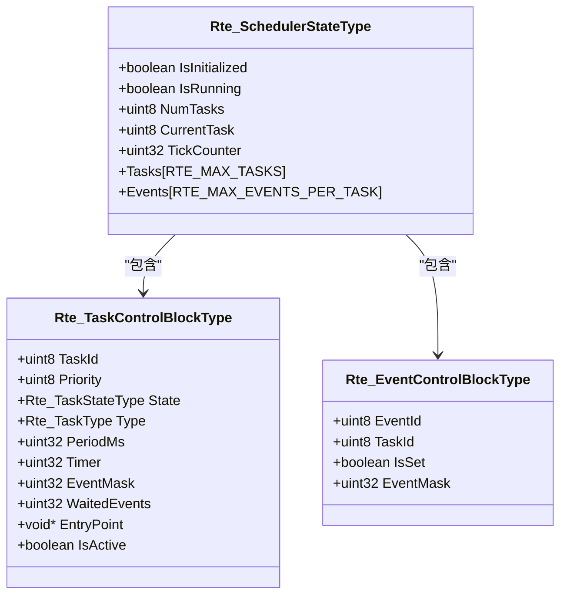
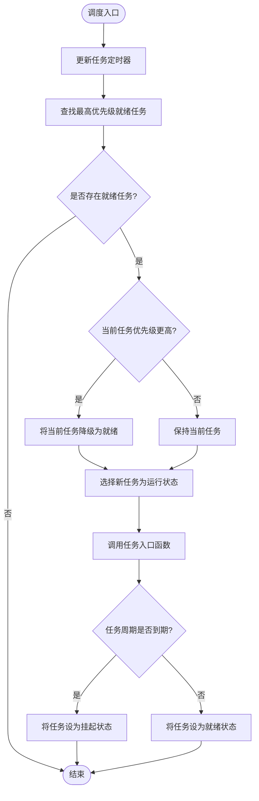
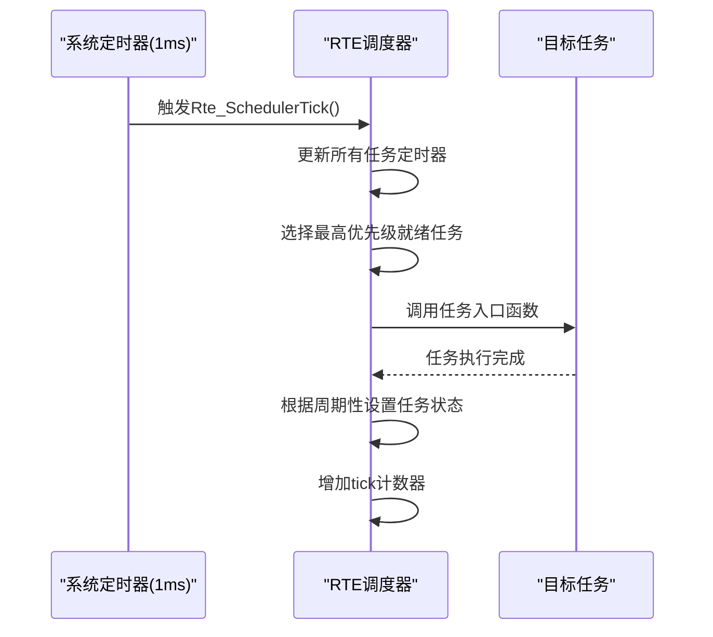
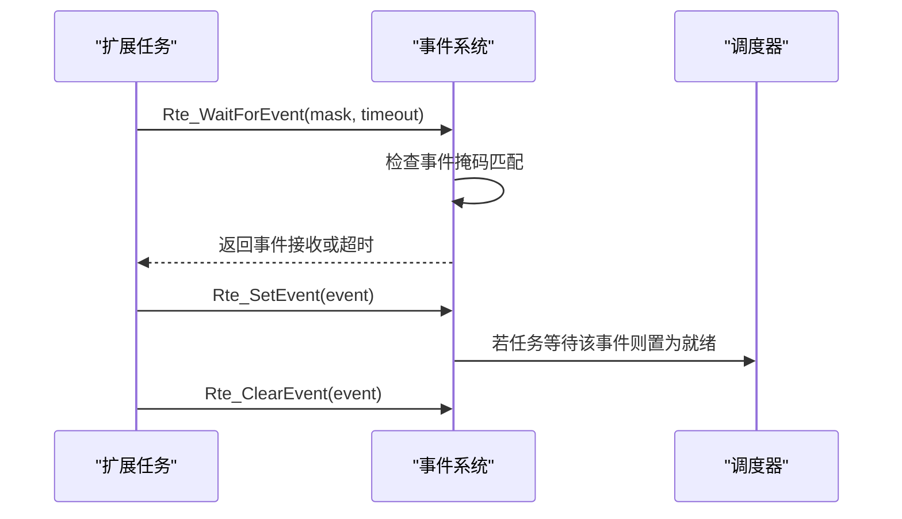
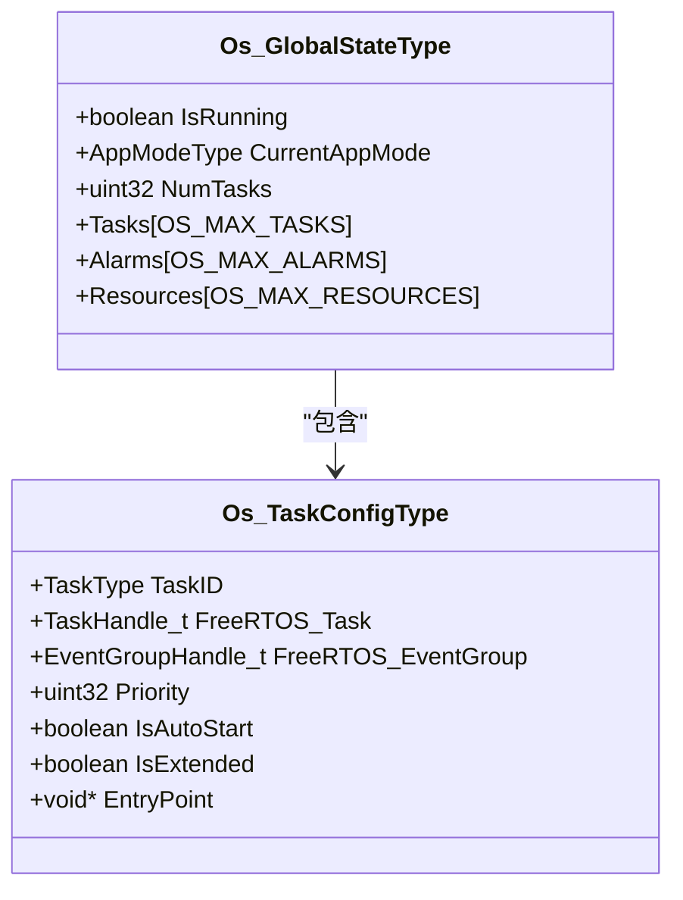
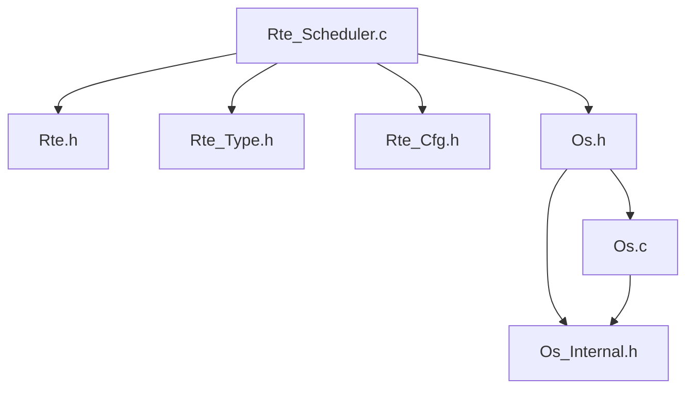

# RTE调度器实现

<cite>
**本文档引用的文件**
- [Rte_Scheduler.c](file://src/bsw/rte/src/Rte_Scheduler.c)
- [Rte.h](file://src/bsw/rte/include/Rte.h)
- [Rte_Cfg.h](file://src/bsw/rte/include/Rte_Cfg.h)
- [Rte_Type.h](file://src/bsw/rte/include/Rte_Type.h)
- [Rte.c](file://src/bsw/rte/src/Rte.c)
- [Os.h](file://src/bsw/os/include/Os.h)
- [Os.c](file://src/bsw/os/src/Os.c)
- [Os_Internal.h](file://src/bsw/os/include/Os_Internal.h)
- [architecture.md](file://docs/architecture.md)
- [development-guide.md](file://docs/development-guide.md)
</cite>

## 目录
1. [简介](#简介)
2. [项目结构](#项目结构)
3. [核心组件](#核心组件)
4. [架构总览](#架构总览)
5. [详细组件分析](#详细组件分析)
6. [依赖关系分析](#依赖关系分析)
7. [性能考虑](#性能考虑)
8. [故障排除指南](#故障排除指南)
9. [结论](#结论)
10. [附录](#附录)

## 简介
本文件针对YuleTech AutoSAR BSW平台中的RTE调度器实现进行全面技术文档化，重点覆盖以下内容：
- Rte_Scheduler.c中的调度算法与实现机制
- RTE主函数Rte_MainFunction()的工作原理与周期性处理逻辑
- 任务调度策略、优先级管理与时间片分配
- 调度器与操作系统内核的集成、中断处理与上下文切换
- 调度性能优化、负载均衡与实时性保证
- 调度器配置参数、调试工具与性能监控方法
- 调度器在复杂系统中的作用与扩展性考虑

## 项目结构
RTE调度器位于BSW层的RTE子系统中，采用AutoSAR Classic Platform 4.x标准实现，与OS层通过FreeRTOS进行集成。整体项目采用分层架构，RTE调度器处于应用层与服务层之间，负责组件间的通信与任务调度。

```mermaid
graph TB
subgraph "应用层"
SWC[软件组件(SWC)]
end
subgraph "RTE层"
RTE_CORE[RTE核心]
RTE_SCHED[RTE调度器]
RTE_IF[RTE接口]
end
subgraph "服务层"
COM[通信服务]
NVM[NVRAM管理器]
DCM_Dem[诊断服务]
end
subgraph "OS层"
FREERTOS[FreeRTOS内核]
OS_API[OS API]
end
SWC --> RTE_CORE
RTE_CORE --> RTE_SCHED
RTE_CORE --> RTE_IF
RTE_IF --> COM
RTE_IF --> NVM
RTE_IF --> DCM_Dem
RTE_SCHED --> OS_API
OS_API --> FREERTOS
```

**图表来源**
- [architecture.md:233-263](file://docs/architecture.md#L233-L263)

**章节来源**
- [architecture.md:23-87](file://docs/architecture.md#L23-L87)

## 核心组件
RTE调度器的核心组件包括：
- 调度器状态管理：维护调度器的初始化状态、运行状态、任务数量、当前任务与tick计数器
- 任务控制块：存储任务ID、优先级、状态、类型、周期、定时器、事件掩码、等待事件、入口函数与激活标志
- 事件控制块：管理事件ID、关联任务、事件设置状态与事件掩码
- 调度算法：基于优先级的任务选择与抢占机制
- 事件管理：支持扩展任务的事件等待、设置与清除操作

调度器对外提供以下关键接口：
- 初始化与启停：Rte_Scheduler_Init()、Rte_Scheduler_Start()、Rte_Scheduler_Stop()
- 任务管理：Rte_SchedulerCreateTask()、Rte_SchedulerActivateTask()、Rte_SchedulerTerminateTask()
- 事件管理：Rte_WaitForEvent()、Rte_SetEvent()、Rte_ClearEvent()
- 周期性处理：Rte_SchedulerTick()、Rte_Scheduler_MainFunction()
- 查询接口：Rte_SchedulerIsRunning()、Rte_SchedulerGetCurrentTask()、Rte_SchedulerGetTickCount()

**章节来源**
- [Rte_Scheduler.c:80-90](file://src/bsw/rte/src/Rte_Scheduler.c#L80-L90)
- [Rte_Scheduler.c:328-354](file://src/bsw/rte/src/Rte_Scheduler.c#L328-L354)
- [Rte_Scheduler.c:527-558](file://src/bsw/rte/src/Rte_Scheduler.c#L527-L558)

## 架构总览
RTE调度器与OS层的集成采用FreeRTOS作为底层内核，通过OS API实现任务管理、事件管理与中断处理。调度器在RTE主函数周期内被调用，完成任务的定时器更新、优先级选择与任务分派。



**图表来源**
- [Rte_Scheduler.c:527-558](file://src/bsw/rte/src/Rte_Scheduler.c#L527-L558)
- [Os.c:84-109](file://src/bsw/os/src/Os.c#L84-L109)

**章节来源**
- [Rte.c:384-397](file://src/bsw/rte/src/Rte.c#L384-L397)
- [Os.h:158-204](file://src/bsw/os/include/Os.h#L158-L204)

## 详细组件分析

### 调度器状态与数据结构
调度器内部维护一个全局状态结构体，包含：
- 初始化标志与运行标志
- 任务总数与当前任务索引
- tick计数器
- 任务数组与事件数组



**图表来源**
- [Rte_Scheduler.c:80-90](file://src/bsw/rte/src/Rte_Scheduler.c#L80-L90)
- [Rte_Scheduler.c:56-69](file://src/bsw/rte/src/Rte_Scheduler.c#L56-L69)
- [Rte_Scheduler.c:71-78](file://src/bsw/rte/src/Rte_Scheduler.c#L71-L78)

**章节来源**
- [Rte_Scheduler.c:98-98](file://src/bsw/rte/src/Rte_Scheduler.c#L98-L98)
- [Rte_Scheduler.c:266-301](file://src/bsw/rte/src/Rte_Scheduler.c#L266-L301)

### 调度算法与优先级管理
调度算法采用静态优先级抢占式调度：
- 任务状态机：挂起(SUSPENDED)、就绪(READY)、运行(RUNNING)、等待(WAITING)
- 优先级选择：遍历所有激活且就绪的任务，选择优先级数值最小的任务
- 抢占机制：若新选择的任务优先级更高，则将当前运行任务降级为就绪状态



**图表来源**
- [Rte_Scheduler.c:122-142](file://src/bsw/rte/src/Rte_Scheduler.c#L122-L142)
- [Rte_Scheduler.c:176-196](file://src/bsw/rte/src/Rte_Scheduler.c#L176-L196)
- [Rte_Scheduler.c:201-222](file://src/bsw/rte/src/Rte_Scheduler.c#L201-L222)

**章节来源**
- [Rte_Scheduler.c:122-196](file://src/bsw/rte/src/Rte_Scheduler.c#L122-L196)

### 时间片分配与周期性处理
RTE调度器采用固定tick周期(1ms)进行任务调度，每个任务的周期通过其PeriodMs字段指定。定时器更新逻辑确保：
- 当任务定时器减至0时，任务从挂起状态转为就绪状态
- 任务执行后根据是否为周期性任务决定状态转换
- tick计数器用于跟踪系统运行时间



**图表来源**
- [Rte_Scheduler.c:530-546](file://src/bsw/rte/src/Rte_Scheduler.c#L530-L546)
- [Rte_Scheduler.c:147-171](file://src/bsw/rte/src/Rte_Scheduler.c#L147-L171)

**章节来源**
- [Rte_Scheduler.c:35-35](file://src/bsw/rte/src/Rte_Scheduler.c#L35-L35)
- [Rte_Scheduler.c:579-582](file://src/bsw/rte/src/Rte_Scheduler.c#L579-L582)

### 事件管理与扩展任务
扩展任务支持事件驱动的同步机制：
- 事件等待：任务设置等待事件掩码并在超时时间内轮询事件状态
- 事件设置：将事件位加入任务事件掩码，若任务处于等待状态则转为就绪
- 事件清除：清除指定事件位



**图表来源**
- [Rte_Scheduler.c:378-445](file://src/bsw/rte/src/Rte_Scheduler.c#L378-L445)
- [Rte_Scheduler.c:450-491](file://src/bsw/rte/src/Rte_Scheduler.c#L450-L491)
- [Rte_Scheduler.c:496-525](file://src/bsw/rte/src/Rte_Scheduler.c#L496-L525)

**章节来源**
- [Rte_Scheduler.c:40-54](file://src/bsw/rte/src/Rte_Scheduler.c#L40-L54)

### 与操作系统内核的集成
RTE调度器通过OS层与FreeRTOS集成：
- 任务管理：通过OS API实现任务的激活、终止与状态查询
- 事件管理：利用FreeRTOS事件组实现任务间事件同步
- 中断处理：OS层提供中断开关与恢复接口，确保调度临界区的安全



**图表来源**
- [Os_Internal.h:60-80](file://src/bsw/os/include/Os_Internal.h#L60-L80)
- [Os_Internal.h:49-58](file://src/bsw/os/include/Os_Internal.h#L49-L58)

**章节来源**
- [Os.h:158-204](file://src/bsw/os/include/Os.h#L158-L204)
- [Os.c:84-109](file://src/bsw/os/src/Os.c#L84-L109)

## 依赖关系分析
RTE调度器的依赖关系如下：



**图表来源**
- [Rte_Scheduler.c:19-22](file://src/bsw/rte/src/Rte_Scheduler.c#L19-L22)
- [Os.h:21-22](file://src/bsw/os/include/Os.h#L21-L22)

**章节来源**
- [Rte_Scheduler.c:19-22](file://src/bsw/rte/src/Rte_Scheduler.c#L19-L22)
- [Os.h:21-22](file://src/bsw/os/include/Os.h#L21-L22)

## 性能考虑
为确保调度器的高性能与实时性，建议关注以下方面：
- 任务数量与优先级配置：合理设置RTE_MAX_TASKS与任务优先级，避免过多任务导致调度开销增大
- 事件管理优化：扩展任务的事件等待应配合超时机制，防止无限阻塞
- 中断处理：通过OS层的中断开关接口保护关键临界区，减少中断延迟
- 内存分区：使用MemMap进行内存分区，确保代码与数据的高效访问
- 错误检测：启用RTE_DEV_ERROR_DETECT与OS_DEV_ERROR_DETECT，及时发现配置错误

[本节为通用性能指导，不涉及具体文件分析]

## 故障排除指南
针对调度器常见问题的排查方法：
- 调度器未启动：检查Rte_Scheduler_Init()与Rte_Scheduler_Start()的调用顺序与条件
- 任务不执行：验证任务状态转换逻辑，确认定时器更新与优先级选择正确
- 事件等待超时：检查事件设置与清除接口的使用，确认事件掩码匹配
- OS集成问题：核对OS层的中断处理与任务管理接口，确保FreeRTOS正确初始化

**章节来源**
- [Rte_Scheduler.c:266-323](file://src/bsw/rte/src/Rte_Scheduler.c#L266-L323)
- [Rte_Scheduler.c:378-525](file://src/bsw/rte/src/Rte_Scheduler.c#L378-L525)
- [Os.c:84-139](file://src/bsw/os/src/Os.c#L84-L139)

## 结论
RTE调度器实现了基于静态优先级的抢占式调度机制，结合事件驱动的扩展任务支持，满足了AutoSAR平台对实时性的要求。通过与FreeRTOS的深度集成，调度器能够高效地管理任务生命周期与事件同步。在实际应用中，应重点关注任务优先级配置、事件管理与OS集成的正确性，以确保系统的稳定性与实时性能。

[本节为总结性内容，不涉及具体文件分析]

## 附录

### 调度器配置参数
- 调度器实例ID：RTE_SCHEDULER_INSTANCE_ID
- 最大任务数：RTE_MAX_TASKS (默认8)
- 每任务最大事件数：RTE_MAX_EVENTS_PER_TASK (默认16)
- 调度tick周期：RTE_SCHEDULER_TICK_MS (默认1ms)
- 主函数周期：RTE_MAIN_FUNCTION_PERIOD_MS (默认10ms)
- 默认超时：RTE_DEFAULT_TIMEOUT_MS (默认100ms)
- 最大超时：RTE_MAX_TIMEOUT_MS (默认10000ms)

**章节来源**
- [Rte_Scheduler.c:26-35](file://src/bsw/rte/src/Rte_Scheduler.c#L26-L35)
- [Rte_Cfg.h:98-112](file://src/bsw/rte/include/Rte_Cfg.h#L98-L112)

### 调试工具与监控方法
- DET错误检测：通过RTE_DEV_ERROR_DETECT与OS_DEV_ERROR_DETECT启用开发时错误检测
- 日志输出：使用DEBUG宏进行条件日志输出
- 断言：使用assert进行运行时断言检查
- GDB调试：通过GDB进行单步调试与变量查看

**章节来源**
- [development-guide.md:431-494](file://docs/development-guide.md#L431-L494)
- [development-guide.md:496-595](file://docs/development-guide.md#L496-L595)