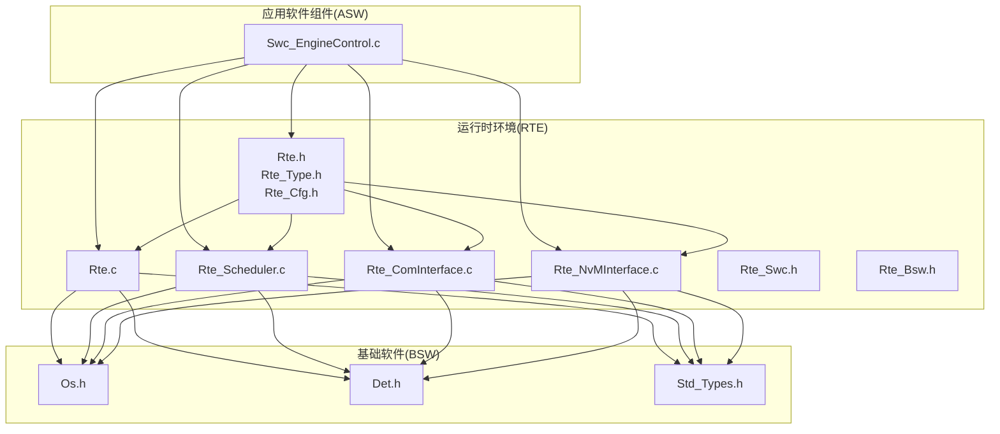
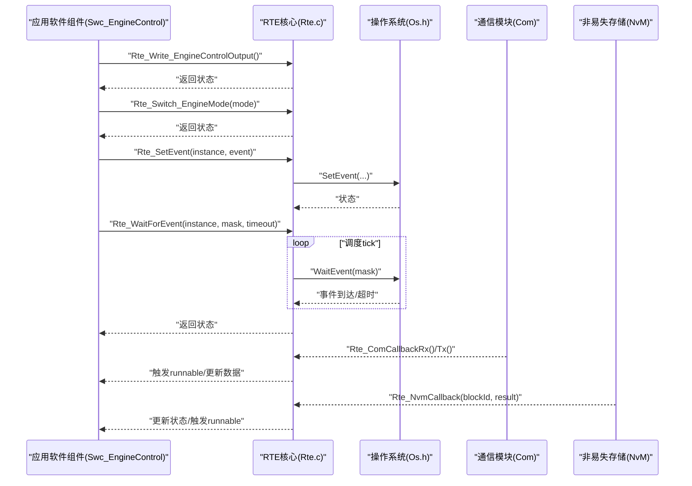
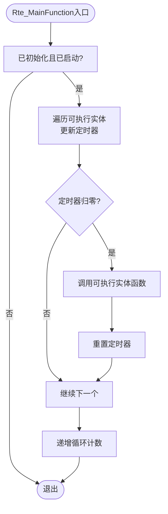
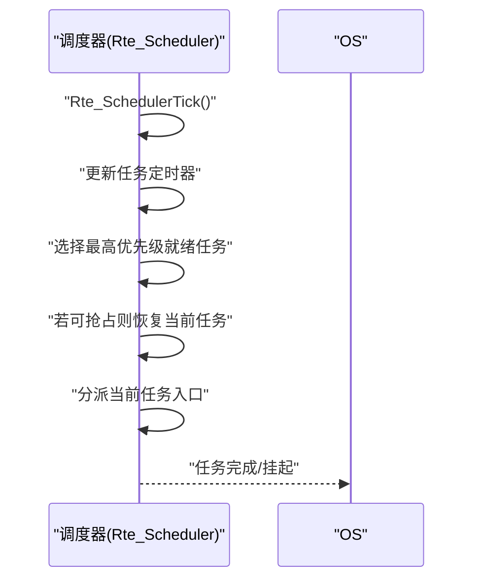
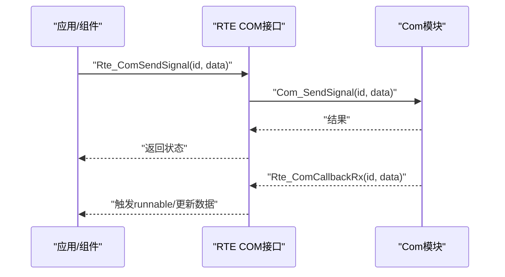
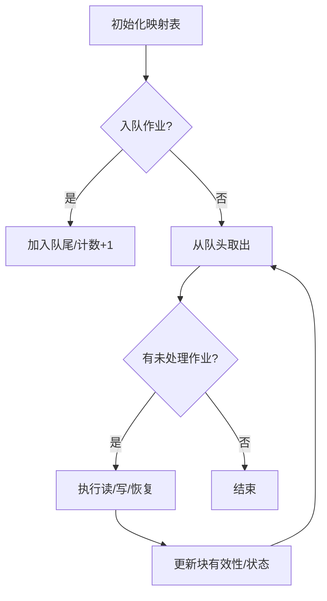
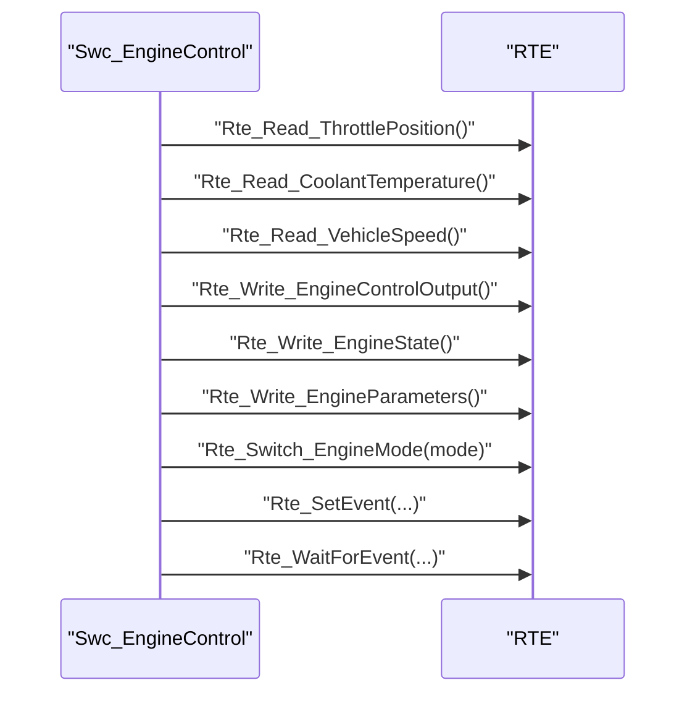
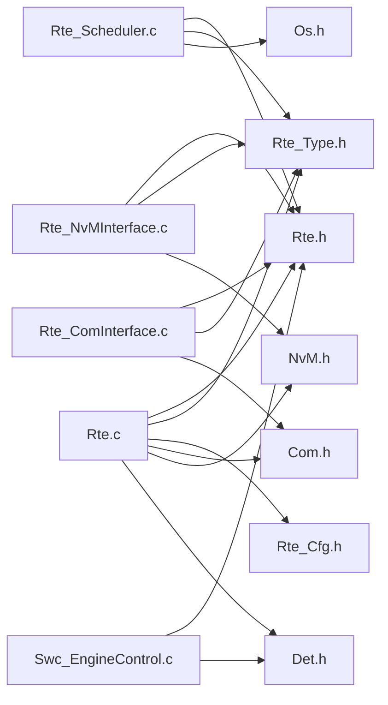

# 运行时环境(RTE)

<cite>
**本文引用的文件**
- [Rte.h](file://src/bsw/rte/include/Rte.h)
- [Rte_Swc.h](file://src/bsw/rte/include/Rte_Swc.h)
- [Rte_Bsw.h](file://src/bsw/rte/include/Rte_Bsw.h)
- [Rte_Type.h](file://src/bsw/rte/include/Rte_Type.h)
- [Rte_Cfg.h](file://src/bsw/rte/include/Rte_Cfg.h)
- [Rte.c](file://src/bsw/rte/src/Rte.c)
- [Rte_Scheduler.c](file://src/bsw/rte/src/Rte_Scheduler.c)
- [Rte_ComInterface.c](file://src/bsw/rte/src/Rte_ComInterface.c)
- [Rte_NvMInterface.c](file://src/bsw/rte/src/Rte_NvMInterface.c)
- [Swc_EngineControl.c](file://src/asw/engine_control/src/Swc_EngineControl.c)
- [Std_Types.h](file://src/bsw/common/Std_Types.h)
- [Det.h](file://src/bsw/common/Det.h)
- [Os.h](file://src/bsw/os/include/Os.h)
- [main.c](file://examples/can_demo/main.c)
</cite>

## 目录
1. [简介](#简介)
2. [项目结构](#项目结构)
3. [核心组件](#核心组件)
4. [架构总览](#架构总览)
5. [详细组件分析](#详细组件分析)
6. [依赖关系分析](#依赖关系分析)
7. [性能考虑](#性能考虑)
8. [故障排查指南](#故障排查指南)
9. [结论](#结论)
10. [附录](#附录)

## 简介
本文件面向RTE（运行时环境）在AutoSAR经典平台4.x中的实现与使用，系统性阐述其在软件组件解耦、跨层通信、任务调度与内存管理方面的职责与机制。重点覆盖以下方面：
- 组件间通信接口：发送/接收（SR）、客户端/服务器（CS）、模式切换（MODE）、触发（TRIG）、参数（PARAM）等。
- 数据类型与句柄体系：统一的句柄类型、事件掩码、缓冲区与数组封装。
- 任务调度与事件：基于优先级的抢占式调度、事件等待与超时处理。
- 内存管理：PIM（每实例内存）、IRV（可变区间变量）、校准参数、测量值等。
- 配置与生成：RTE配置宏、组件/端口/数据元素/信号映射等。
- 实际使用：通过引擎控制组件示例展示RTE读写、模式切换与回调。

## 项目结构
RTE位于BSW层，提供应用软件组件（ASW）与基础软件（BSW）之间的抽象与桥接。关键目录与文件如下：
- 头文件：Rte.h、Rte_Swc.h、Rte_Bsw.h、Rte_Type.h、Rte_Cfg.h
- 实现：Rte.c、Rte_Scheduler.c、Rte_ComInterface.c、Rte_NvMInterface.c
- 示例：Swc_EngineControl.c 展示RTE读写与模式切换；CAN示例演示底层通信链路

**图表来源**
- [Rte.h:1-441](file://src/bsw/rte/include/Rte.h#L1-L441)
- [Rte.c:1-792](file://src/bsw/rte/src/Rte.c#L1-L792)
- [Rte_Scheduler.c:1-590](file://src/bsw/rte/src/Rte_Scheduler.c#L1-L590)
- [Rte_ComInterface.c:1-283](file://src/bsw/rte/src/Rte_ComInterface.c#L1-L283)
- [Rte_NvMInterface.c:1-429](file://src/bsw/rte/src/Rte_NvMInterface.c#L1-L429)
- [Swc_EngineControl.c:1-540](file://src/asw/engine_control/src/Swc_EngineControl.c#L1-L540)
- [Os.h:1-213](file://src/bsw/os/include/Os.h#L1-L213)
- [Std_Types.h:1-117](file://src/bsw/common/Std_Types.h#L1-L117)
- [Det.h:1-76](file://src/bsw/common/Det.h#L1-L76)

**章节来源**
- [Rte.h:1-441](file://src/bsw/rte/include/Rte.h#L1-L441)
- [Rte_Swc.h:1-406](file://src/bsw/rte/include/Rte_Swc.h#L1-L406)
- [Rte_Bsw.h:1-351](file://src/bsw/rte/include/Rte_Bsw.h#L1-L351)
- [Rte_Type.h:1-361](file://src/bsw/rte/include/Rte_Type.h#L1-L361)
- [Rte_Cfg.h:1-280](file://src/bsw/rte/include/Rte_Cfg.h#L1-L280)

## 核心组件
- RTE核心API与状态机：负责初始化、启动/停止、主函数周期推进、端口连接、读写、模式切换、互斥区、COM回调等。
- 调度器：实现任务创建、激活、终止、事件等待与超时、时间片推进与抢占选择。
- 接口适配层：COM接口（信号到数据元素映射与回调）、NvM接口（块映射、作业队列与回调）。
- 类型与配置：统一数据类型、句柄类型、事件掩码、缓冲区、字符串/字节数组、时间戳、通信规范枚举；RTE配置宏定义资源上限与ID空间。
- 软件组件模板：提供组件、端口、可执行实体（runnable）的类型与宏，便于快速声明与使用。

**章节来源**
- [Rte.c:208-397](file://src/bsw/rte/src/Rte.c#L208-L397)
- [Rte_Scheduler.c:266-558](file://src/bsw/rte/src/Rte_Scheduler.c#L266-L558)
- [Rte_ComInterface.c:124-275](file://src/bsw/rte/src/Rte_ComInterface.c#L124-L275)
- [Rte_NvMInterface.c:219-371](file://src/bsw/rte/src/Rte_NvMInterface.c#L219-L371)
- [Rte_Type.h:38-361](file://src/bsw/rte/include/Rte_Type.h#L38-L361)
- [Rte_Cfg.h:15-280](file://src/bsw/rte/include/Rte_Cfg.h#L15-L280)
- [Rte_Swc.h:26-406](file://src/bsw/rte/include/Rte_Swc.h#L26-L406)

## 架构总览
RTE在AutoSAR中承担“抽象层”角色，向上屏蔽底层OS与BSW差异，向下对接COM/NvM等服务模块。典型调用路径：
- 应用软件组件通过RTE API访问数据元素、触发操作、设置事件、切换模式。
- COM/NvM等BSW模块通过回调通知RTE，RTE再驱动runnable或更新数据。
- OS提供任务调度与事件机制，RTE调度器与之协同。

**图表来源**
- [Swc_EngineControl.c:358-407](file://src/asw/engine_control/src/Swc_EngineControl.c#L358-L407)
- [Rte.c:716-784](file://src/bsw/rte/src/Rte.c#L716-L784)
- [Rte_Scheduler.c:378-444](file://src/bsw/rte/src/Rte_Scheduler.c#L378-L444)
- [Rte_ComInterface.c:202-236](file://src/bsw/rte/src/Rte_ComInterface.c#L202-L236)
- [Rte_NvMInterface.c:337-356](file://src/bsw/rte/src/Rte_NvMInterface.c#L337-L356)
- [Os.h:158-201](file://src/bsw/os/include/Os.h#L158-L201)

## 详细组件分析

### 组件A：RTE核心（Rte.c）
- 初始化与生命周期：Rte_Init/Rte_Start/Rte_Stop维护内部状态机与组件/端口缓冲区。
- 端口读写：Rte_Read/Rte_Write基于端口句柄与方向，进行数据拷贝与有效性标记。
- 模式管理：Rte_Switch/Rte_Mode支持运行模式切换与查询。
- 互斥区：Rte_EnterExclusiveArea/Rte_ExitExclusiveArea预留保护接口。
- 回调：Rte_ComCbk/Rte_ComCbkTout/Rte_ComCbkInv/Rte_ComCbkSwitchAck用于COM事件通知。
- 主函数：Rte_MainFunction推进周期计数与定时器。

**图表来源**
- [Rte.c:387-397](file://src/bsw/rte/src/Rte.c#L387-L397)
- [Rte.c:177-199](file://src/bsw/rte/src/Rte.c#L177-L199)

**章节来源**
- [Rte.c:208-397](file://src/bsw/rte/src/Rte.c#L208-L397)

### 组件B：调度器（Rte_Scheduler.c）
- 任务模型：支持基本/扩展两类任务，具备优先级、周期、事件掩码、等待事件集。
- 调度算法：按优先级选择最高优先级就绪任务，必要时抢占当前任务。
- 事件机制：SetEvent/ClearEvent/WaitForEvent支持事件等待与超时。
- Tick处理：Rte_SchedulerTick推进所有任务定时器、选择与分派任务。

**图表来源**
- [Rte_Scheduler.c:530-558](file://src/bsw/rte/src/Rte_Scheduler.c#L530-L558)
- [Rte_Scheduler.c:176-222](file://src/bsw/rte/src/Rte_Scheduler.c#L176-L222)

**章节来源**
- [Rte_Scheduler.c:266-558](file://src/bsw/rte/src/Rte_Scheduler.c#L266-L558)

### 组件C：COM接口（Rte_ComInterface.c）
- 信号映射：将COM信号ID映射到RTE数据元素句柄，支持默认映射表。
- 发送/接收：Rte_ComSendSignal/Rte_ComReceiveSignal封装底层Com接口。
- 回调：Rte_ComCallbackRx/Tx用于接收确认与传输完成通知。

**图表来源**
- [Rte_ComInterface.c:155-197](file://src/bsw/rte/src/Rte_ComInterface.c#L155-L197)
- [Rte_ComInterface.c:202-236](file://src/bsw/rte/src/Rte_ComInterface.c#L202-L236)

**章节来源**
- [Rte_ComInterface.c:124-275](file://src/bsw/rte/src/Rte_ComInterface.c#L124-L275)

### 组件D：NvM接口（Rte_NvMInterface.c）
- 块映射：将NvM块ID映射到RTE端口句柄与长度。
- 作业队列：异步读写/恢复作业排队，逐个出队执行。
- 回调：Rte_NvmCallback根据作业结果更新块有效性并通知上层。

**图表来源**
- [Rte_NvMInterface.c:149-210](file://src/bsw/rte/src/Rte_NvMInterface.c#L149-L210)
- [Rte_NvMInterface.c:337-356](file://src/bsw/rte/src/Rte_NvMInterface.c#L337-L356)

**章节来源**
- [Rte_NvMInterface.c:219-371](file://src/bsw/rte/src/Rte_NvMInterface.c#L219-L371)

### 组件E：软件组件模板（Rte_Swc.h）
- 组件/端口/可执行实体类型与配置结构体。
- 组件生命周期API：初始化/去初始化/启动/停止/状态查询。
- 端口连接/断开API。
- 模板宏：声明组件、runnable、SR/CS/MODE/TRIG/PIM/IRV等。

**章节来源**
- [Rte_Swc.h:26-406](file://src/bsw/rte/include/Rte_Swc.h#L26-L406)

### 组件F：BSW接口（Rte_Bsw.h）
- 定义ECUM、Diag、Com、NVM、IO、Mode、Watchdog等BSW模块的接口与回调。
- 提供统一的调用宏与注册回调函数接口。

**章节来源**
- [Rte_Bsw.h:26-351](file://src/bsw/rte/include/Rte_Bsw.h#L26-L351)

### 组件G：类型与配置（Rte_Type.h、Rte_Cfg.h）
- 类型体系：状态类型、事件掩码、缓冲区、字符串/字节数组、时间戳、通信规范枚举。
- 句柄体系：端口/数据/CS操作/模式/IRV/测量/参数/互斥区等句柄类型。
- 配置宏：组件/端口/数据元素/作业数量、缓冲区大小、字符串/数组长度、队列深度、超时、OS任务/事件/报警数量、主函数周期等。

**章节来源**
- [Rte_Type.h:38-361](file://src/bsw/rte/include/Rte_Type.h#L38-L361)
- [Rte_Cfg.h:15-280](file://src/bsw/rte/include/Rte_Cfg.h#L15-L280)

### 使用示例：引擎控制组件（Swc_EngineControl.c）
- 读取传感器输入并通过Rte_Read_*接口更新内部参数。
- 计算输出并通过Rte_Write_*接口发布。
- 通过Rte_Switch_*接口上报模式变化。
- 通过Rte_SetEvent/Rte_WaitForEvent与调度器交互事件。

**图表来源**
- [Swc_EngineControl.c:108-147](file://src/asw/engine_control/src/Swc_EngineControl.c#L108-L147)
- [Swc_EngineControl.c:376-394](file://src/asw/engine_control/src/Swc_EngineControl.c#L376-L394)
- [Swc_EngineControl.c:406-407](file://src/asw/engine_control/src/Swc_EngineControl.c#L406-L407)
- [Swc_EngineControl.c:360-377](file://src/asw/engine_control/src/Swc_EngineControl.c#L360-L377)
- [Swc_EngineControl.c:382-394](file://src/asw/engine_control/src/Swc_EngineControl.c#L382-L394)

**章节来源**
- [Swc_EngineControl.c:101-202](file://src/asw/engine_control/src/Swc_EngineControl.c#L101-L202)
- [Swc_EngineControl.c:358-407](file://src/asw/engine_control/src/Swc_EngineControl.c#L358-L407)

## 依赖关系分析
- 内部依赖
  - Rte.c依赖Rte_Type.h、Rte_Cfg.h、Com/NvM/Det/MemMap等。
  - Rte_Scheduler.c依赖Rte.h、Rte_Type.h、MemMap。
  - 接口层依赖对应BSW模块头文件。
- 外部依赖
  - OS：提供任务、事件、中断、报警等能力。
  - 标准类型与DET：提供标准返回类型、错误报告等。

**图表来源**
- [Rte.c:19-26](file://src/bsw/rte/src/Rte.c#L19-L26)
- [Rte_Scheduler.c:19-22](file://src/bsw/rte/src/Rte_Scheduler.c#L19-L22)
- [Rte_ComInterface.c:19-23](file://src/bsw/rte/src/Rte_ComInterface.c#L19-L23)
- [Rte_NvMInterface.c:19-23](file://src/bsw/rte/src/Rte_NvMInterface.c#L19-L23)
- [Swc_EngineControl.c:15-18](file://src/asw/engine_control/src/Swc_EngineControl.c#L15-L18)
- [Os.h:1-213](file://src/bsw/os/include/Os.h#L1-L213)
- [Std_Types.h:1-117](file://src/bsw/common/Std_Types.h#L1-L117)
- [Det.h:1-76](file://src/bsw/common/Det.h#L1-L76)

**章节来源**
- [Rte.c:19-26](file://src/bsw/rte/src/Rte.c#L19-L26)
- [Rte_Scheduler.c:19-22](file://src/bsw/rte/src/Rte_Scheduler.c#L19-L22)
- [Rte_ComInterface.c:19-23](file://src/bsw/rte/src/Rte_ComInterface.c#L19-L23)
- [Rte_NvMInterface.c:19-23](file://src/bsw/rte/src/Rte_NvMInterface.c#L19-L23)
- [Swc_EngineControl.c:15-18](file://src/asw/engine_control/src/Swc_EngineControl.c#L15-L18)

## 性能考虑
- 时间复杂度
  - 端口读写：O(n)遍历端口状态（n为端口数），实际通过句柄索引可视为O(1)。
  - 调度器：每次tick对所有任务定时器O(m)，选择最高优先级O(m)。
  - COM/NvM接口：查找映射/队列操作均为O(k)，k为映射/队列长度。
- 内存占用
  - 缓冲区最大长度由RTE_MAX_BUFFER_SIZE限制；字符串/字节数组长度受RTE_MAX_STRING_LENGTH与RTE_MAX_BYTE_ARRAY_LENGTH限制。
  - 任务/事件/报警数量由RTE_OS_TASKS_NUM、RTE_OS_EVENTS_NUM、RTE_OS_ALARMS_NUM限制。
- 优化建议
  - 合理设置主函数周期（RTE_MAIN_FUNCTION_PERIOD_MS）与任务周期，避免过短导致上下文切换频繁。
  - 控制队列长度（RTE_MAX_QUEUE_LENGTH）与缓冲区大小，防止溢出与碎片化。
  - 使用事件机制替代轮询，减少无效唤醒。

[本节为通用指导，无需特定文件引用]

## 故障排查指南
- 常见错误码
  - 未初始化、越界、无数据、超时、段错误、范围错误、序列化错误、转换器错误、通信停止/重启、互斥区冲突等。
- 错误检测
  - 开启RTE_DEV_ERROR_DETECT后，Rte内部通过Det_ReportError上报错误。
- 典型问题定位
  - 端口未连接：Rte_Read返回“未连接”，检查Rte_ConnectPort与句柄合法性。
  - 事件超时：Rte_WaitForEvent返回“超时”，检查事件是否正确Set/Clear以及调度器Tick是否正常。
  - COM/NvM回调未触发：检查映射表与回调注册，确认Com/NvM主函数被调用。
- 关键API与错误映射
  - Rte_Read/Rte_Write：关注“未连接/无数据/段错误”。
  - Rte_Switch/Rte_Mode：关注“越界/未初始化”。
  - Rte_WaitForEvent：关注“超时”。

**章节来源**
- [Rte.h:55-69](file://src/bsw/rte/include/Rte.h#L55-L69)
- [Rte.c:431-465](file://src/bsw/rte/src/Rte.c#L431-L465)
- [Rte.c:596-661](file://src/bsw/rte/src/Rte.c#L596-L661)
- [Rte_Scheduler.c:386-444](file://src/bsw/rte/src/Rte_Scheduler.c#L386-L444)
- [Det.h:59-70](file://src/bsw/common/Det.h#L59-L70)

## 结论
RTE通过统一的类型与句柄体系、完善的组件通信接口、灵活的任务调度与事件机制，有效实现了软件组件的解耦与系统集成。结合COM/NvM等接口层与OS调度，RTE在保证实时性的同时提供了良好的可维护性与扩展性。建议在工程实践中严格遵循配置宏约束、事件驱动设计与错误检测策略，确保系统稳定运行。

[本节为总结性内容，无需特定文件引用]

## 附录
- 配置要点
  - 组件/端口/数据元素/作业数量上限与ID空间由Rte_Cfg.h集中定义。
  - 缓冲区、字符串/数组长度、队列深度、超时等参数需根据实际需求调整。
- 生成与集成
  - 代码生成工具会依据配置生成具体的数据元素、端口与回调声明，RTE层通过统一接口与之对接。
- 示例参考
  - 引擎控制组件展示了典型SR/CS/MODE/事件使用模式；CAN示例展示了底层通信链路与回调。

**章节来源**
- [Rte_Cfg.h:15-280](file://src/bsw/rte/include/Rte_Cfg.h#L15-L280)
- [Swc_EngineControl.c:358-407](file://src/asw/engine_control/src/Swc_EngineControl.c#L358-L407)
- [main.c:37-58](file://examples/can_demo/main.c#L37-L58)