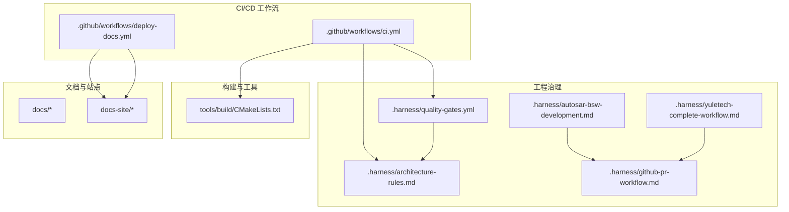
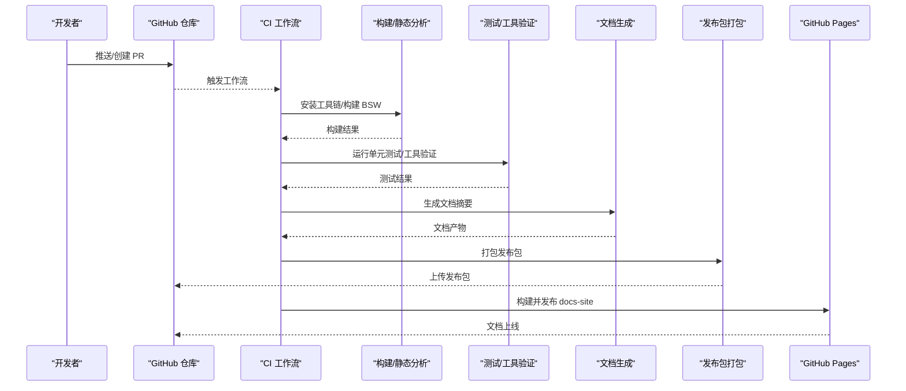
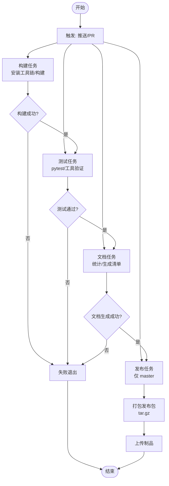
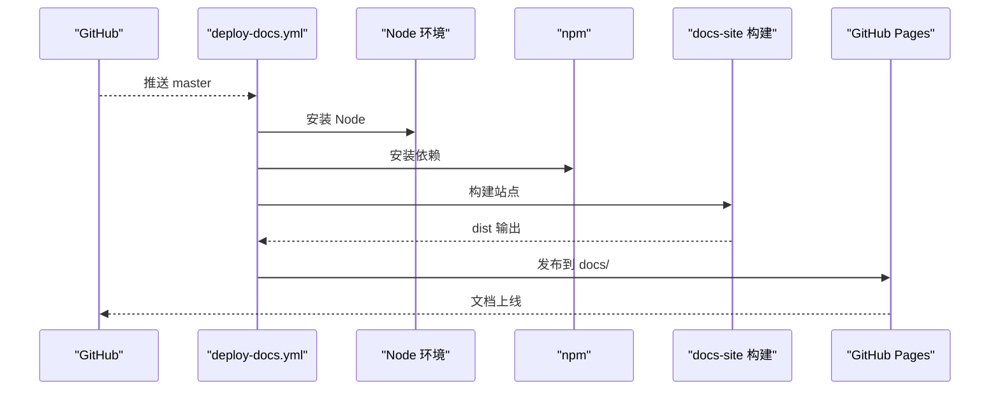
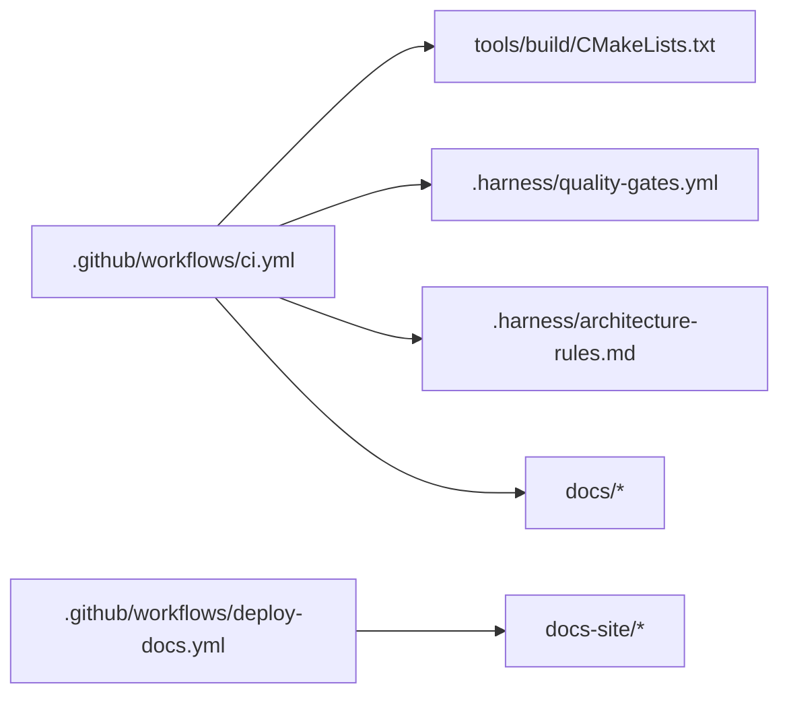

# 部署与发布

<cite>
**本文引用的文件**
- [ci.yml](file://.github/workflows/ci.yml)
- [deploy-docs.yml](file://.github/workflows/deploy-docs.yml)
- [质量门禁配置](file://.harness/quality-gates.yml)
- [完整项目开发工作流](file://.harness/yuletech-complete-workflow.md)
- [GitHub PR 工作流](file://.harness/github-pr-workflow.md)
- [架构约束规则](file://.harness/architecture-rules.md)
- [AutoSAR BSW 开发 Skill](file://.harness/autosar-bsw-development.md)
- [CMake 构建配置](file://tools/build/CMakeLists.txt)
- [项目总览](file://README.md)
- [开发指南](file://docs/development-guide.md)
- [架构文档](file://docs/architecture.md)
- [版本历史](file://docs/changelog.md)
</cite>

## 目录
1. [简介](#简介)
2. [项目结构](#项目结构)
3. [核心组件](#核心组件)
4. [架构总览](#架构总览)
5. [详细组件分析](#详细组件分析)
6. [依赖分析](#依赖分析)
7. [性能考量](#性能考量)
8. [故障排查指南](#故障排查指南)
9. [结论](#结论)
10. [附录](#附录)

## 简介
本文件面向 YuleTech BSW 平台的部署与发布，系统化梳理 CI/CD 流水线、版本管理与标签规范、发布分支策略、构建环境与依赖管理、测试与文档生成、发布质量与一致性保障、安全与回滚策略，并提供最佳实践与常见问题处理建议。文档同时结合仓库内现有工作流与约束配置，给出可落地的实施步骤。

## 项目结构
仓库采用按“层次/功能”组织的源码与文档结构，配合 GitHub Actions 工作流实现自动化构建、测试、静态分析与文档发布；.harness 目录提供开发流程、质量门禁与架构约束等工程治理规则；tools/build 提供 CMake 构建配置；docs 与 docs-site 分别承载静态文档与站点构建。

图表来源
- [.github/workflows/ci.yml](file://.github/workflows/ci.yml)
- [.github/workflows/deploy-docs.yml](file://.github/workflows/deploy-docs.yml)
- [.harness/quality-gates.yml](file://.harness/quality-gates.yml)
- [.harness/architecture-rules.md](file://.harness/architecture-rules.md)
- [.harness/autosar-bsw-development.md](file://.harness/autosar-bsw-development.md)
- [.harness/github-pr-workflow.md](file://.harness/github-pr-workflow.md)
- [.harness/yuletech-complete-workflow.md](file://.harness/yuletech-complete-workflow.md)
- [tools/build/CMakeLists.txt](file://tools/build/CMakeLists.txt)
- [docs/*](file://docs/architecture.md)

章节来源
- [.github/workflows/ci.yml](file://.github/workflows/ci.yml)
- [.github/workflows/deploy-docs.yml](file://.github/workflows/deploy-docs.yml)
- [.harness/quality-gates.yml](file://.harness/quality-gates.yml)
- [.harness/architecture-rules.md](file://.harness/architecture-rules.md)
- [.harness/autosar-bsw-development.md](file://.harness/autosar-bsw-development.md)
- [.harness/github-pr-workflow.md](file://.harness/github-pr-workflow.md)
- [.harness/yuletech-complete-workflow.md](file://.harness/yuletech-complete-workflow.md)
- [tools/build/CMakeLists.txt](file://tools/build/CMakeLists.txt)
- [docs/architecture.md](file://docs/architecture.md)

## 核心组件
- CI 工作流（ci.yml）
  - 触发：master/develop 推送与 master PR
  - 步骤：Python 环境准备、ARM GCC 安装、BSW 构建、静态分析、上传分析报告、单元测试与工具验证、文档生成与上传、发布包打包与上传
- 文档发布工作流（deploy-docs.yml）
  - 触发：master 推送
  - 步骤：Node 环境准备、npm 安装、构建 docs-site、发布到 GitHub Pages 的 docs 目录
- 质量门禁（quality-gates.yml）
  - 静态分析、MISRA C:2012、复杂度、代码风格、覆盖率、安全检查、架构检查、文档检查、提交门禁、报告与通知、忽略模式
- 构建配置（CMakeLists.txt）
  - C99 标准、编译选项、包含路径、源文件集合、库目标、安装规则、版本宏
- 开发与发布流程（Skill 与工作流）
  - 完整项目开发工作流、GitHub PR 工作流、AutoSAR BSW 开发 Skill、架构约束规则

章节来源
- [.github/workflows/ci.yml](file://.github/workflows/ci.yml)
- [.github/workflows/deploy-docs.yml](file://.github/workflows/deploy-docs.yml)
- [.harness/quality-gates.yml](file://.harness/quality-gates.yml)
- [tools/build/CMakeLists.txt](file://tools/build/CMakeLists.txt)
- [.harness/yuletech-complete-workflow.md](file://.harness/yuletech-complete-workflow.md)
- [.harness/github-pr-workflow.md](file://.harness/github-pr-workflow.md)
- [.harness/architecture-rules.md](file://.harness/architecture-rules.md)

## 架构总览
下图展示从代码提交到发布产物的端到端流程，包括 CI 构建、测试与静态分析、文档生成与发布、以及发布包打包。

图表来源
- [.github/workflows/ci.yml](file://.github/workflows/ci.yml)
- [.github/workflows/deploy-docs.yml](file://.github/workflows/deploy-docs.yml)

章节来源
- [.github/workflows/ci.yml](file://.github/workflows/ci.yml)
- [.github/workflows/deploy-docs.yml](file://.github/workflows/deploy-docs.yml)

## 详细组件分析

### CI 工作流（ci.yml）解析
- 触发策略
  - master/develop 分支推送触发构建
  - master PR 触发测试
- 任务拆分
  - build：安装 Python 与 ARM GCC，使用 CMake 与工具链构建 BSW
  - test：安装 pytest，编译单元测试，验证配置工具与代码生成工具
  - documentation：统计代码行、生成模块清单，上传 docs 产物
  - release：仅在 master 分支，打包 src/docs/examples/tools 与根级 README/License，生成带 SHA 截断的压缩包并上传为制品
- 质量门禁
  - 静态分析报告中错误数阈值控制（示例），可与质量门禁配置联动

图表来源
- [.github/workflows/ci.yml](file://.github/workflows/ci.yml)

章节来源
- [.github/workflows/ci.yml](file://.github/workflows/ci.yml)

### 文档发布工作流（deploy-docs.yml）解析
- 触发：master 推送
- 步骤：安装 Node 与缓存、安装依赖、构建 docs-site、使用 GitHub Pages Action 发布到 docs 目录
- 产出：在线文档站点

图表来源
- [.github/workflows/deploy-docs.yml](file://.github/workflows/deploy-docs.yml)

章节来源
- [.github/workflows/deploy-docs.yml](file://.github/workflows/deploy-docs.yml)

### 质量门禁与架构约束
- 质量门禁（quality-gates.yml）
  - 静态分析：cppcheck，启用多项检查与抑制
  - MISRA C:2012：必遵守与建议规则清单
  - 复杂度：圈复杂度、函数/文件行数、参数数量、嵌套深度上限
  - 代码风格：命名、格式、注释要求
  - 覆盖率：MCAL/Service/Utility 各指标
  - 安全检查：缓冲区溢出、空指针、整数溢出、use-after-free、格式化字符串等
  - 架构检查：分层依赖、禁止循环依赖、接口使用、禁止直接硬件访问
  - 文档检查：文件头、函数/类型/宏注释要求
  - 提交门禁：编译、静态分析、单元测试、覆盖率检查
  - 报告与通知：HTML/XML/JSON 报告格式、邮件通知
  - 忽略模式：第三方、生成物、测试桩、模板文件、TODO/FIXME/AUTOSAR
- 架构约束规则（architecture-rules.md）
  - 分层定义与依赖规则（上层可依赖下层、禁止循环依赖、通过标准接口）
  - AutoSAR 合规（标准类型、错误处理、配置与代码分离）
  - 安全规则（指针/数组/初始化检查）
  - 测试规则（TDD、覆盖率、命名）
  - 工具链规则（代码生成、配置验证）

章节来源
- [.harness/quality-gates.yml](file://.harness/quality-gates.yml)
- [.harness/architecture-rules.md](file://.harness/architecture-rules.md)

### 构建与依赖管理（CMake）
- C99 标准、编译选项（警告、优化）
- 包含路径：common、MCAL、ECUAL、Service、RTE 头文件
- 源文件集合：按层聚合
- 目标：bsw 静态库，安装头文件与库
- 版本宏：BSW_VERSION_* 宏注入

章节来源
- [tools/build/CMakeLists.txt](file://tools/build/CMakeLists.txt)

### 版本管理与发布分支策略
- 版本历史与编号规则（语义化版本）
- 发布计划（短期/中期/长期）
- 发布分支建议
  - develop：日常集成与预发布测试
  - master：稳定发布分支，仅合并经审查的 PR
  - hotfix/*：紧急修复分支，从 master 切出，修复后回并至 master 与 develop
- 标签规范
  - 语义化版本标签：v1.0.0、v1.1.0、v1.1.1、v2.0.0
  - 与发布包命名一致（SHA 截断）

章节来源
- [docs/changelog.md](file://docs/changelog.md)
- [.harness/yuletech-complete-workflow.md](file://.harness/yuletech-complete-workflow.md)
- [.harness/github-pr-workflow.md](file://.harness/github-pr-workflow.md)

### 测试集成与覆盖率
- 单元测试：pytest、GCC 编译单测
- 集成测试：模块间交互验证
- 覆盖率：Make 目标与报告查看
- 质量门禁：覆盖率阈值与检查

章节来源
- [.github/workflows/ci.yml](file://.github/workflows/ci.yml)
- [docs/development-guide.md](file://docs/development-guide.md)
- [.harness/quality-gates.yml](file://.harness/quality-gates.yml)

### 文档生成与站点发布
- CI 文档任务：统计 LOC、生成模块清单
- 站点构建：docs-site 使用 npm 与 Vite 构建
- 发布：GitHub Pages，目标目录 docs

章节来源
- [.github/workflows/ci.yml](file://.github/workflows/ci.yml)
- [.github/workflows/deploy-docs.yml](file://.github/workflows/deploy-docs.yml)

### 发布流程自动化
- CI release 任务：复制 src/docs/examples/tools 与根级文件，打包 tar.gz
- Artifacts：静态分析报告、文档、发布包
- 与质量门禁联动：静态分析错误数阈值、覆盖率检查

章节来源
- [.github/workflows/ci.yml](file://.github/workflows/ci.yml)
- [.harness/quality-gates.yml](file://.harness/quality-gates.yml)

## 依赖分析
- 组件耦合
  - CI 工作流依赖构建配置（CMake）、质量门禁规则、文档站点配置
  - 文档发布依赖 Node 生态与 GitHub Pages Action
- 外部依赖
  - ARM GCC、Python、pytest、Node/npm、GitHub Actions Runner 环境
- 潜在风险
  - 工具链版本升级导致的兼容性问题
  - 质量门禁规则变更引发的阻断

图表来源
- [.github/workflows/ci.yml](file://.github/workflows/ci.yml)
- [.github/workflows/deploy-docs.yml](file://.github/workflows/deploy-docs.yml)
- [tools/build/CMakeLists.txt](file://tools/build/CMakeLists.txt)
- [.harness/quality-gates.yml](file://.harness/quality-gates.yml)
- [.harness/architecture-rules.md](file://.harness/architecture-rules.md)
- [docs/*](file://docs/architecture.md)

章节来源
- [.github/workflows/ci.yml](file://.github/workflows/ci.yml)
- [.github/workflows/deploy-docs.yml](file://.github/workflows/deploy-docs.yml)
- [tools/build/CMakeLists.txt](file://tools/build/CMakeLists.txt)
- [.harness/quality-gates.yml](file://.harness/quality-gates.yml)
- [.harness/architecture-rules.md](file://.harness/architecture-rules.md)

## 性能考量
- 构建性能
  - 并行编译：make -j$(nproc)
  - 工具链缓存与依赖缓存（Actions cache）
- 测试性能
  - 单元测试隔离与快速反馈
  - 覆盖率生成与报告定位热点
- 文档站点
  - 构建缓存与增量构建（npm ci 与缓存配置）

## 故障排查指南
- 构建失败
  - 检查 ARM GCC 安装与工具链文件路径
  - 核对 CMake 配置与包含路径
- 静态分析失败
  - 对照质量门禁规则，逐项修正
  - 关注抑制列表与忽略模式
- 测试失败
  - 单元测试编译与运行日志
  - 覆盖率检查与阈值对比
- 文档发布失败
  - Node 版本与依赖安装
  - GitHub Pages 发布权限与目标目录
- 发布包缺失
  - 确认 master 分支触发与打包步骤
  - 检查上传 Artifacts

章节来源
- [.github/workflows/ci.yml](file://.github/workflows/ci.yml)
- [.github/workflows/deploy-docs.yml](file://.github/workflows/deploy-docs.yml)
- [.harness/quality-gates.yml](file://.harness/quality-gates.yml)

## 结论
本仓库已具备完善的 CI/CD 自动化能力：构建、测试、静态分析、文档生成与发布包打包均通过 GitHub Actions 实现；质量门禁与架构约束为发布质量提供制度保障。建议在现有基础上进一步完善标签与分支策略、增强发布前门禁检查、固化发布回滚流程，并持续优化构建与测试性能。

## 附录
- 开发与协作流程
  - 完整项目开发工作流、GitHub PR 工作流、AutoSAR BSW 开发 Skill
- 架构与设计
  - 分层架构、模块交互、接口定义、设计原则、安全与扩展性
- 版本与发布
  - 版本历史、编号规则、发布计划、发布分支与标签规范

章节来源
- [.harness/yuletech-complete-workflow.md](file://.harness/yuletech-complete-workflow.md)
- [.harness/github-pr-workflow.md](file://.harness/github-pr-workflow.md)
- [.harness/autosar-bsw-development.md](file://.harness/autosar-bsw-development.md)
- [docs/architecture.md](file://docs/architecture.md)
- [docs/changelog.md](file://docs/changelog.md)
- [README.md](file://README.md)