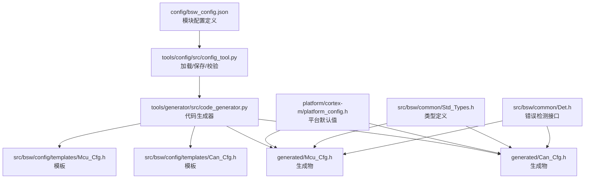
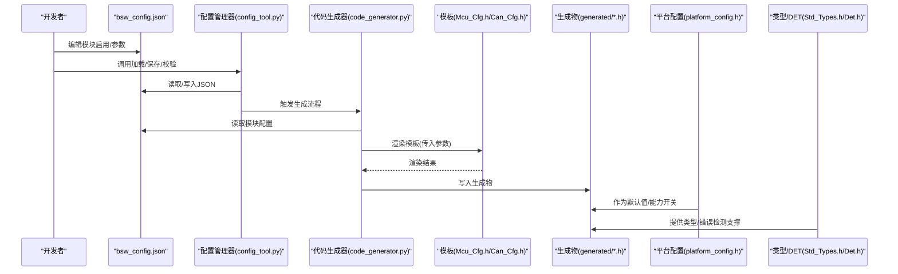
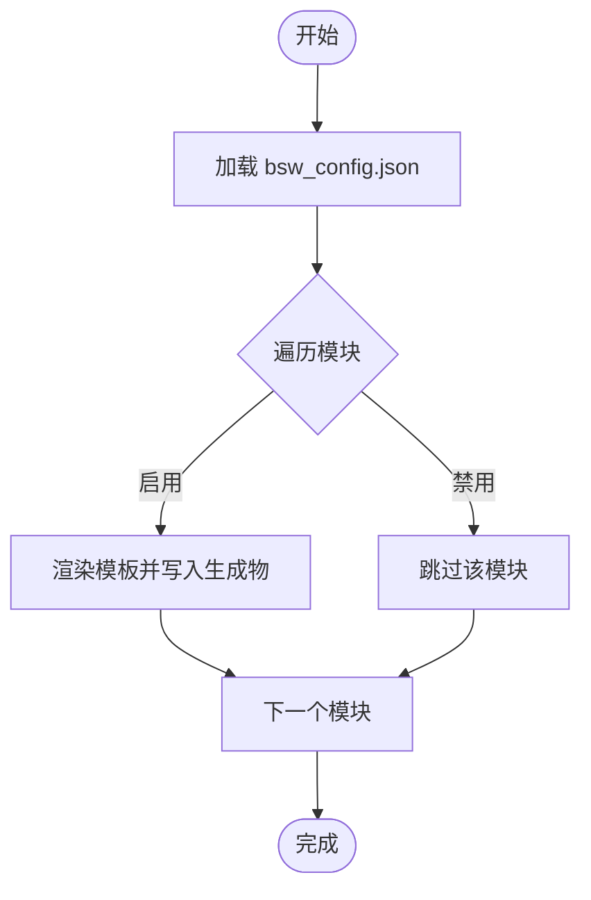
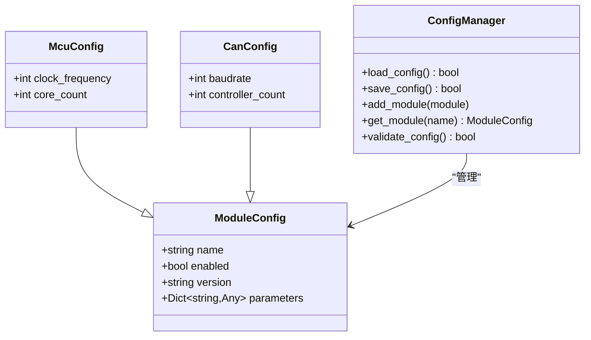
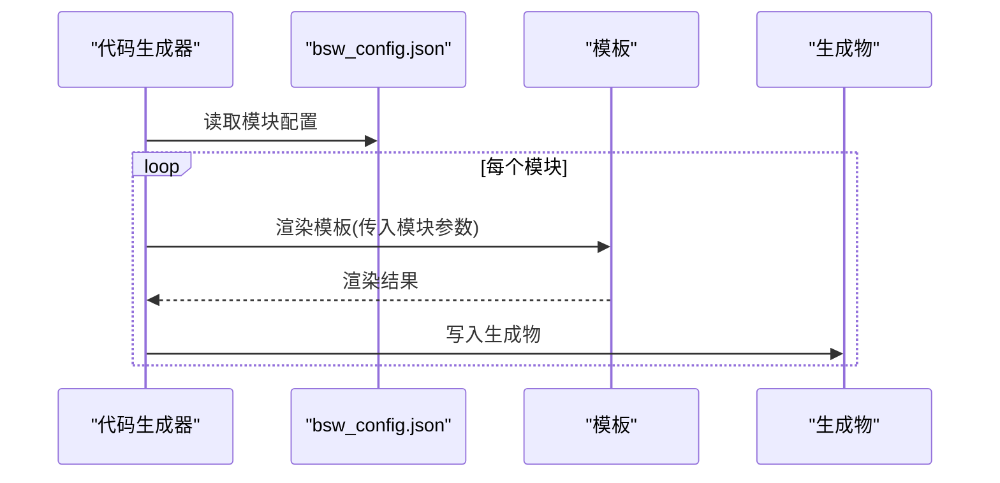
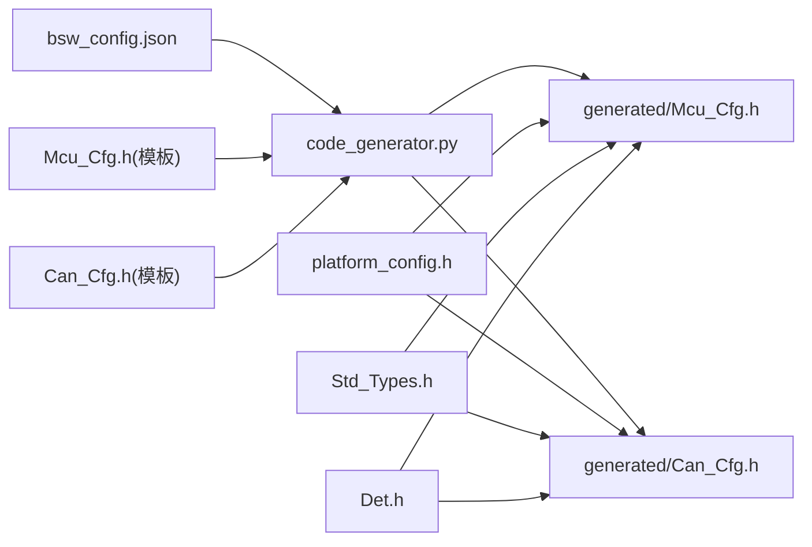

# 配置管理

<cite>
**本文引用的文件**
- [bsw_config.json](file://config/bsw_config.json)
- [platform_config.h](file://platform/cortex-m/platform_config.h)
- [config_tool.py](file://tools/config/src/config_tool.py)
- [code_generator.py](file://tools/generator/src/code_generator.py)
- [Mcu_Cfg.h（模板）](file://src/bsw/config/templates/Mcu_Cfg.h)
- [Can_Cfg.h（模板）](file://src/bsw/config/templates/Can_Cfg.h)
- [Mcu_Cfg.h（生成物）](file://generated/Mcu_Cfg.h)
- [Can_Cfg.h（生成物）](file://generated/Can_Cfg.h)
- [Std_Types.h](file://src/bsw/common/Std_Types.h)
- [Det.h](file://src/bsw/common/Det.h)
- [rte_generator.py](file://tools/rte_generator/rte_generator.py)
- [example_config.json](file://tools/rte_generator/example_config.json)
- [README.md](file://README.md)
</cite>

## 目录
1. [简介](#简介)
2. [项目结构](#项目结构)
3. [核心组件](#核心组件)
4. [架构总览](#架构总览)
5. [详细组件分析](#详细组件分析)
6. [依赖分析](#依赖分析)
7. [性能考虑](#性能考虑)
8. [故障排查指南](#故障排查指南)
9. [结论](#结论)
10. [附录](#附录)

## 简介
本文件面向YuleTech BSW平台的配置管理，系统化阐述配置系统的数据模型、生成流程与运行期集成方式。重点包括：
- bsw_config.json的配置文件格式与参数语义
- 平台特定配置platform_config.h的设计与作用域
- 模块配置模板与代码生成工具链的协作机制
- 配置参数的层次结构、继承与覆盖策略
- 配置验证规则、默认值处理与错误检测
- 最佳实践、性能影响与调试技巧
- 如何通过配置实现灵活定制与多平台支持

## 项目结构
配置相关的关键位置与职责如下：
- 配置定义与生成
  - config/bsw_config.json：顶层配置文件，描述模块启用状态、版本与参数
  - tools/config/src/config_tool.py：配置加载、保存、校验与默认值处理
  - tools/generator/src/code_generator.py：根据配置生成各模块的配置头文件
  - generated/：生成的模块配置头文件输出目录
- 平台特定配置
  - platform/cortex-m/platform_config.h：针对Cortex-M系列的平台级宏与默认值
- 模板与类型支撑
  - src/bsw/config/templates/*.h：模块配置模板（如Mcu_Cfg.h、Can_Cfg.h）
  - src/bsw/common/Std_Types.h、src/bsw/common/Det.h：类型与错误检测支撑
- 运行时环境配置生成
  - tools/rte_generator/rte_generator.py、tools/rte_generator/example_config.json：RTE层配置生成工具与示例

**图示来源**
- [bsw_config.json:1-21](file://config/bsw_config.json#L1-L21)
- [config_tool.py:48-124](file://tools/config/src/config_tool.py#L48-L124)
- [code_generator.py:59-153](file://tools/generator/src/code_generator.py#L59-L153)
- [Mcu_Cfg.h（模板）:1-69](file://src/bsw/config/templates/Mcu_Cfg.h#L1-L69)
- [Can_Cfg.h（模板）:1-57](file://src/bsw/config/templates/Can_Cfg.h#L1-L57)
- [Mcu_Cfg.h（生成物）:1-19](file://generated/Mcu_Cfg.h#L1-L19)
- [Can_Cfg.h（生成物）:1-19](file://generated/Can_Cfg.h#L1-L19)
- [Std_Types.h:11-117](file://src/bsw/common/Std_Types.h#L11-L117)
- [Det.h:11-76](file://src/bsw/common/Det.h#L11-L76)
- [platform_config.h:12-307](file://platform/cortex-m/platform_config.h#L12-L307)

**章节来源**
- [README.md:153-199](file://README.md#L153-L199)

## 核心组件
- 配置文件模型（bsw_config.json）
  - 版本字段：用于追踪配置版本
  - 模块集合：每个模块包含名称、启用标志、版本、参数对象以及模块特定参数
  - 示例模块：Mcu（时钟频率、核心数）、Can（波特率、控制器数量）
- 配置管理器（config_tool.py）
  - 加载：从JSON读取模块配置，按模块类型实例化对应配置对象
  - 保存：序列化模块配置回JSON
  - 校验：确保启用模块具备必要字段（如版本）
  - 默认值：未显式提供的模块参数使用模块类型的默认值
- 代码生成器（code_generator.py）
  - 解析配置：读取bsw_config.json
  - 条件生成：仅对启用的模块生成配置头文件
  - 模板渲染：使用Jinja2模板填充模块参数
  - 输出：写入generated/目录下的模块配置头文件
- 平台配置（platform_config.h）
  - 提供平台默认值与能力开关，作为生成物的补充或覆盖依据
  - 例如：系统时钟、中断优先级位宽、内联/汇编指令等
- 类型与错误检测（Std_Types.h、Det.h）
  - Std_Types.h：统一的数据类型与版本信息常量
  - Det.h：错误上报接口，用于配置阶段的错误检测与报告

**章节来源**
- [bsw_config.json:1-21](file://config/bsw_config.json#L1-L21)
- [config_tool.py:15-124](file://tools/config/src/config_tool.py#L15-L124)
- [code_generator.py:59-153](file://tools/generator/src/code_generator.py#L59-L153)
- [platform_config.h:12-307](file://platform/cortex-m/platform_config.h#L12-L307)
- [Std_Types.h:11-117](file://src/bsw/common/Std_Types.h#L11-L117)
- [Det.h:11-76](file://src/bsw/common/Det.h#L11-L76)

## 架构总览
下图展示从配置定义到生成物落地的端到端流程，以及平台默认值与类型支撑的作用点。

**图示来源**
- [bsw_config.json:1-21](file://config/bsw_config.json#L1-L21)
- [config_tool.py:48-124](file://tools/config/src/config_tool.py#L48-L124)
- [code_generator.py:59-153](file://tools/generator/src/code_generator.py#L59-L153)
- [Mcu_Cfg.h（模板）:1-69](file://src/bsw/config/templates/Mcu_Cfg.h#L1-L69)
- [Can_Cfg.h（模板）:1-57](file://src/bsw/config/templates/Can_Cfg.h#L1-L57)
- [Mcu_Cfg.h（生成物）:1-19](file://generated/Mcu_Cfg.h#L1-L19)
- [Can_Cfg.h（生成物）:1-19](file://generated/Can_Cfg.h#L1-L19)
- [platform_config.h:12-307](file://platform/cortex-m/platform_config.h#L12-L307)
- [Std_Types.h:11-117](file://src/bsw/common/Std_Types.h#L11-L117)
- [Det.h:11-76](file://src/bsw/common/Det.h#L11-L76)

## 详细组件分析

### 配置文件模型与层次结构
- 顶层结构
  - version：配置版本号
  - modules：模块集合，键为模块名，值为模块配置对象
- 模块配置对象
  - name：模块名
  - enabled：是否启用
  - version：模块版本
  - parameters：预留扩展参数对象
  - 模块特定参数：如Mcu的clock_frequency、core_count；Can的baudrate、controller_count
- 层次与继承
  - 逻辑上存在“平台默认值”与“模块参数”的分层：平台默认值在platform_config.h中定义，模块参数在bsw_config.json中定义
  - 生成阶段，模块配置头文件直接采用bsw_config.json中的模块参数进行渲染，不引入跨模块继承关系
- 覆盖机制
  - 生成器按模块参数直接渲染，若模块未启用则跳过生成
  - 平台默认值可通过宏重定义在构建时覆盖（例如SYSTEM_CLOCK_FREQ、SRAM_SIZE等）

**图示来源**
- [bsw_config.json:1-21](file://config/bsw_config.json#L1-L21)
- [code_generator.py:67-153](file://tools/generator/src/code_generator.py#L67-L153)

**章节来源**
- [bsw_config.json:1-21](file://config/bsw_config.json#L1-L21)
- [platform_config.h:74-119](file://platform/cortex-m/platform_config.h#L74-L119)

### 配置管理器（加载/保存/校验）
- 加载流程
  - 读取JSON并遍历modules
  - 根据模块名选择对应配置类（如McuConfig、CanConfig），未识别模块使用通用ModuleConfig
  - 将JSON中的键值映射到配置对象属性（仅映射已存在的属性）
- 保存流程
  - 将模块配置序列化为JSON，写回bsw_config.json
- 校验规则
  - 对启用的模块，要求version非空
- 默认值处理
  - 未提供参数时使用配置类的默认值（如McuConfig的clock_frequency、core_count；CanConfig的baudrate、controller_count）

**图示来源**
- [config_tool.py:15-124](file://tools/config/src/config_tool.py#L15-L124)

**章节来源**
- [config_tool.py:48-124](file://tools/config/src/config_tool.py#L48-L124)

### 代码生成器（模板渲染与生成）
- 输入：bsw_config.json
- 逻辑
  - 逐模块读取配置
  - 若模块未启用，则跳过生成
  - 使用Jinja2模板渲染，参数来自模块配置对象
  - 输出至generated/目录，文件名为<模块名>_Cfg.h
- 模板与参数
  - Mcu_Cfg.h模板：clock_frequency、core_count
  - Can_Cfg.h模板：baudrate、controller_count
- 生成物
  - generated/Mcu_Cfg.h
  - generated/Can_Cfg.h

**图示来源**
- [code_generator.py:59-153](file://tools/generator/src/code_generator.py#L59-L153)
- [Mcu_Cfg.h（模板）:1-69](file://src/bsw/config/templates/Mcu_Cfg.h#L1-L69)
- [Can_Cfg.h（模板）:1-57](file://src/bsw/config/templates/Can_Cfg.h#L1-L57)
- [Mcu_Cfg.h（生成物）:1-19](file://generated/Mcu_Cfg.h#L1-L19)
- [Can_Cfg.h（生成物）:1-19](file://generated/Can_Cfg.h#L1-L19)

**章节来源**
- [code_generator.py:59-153](file://tools/generator/src/code_generator.py#L59-L153)

### 平台特定配置（platform_config.h）
- 作用
  - 定义平台默认值与能力开关，作为生成物的补充或在构建时被覆盖
  - 提供与Cortex-M系列相关的宏定义（如核心类型、FPU/MPU/DSP支持、内存基地址与大小、时钟频率、NVIC优先级位数、SysTick配置、编译器抽象与内联汇编等）
- 与生成物的关系
  - 生成物中的模块配置头文件（如Mcu_Cfg.h、Can_Cfg.h）直接采用bsw_config.json中的模块参数
  - platform_config.h中的默认值可在构建时通过宏重定义进行覆盖，从而影响最终二进制

**章节来源**
- [platform_config.h:12-307](file://platform/cortex-m/platform_config.h#L12-L307)

### 类型与错误检测支撑（Std_Types.h、Det.h）
- Std_Types.h
  - 定义标准数据类型与版本信息常量，供生成物与模块使用
- Det.h
  - 提供错误上报接口与服务ID、错误码定义，用于配置阶段的错误检测与报告

**章节来源**
- [Std_Types.h:11-117](file://src/bsw/common/Std_Types.h#L11-L117)
- [Det.h:11-76](file://src/bsw/common/Det.h#L11-L76)

### 运行时环境配置生成（RTE）
- 工具与输入
  - tools/rte_generator/rte_generator.py：根据JSON配置生成RTE接口代码
  - tools/rte_generator/example_config.json：示例配置，描述软件组件、端口与接口
- 生成内容
  - 为每个软件组件生成头文件与源文件，包含API原型、宏定义、缓冲区与辅助函数
- 与配置管理的关系
  - 该工具专注于RTE层的代码生成，与bsw_config.json的模块配置生成工具互补，共同构成配置到代码的完整链路

**章节来源**
- [rte_generator.py:180-701](file://tools/rte_generator/rte_generator.py#L180-L701)
- [example_config.json:1-128](file://tools/rte_generator/example_config.json#L1-L128)

## 依赖分析
- 配置文件到生成器
  - bsw_config.json是生成器的唯一输入，生成器据此渲染模板并输出模块配置头文件
- 生成器到模板
  - 生成器依赖模板文件（Mcu_Cfg.h、Can_Cfg.h）进行渲染
- 生成物到平台配置
  - 平台配置头文件提供默认值与能力开关，可在构建时被覆盖
- 类型与错误检测
  - Std_Types.h与Det.h为生成物提供类型与错误检测支撑

**图示来源**
- [bsw_config.json:1-21](file://config/bsw_config.json#L1-L21)
- [code_generator.py:59-153](file://tools/generator/src/code_generator.py#L59-L153)
- [Mcu_Cfg.h（模板）:1-69](file://src/bsw/config/templates/Mcu_Cfg.h#L1-L69)
- [Can_Cfg.h（模板）:1-57](file://src/bsw/config/templates/Can_Cfg.h#L1-L57)
- [Mcu_Cfg.h（生成物）:1-19](file://generated/Mcu_Cfg.h#L1-L19)
- [Can_Cfg.h（生成物）:1-19](file://generated/Can_Cfg.h#L1-L19)
- [platform_config.h:12-307](file://platform/cortex-m/platform_config.h#L12-L307)
- [Std_Types.h:11-117](file://src/bsw/common/Std_Types.h#L11-L117)
- [Det.h:11-76](file://src/bsw/common/Det.h#L11-L76)

**章节来源**
- [code_generator.py:59-153](file://tools/generator/src/code_generator.py#L59-L153)
- [platform_config.h:74-119](file://platform/cortex-m/platform_config.h#L74-L119)

## 性能考虑
- 生成器开销
  - JSON解析与模板渲染为轻量操作，通常在毫秒级完成
  - 仅对启用的模块生成配置头文件，避免无效I/O
- 平台默认值的影响
  - platform_config.h中的默认值在编译期生效，不会引入运行时开销
  - 通过宏重定义覆盖平台默认值时需谨慎，确保与硬件规格一致
- 类型与错误检测
  - Std_Types.h与Det.h为头文件级声明，不引入额外运行时成本
  - DET仅在开发/调试阶段启用，生产版本可通过编译选项关闭

[本节为通用指导，无需列出具体文件来源]

## 故障排查指南
- 配置加载失败
  - 检查bsw_config.json语法与字段完整性
  - 确认模块名与配置类匹配（如Mcu、Can）
- 生成失败
  - 确认模板文件存在且路径正确
  - 检查模块启用状态与参数是否齐全
- 默认值与期望不符
  - 检查platform_config.h中的默认值是否被宏覆盖
  - 在构建脚本中确认宏重定义顺序与范围
- 类型或错误检测问题
  - 确保Std_Types.h与Det.h在编译路径中可用
  - 检查生成物是否包含必要的类型与错误检测接口

**章节来源**
- [config_tool.py:56-82](file://tools/config/src/config_tool.py#L56-L82)
- [code_generator.py:67-76](file://tools/generator/src/code_generator.py#L67-L76)
- [platform_config.h:74-119](file://platform/cortex-m/platform_config.h#L74-L119)
- [Std_Types.h:11-117](file://src/bsw/common/Std_Types.h#L11-L117)
- [Det.h:11-76](file://src/bsw/common/Det.h#L11-L76)

## 结论
YuleTech BSW平台的配置管理以bsw_config.json为核心，结合配置管理器与代码生成器，实现了从配置到模块配置头文件的自动化生成。平台特定配置通过platform_config.h提供默认值与能力开关，并可在构建时被覆盖。配合Std_Types.h与Det.h，系统在保证AutoSAR兼容性的同时，提供了清晰的层次结构、明确的覆盖机制与完善的错误检测支撑。通过合理使用配置与模板，可灵活实现系统定制与多平台支持。

[本节为总结性内容，无需列出具体文件来源]

## 附录

### 配置参数与默认值对照表
- Mcu模块
  - clock_frequency：模块参数；默认值见配置类
  - core_count：模块参数；默认值见配置类
- Can模块
  - baudrate：模块参数；默认值见配置类
  - controller_count：模块参数；默认值见配置类
- 平台默认值（platform_config.h）
  - SYSTEM_CLOCK_FREQ、AHB_CLOCK_FREQ、APB1_CLOCK_FREQ、APB2_CLOCK_FREQ
  - NVIC_PRIO_BITS、NVIC_MAX_IRQ
  - SYSTICK_CLKSOURCE、DEBUG_ENABLE、DEBUG_UART_BAUDRATE
  - 编译器抽象与内联汇编宏

**章节来源**
- [config_tool.py:28-46](file://tools/config/src/config_tool.py#L28-L46)
- [platform_config.h:74-167](file://platform/cortex-m/platform_config.h#L74-L167)