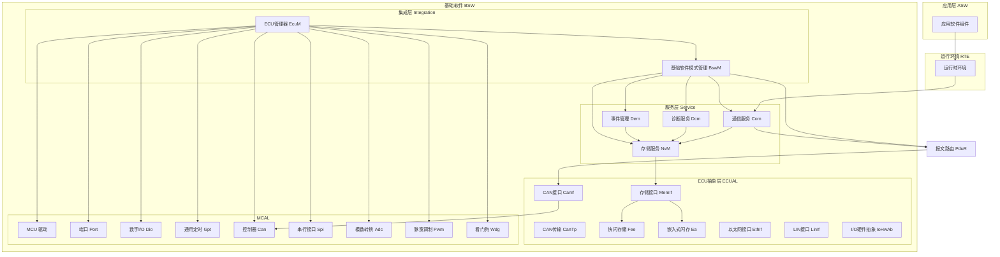
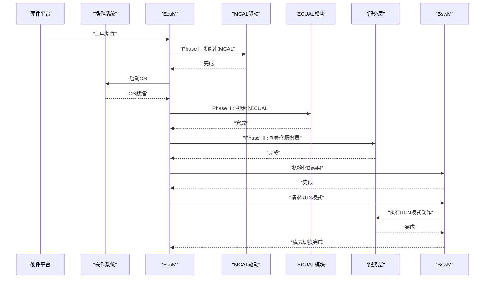
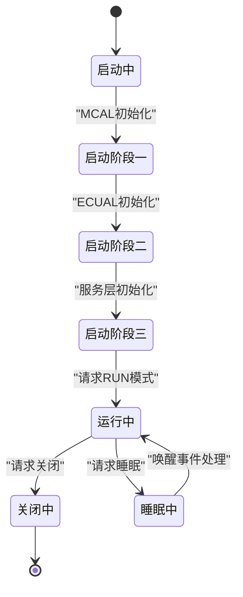
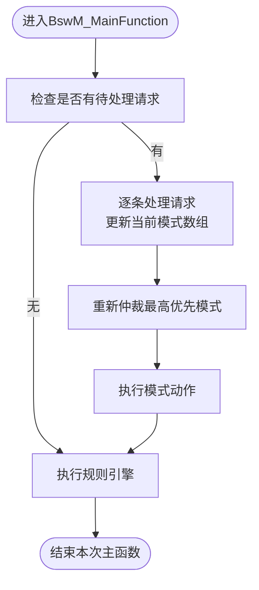
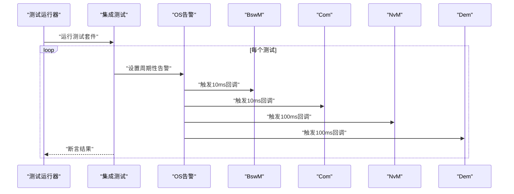
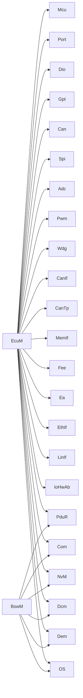

# 集成层

<cite>
**本文引用的文件**   
- [BswM.h](file://src/bsw/services/bswm/include/BswM.h)
- [BswM.c](file://src/bsw/services/bswm/src/BswM.c)
- [EcuM.h](file://src/bsw/services/ecum/include/EcuM.h)
- [EcuM.c](file://src/bsw/services/ecum/src/EcuM.c)
- [integration_test.c](file://tests/integration/bsw/integration_test.c)
- [integration_test_cfg.h](file://tests/integration/integration_test_cfg.h)
- [test_runner.c](file://tests/integration/bsw/test_runner.c)
- [BswM_test.c](file://tests/integration/bsw/BswM_test.c)
- [EcuM_test.c](file://tests/integration/bsw/EcuM_test.c)
- [bsw_config.json](file://config/bsw_config.json)
- [spec.md](file://openspec/specs/bsw/spec.md)
- [Mcu_Cfg.h](file://src/bsw/config/templates/Mcu_Cfg.h)
- [Can_Cfg.h](file://src/bsw/config/templates/Can_Cfg.h)
- [Com_Cfg.h](file://src/bsw/config/templates/Com_Cfg.h)
</cite>

## 目录
1. [简介](#简介)
2. [项目结构](#项目结构)
3. [核心组件](#核心组件)
4. [架构总览](#架构总览)
5. [详细组件分析](#详细组件分析)
6. [依赖关系分析](#依赖关系分析)
7. [性能考量](#性能考量)
8. [故障排查指南](#故障排查指南)
9. [结论](#结论)
10. [附录](#附录)

## 简介
本文件面向集成层（BSWM基础软件模式管理器与ECUM ECU管理器）提供全面技术文档，涵盖系统启动流程、模式切换机制、电源管理模式、故障恢复策略、集成测试框架设计与用例实现、配置参数与回调机制、状态管理、初始化序列、运行时监控与异常处理等。目标是帮助开发者快速理解并正确使用集成层，确保各软件模块协同工作与系统级资源管理。

## 项目结构
集成层位于基础软件（BSW）的顶层，负责系统级状态机与模式管理，并协调MCAL、ECUAL、Service层及OS的初始化与运行。关键文件如下：
- 集成层模块：BswM.h/c、EcuM.h/c
- 集成测试：integration_test.c、integration_test_cfg.h、test_runner.c
- 单元测试：BswM_test.c、EcuM_test.c
- 配置与规范：bsw_config.json、Mcu_Cfg.h、Can_Cfg.h、Com_Cfg.h、spec.md

图表来源
- [EcuM.c:13-52](file://src/bsw/services/ecum/src/EcuM.c#L13-L52)
- [BswM.c:23-51](file://src/bsw/services/bswm/src/BswM.c#L23-L51)

章节来源
- [EcuM.c:13-52](file://src/bsw/services/ecum/src/EcuM.c#L13-L52)
- [BswM.c:23-51](file://src/bsw/services/bswm/src/BswM.c#L23-L51)

## 核心组件
- EcuM（ECU管理器）：负责系统启动阶段（MCAL/ECUAL/Service）的分阶段初始化与运行状态管理；支持请求睡眠/关闭；处理唤醒事件；维护内部状态机。
- BswM（基础软件模式管理器）：在系统运行后根据用户请求与规则执行模式仲裁与动作，协调通信、路由与存储等服务进入对应模式（RUN/SHUTDOWN/SLEEP等）。

章节来源
- [EcuM.h:13-220](file://src/bsw/services/ecum/include/EcuM.h#L13-L220)
- [EcuM.c:13-52](file://src/bsw/services/ecum/src/EcuM.c#L13-L52)
- [BswM.h:13-185](file://src/bsw/services/bswm/include/BswM.h#L13-L185)
- [BswM.c:23-51](file://src/bsw/services/bswm/src/BswM.c#L23-L51)

## 架构总览
集成层通过EcuM完成系统启动与状态管理，随后由BswM进行模式仲裁与动作执行，贯穿通信、路由、存储、诊断与事件管理等服务层模块。

图表来源
- [EcuM.c:252-342](file://src/bsw/services/ecum/src/EcuM.c#L252-L342)
- [BswM.c:103-172](file://src/bsw/services/bswm/src/BswM.c#L103-L172)

## 详细组件分析

### EcuM（ECU管理器）
- 启动流程
  - Phase I：MCAL初始化顺序严格遵循依赖关系（MCU→时钟→PLL→PORT→GPT→CAN→SPI→ADC→PWM→WDG），随后启动OS。
  - Phase II：ECUAL初始化（CanIf、CanTp、MemIf、Fee、Ea、EthIf、LinIf、IoHwAb）。
  - Phase III：服务层初始化（PduR、Com、NvM、Dcm、Dem），最后初始化BswM并请求RUN模式。
- 关闭流程
  - 先服务层反初始化（逆序），再ECUAL反初始化，最后MCAL反初始化，并关闭OS。
- 睡眠与唤醒
  - 支持请求睡眠与睡眠模式选择；维护待处理与已验证唤醒事件队列；提供清除接口。
- 状态机
  - 内部子状态包括StartupOne/Two/Three、AppRun、AppPostRun、Shutdown、Sleep、WakeSleep等。

图表来源
- [EcuM.c:79-90](file://src/bsw/services/ecum/src/EcuM.c#L79-L90)
- [EcuM.c:461-485](file://src/bsw/services/ecum/src/EcuM.c#L461-L485)

章节来源
- [EcuM.h:70-124](file://src/bsw/services/ecum/include/EcuM.h#L70-L124)
- [EcuM.c:140-228](file://src/bsw/services/ecum/src/EcuM.c#L140-L228)
- [EcuM.c:279-342](file://src/bsw/services/ecum/src/EcuM.c#L279-L342)
- [EcuM.c:461-485](file://src/bsw/services/ecum/src/EcuM.c#L461-L485)

### BswM（基础软件模式管理器）
- 模式与用户
  - 模式：STARTUP、RUN、POST_RUN、SHUTDOWN、SLEEP；用户：ECU_STATE、COMMUNICATION、DIAGNOSTIC、STORAGE、IO_CONTROL、MODE_MANAGER、WATCHDOG、APPLICATION。
- 队列与仲裁
  - 请求队列（固定大小）缓存来自不同用户的模式请求；仲裁采用“数值优先”策略，高数值模式胜出。
- 动作执行
  - RUN：启用通信I-PDU组与PDU路由；SHUTDOWN：停止通信I-PDU组与PDU路由，并触发写入待处理块；SLEEP：准备通信睡眠并禁用路由。
- 规则引擎
  - 支持条件函数与真/假动作列表，周期性执行以响应系统条件变化。
- 主函数
  - 处理队列中的请求、执行仲裁结果的动作、周期性执行规则。

图表来源
- [BswM.c:324-362](file://src/bsw/services/bswm/src/BswM.c#L324-L362)
- [BswM.c:218-249](file://src/bsw/services/bswm/src/BswM.c#L218-L249)

章节来源
- [BswM.h:68-118](file://src/bsw/services/bswm/include/BswM.h#L68-L118)
- [BswM.c:103-172](file://src/bsw/services/bswm/src/BswM.c#L103-L172)
- [BswM.c:180-197](file://src/bsw/services/bswm/src/BswM.c#L180-L197)
- [BswM.c:218-249](file://src/bsw/services/bswm/src/BswM.c#L218-L249)
- [BswM.c:324-362](file://src/bsw/services/bswm/src/BswM.c#L324-L362)

### 集成测试框架与用例
- 测试框架
  - 使用轻量测试框架与自定义宏组织用例；提供统一入口test_runner.c。
  - 集成测试通过大量Mock替换真实模块，模拟OS、MCAL、ECUAL、Service与BswM行为，验证跨层交互。
- 关键用例
  - 端到端CAN信号路径验证、NVM启动恢复、诊断请求端到端、模式切换（BswM/EcuM）、OS告警循环调度。
- 配置与覆盖
  - integration_test_cfg.h提供测试专用配置（较小的信号/IPDU/NVM块数量等），便于快速验证。

图表来源
- [test_runner.c:27-39](file://tests/integration/bsw/test_runner.c#L27-L39)
- [integration_test.c:493-514](file://tests/integration/bsw/integration_test.c#L493-L514)

章节来源
- [integration_test.c:12-800](file://tests/integration/bsw/integration_test.c#L12-L800)
- [integration_test_cfg.h:12-101](file://tests/integration/integration_test_cfg.h#L12-L101)
- [test_runner.c:12-40](file://tests/integration/bsw/test_runner.c#L12-L40)

## 依赖关系分析
- EcuM依赖
  - MCAL：Mcu、Port、Dio、Gpt、Can、Spi、Adc、Pwm、Wdg
  - ECUAL：CanIf、CanTp、MemIf、Fee、Ea、EthIf、LinIf、IoHwAb
  - Service：PduR、Com、NvM、Dcm、Dem
  - OS：StartOS、ShutdownOS
- BswM依赖
  - Service：Com、PduR、NvM、Dcm、Dem
  - OS：周期性主函数调度（通过OS告警）

图表来源
- [EcuM.c:24-51](file://src/bsw/services/ecum/src/EcuM.c#L24-L51)
- [BswM.c:23-28](file://src/bsw/services/bswm/src/BswM.c#L23-L28)

章节来源
- [EcuM.c:24-51](file://src/bsw/services/ecum/src/EcuM.c#L24-L51)
- [BswM.c:23-28](file://src/bsw/services/bswm/src/BswM.c#L23-L28)

## 性能考量
- 启动阶段
  - 严格按依赖顺序初始化MCAL，避免后续模块因时钟/外设未就绪导致失败。
  - Phase II/III分阶段初始化，降低首次启动时间与内存占用峰值。
- 模式切换
  - BswM采用固定大小请求队列与仲裁算法，保证在高频请求下仍可稳定执行。
  - 主函数周期性处理，避免阻塞OS调度。
- 通信与存储
  - Com/PduR/NvM等服务层模块的主函数周期通过OS告警精确控制，满足实时性需求。

## 故障排查指南
- 启动失败
  - 检查EcuM启动阶段调用顺序是否被中断；确认StartOS是否被正确调用且返回。
  - 核对MCAL初始化返回值与配置项（如时钟、PLL、端口）。
- 模式切换异常
  - 确认BswM初始化与配置指针有效；检查请求用户与模式范围；查看主函数是否被周期性调度。
  - 若动作未生效，检查Com/PduR/NvM等服务层初始化与回调。
- 关闭/睡眠问题
  - 关闭流程需严格按逆序执行；若OS未关闭，检查ShutdownOS调用与返回路径。
  - 睡眠模式需确保通信与路由处于预期状态，避免唤醒事件丢失。
- 测试验证
  - 使用集成测试覆盖端到端路径与边界条件；利用Mock隔离外部依赖，定位问题模块。

章节来源
- [EcuM_test.c:304-456](file://tests/integration/bsw/EcuM_test.c#L304-L456)
- [BswM_test.c:116-306](file://tests/integration/bsw/BswM_test.c#L116-L306)

## 结论
集成层通过EcuM与BswM实现了从硬件到服务层的系统级编排：前者负责启动、状态与电源管理，后者负责模式仲裁与动作执行。配合完善的集成测试框架与清晰的配置模板，可确保系统在复杂场景下的稳定性与可维护性。

## 附录

### 配置参数与回调机制
- EcuM配置类型
  - 包含MCAL/PORT/BswM配置指针、默认应用模式、默认关机目标与睡眠模式。
- BswM配置类型
  - 规则数组与规则数量；请求队列大小、用户数量、规则数量等预编译参数。
- 回调机制
  - OS通过告警回调触发各模块主函数；BswM通过服务层回调执行模式动作（通信、路由、存储等）。

章节来源
- [EcuM.h:104-124](file://src/bsw/services/ecum/include/EcuM.h#L104-L124)
- [BswM.h:114-129](file://src/bsw/services/bswm/include/BswM.h#L114-L129)
- [integration_test.c:493-514](file://tests/integration/bsw/integration_test.c#L493-L514)

### 系统初始化序列与运行时监控
- 初始化序列
  - EcuM_Init → EcuM_StartupOne（MCAL）→ EcuM_StartupTwo（ECUAL）→ EcuM_StartupThree（Service/BswM）。
- 运行时监控
  - EcuM_MainFunction周期处理唤醒事件、睡眠请求与关闭请求；BswM_MainFunction周期处理请求队列与规则执行。

章节来源
- [EcuM.c:252-342](file://src/bsw/services/ecum/src/EcuM.c#L252-L342)
- [EcuM.c:461-485](file://src/bsw/services/ecum/src/EcuM.c#L461-L485)
- [BswM.c:324-362](file://src/bsw/services/bswm/src/BswM.c#L324-L362)

### 故障恢复策略
- 启动恢复
  - 通过NvM在启动阶段恢复非易失数据；在RUN模式下保持通信与路由可用。
- 关闭恢复
  - 在关闭阶段写入所有待处理块，确保数据一致性；随后按逆序反初始化。
- 唤醒恢复
  - 唤醒事件验证后进入运行态；支持清除无效事件，防止误唤醒。

章节来源
- [BswM.c:118-128](file://src/bsw/services/bswm/src/BswM.c#L118-L128)
- [EcuM.c:178-228](file://src/bsw/services/ecum/src/EcuM.c#L178-L228)
- [EcuM.c:233-241](file://src/bsw/services/ecum/src/EcuM.c#L233-L241)

### 配置示例与模板
- BSW配置（JSON）
  - 示例包含Mcu与Can模块的基本参数（时钟频率、控制器数量、波特率等）。
- 预编译配置模板
  - Mcu_Cfg.h：时钟、RAM扇区、模式、复位原因等。
  - Can_Cfg.h：控制器数量、ID类型、波特率等。
  - Com_Cfg.h：信号/IPDU数量、传输模式、字节序、主函数周期等。

章节来源
- [bsw_config.json:1-21](file://config/bsw_config.json#L1-L21)
- [Mcu_Cfg.h:12-69](file://src/bsw/config/templates/Mcu_Cfg.h#L12-L69)
- [Can_Cfg.h:12-57](file://src/bsw/config/templates/Can_Cfg.h#L12-L57)
- [Com_Cfg.h:12-129](file://src/bsw/config/templates/Com_Cfg.h#L12-L129)