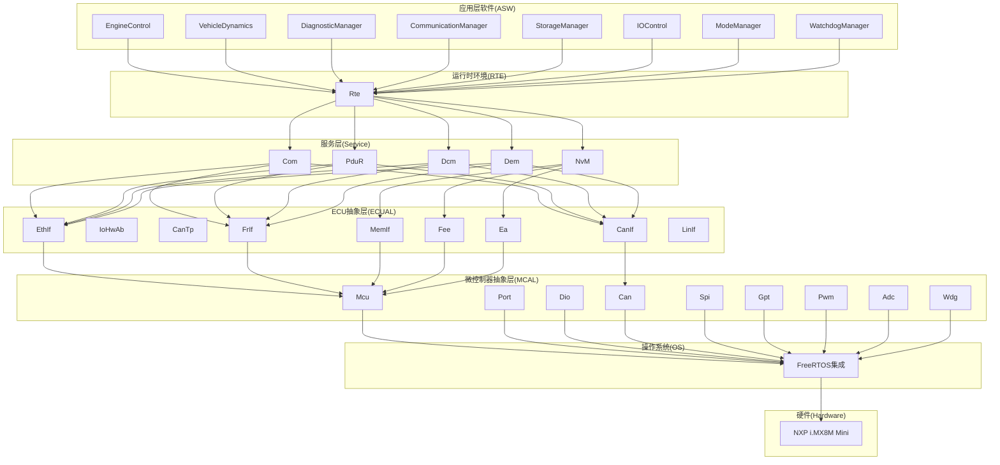
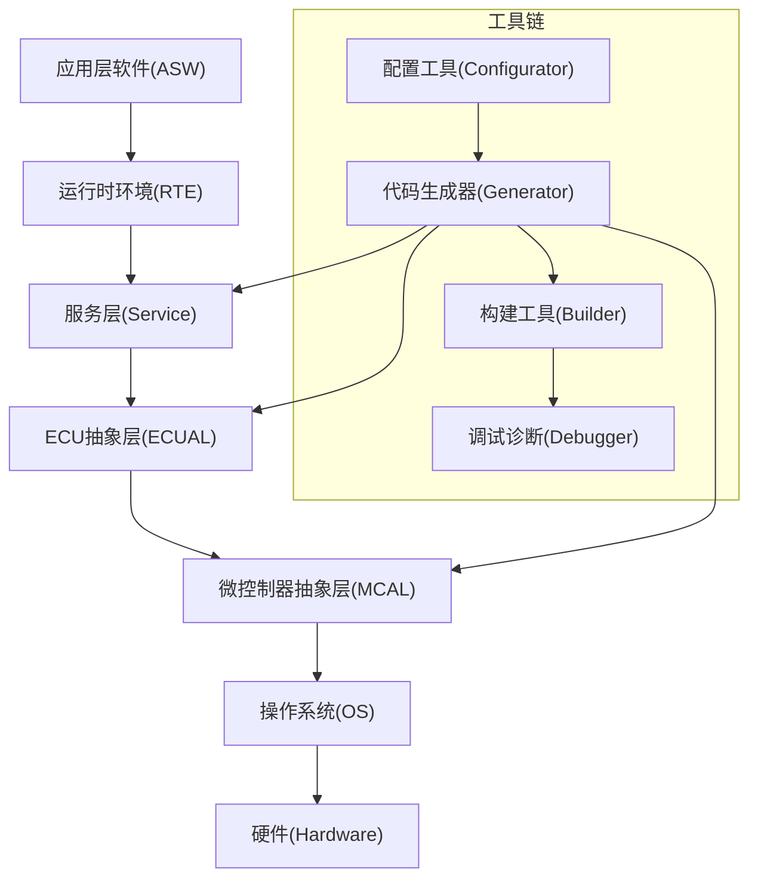
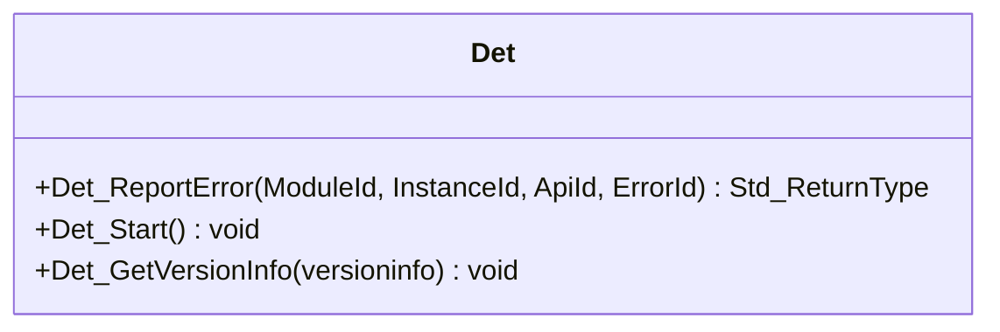
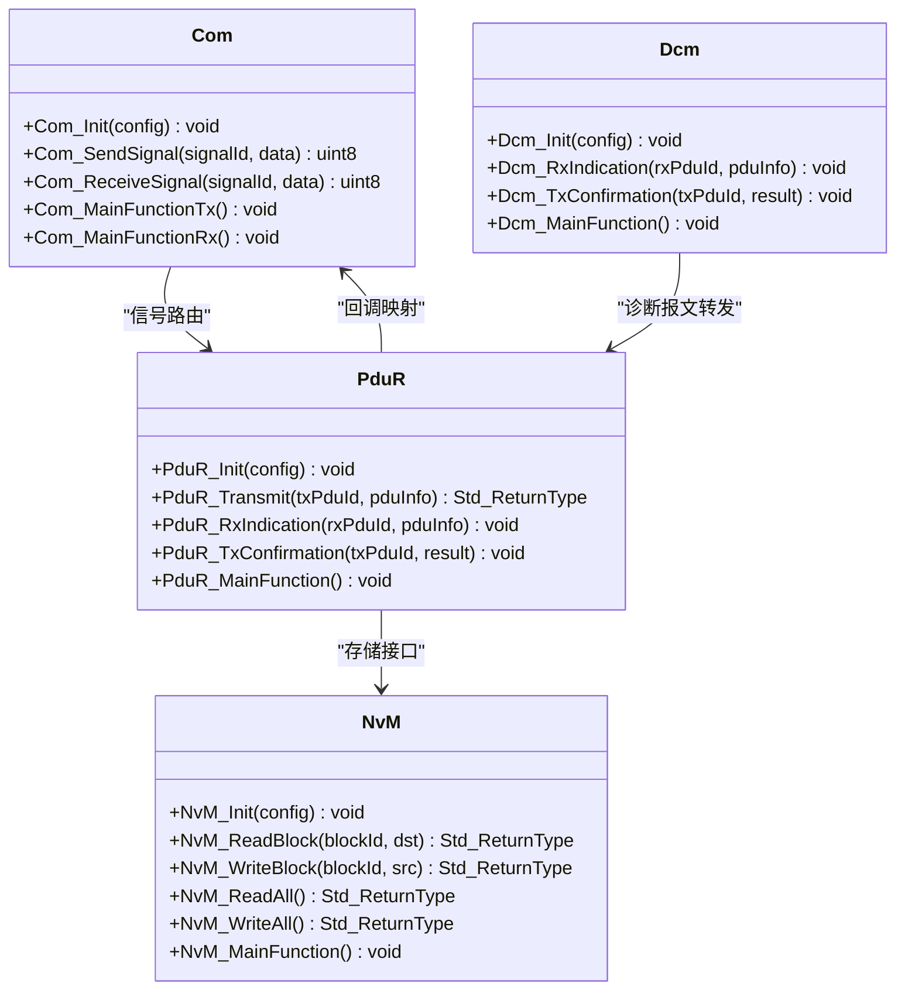
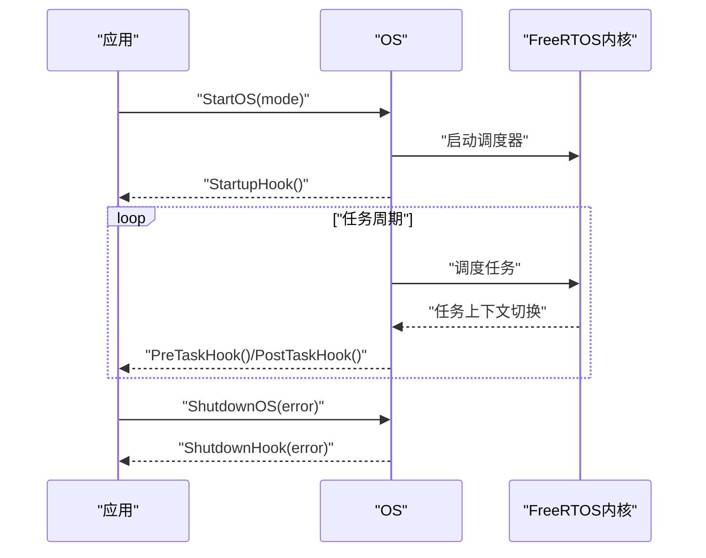
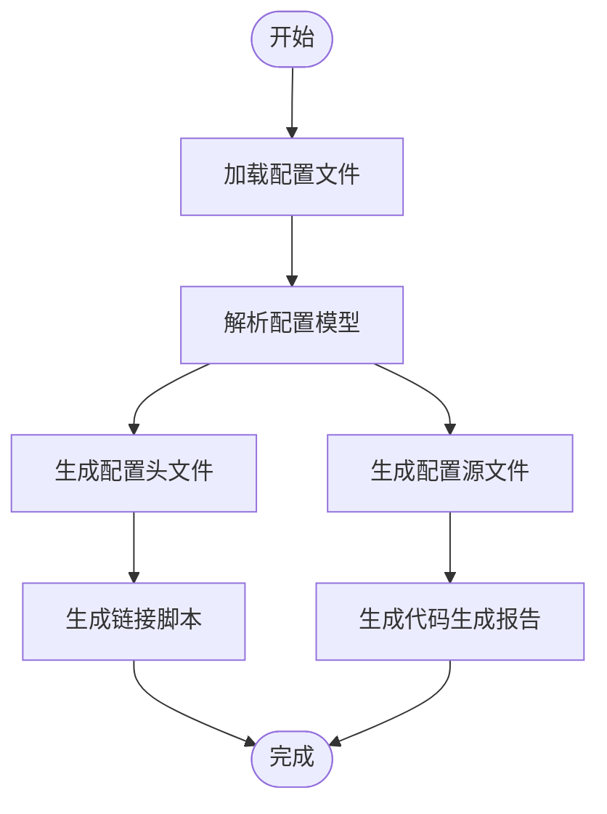

# 项目概览

<cite>
**本文引用的文件**
- [README.md](file://README.md)
- [bsw_config.json](file://config/bsw_config.json)
- [spec.md](file://openspec/specs/bsw/spec.md)
- [spec.md](file://openspec/specs/toolchain/spec.md)
- [development-guide.md](file://docs/development-guide.md)
- [bsw_integration_verification.md](file://verification/bsw_integration_verification.md)
- [code_generator.py](file://tools/generator/src/code_generator.py)
- [Det.h](file://src/bsw/common/Det.h)
- [Os.h](file://src/bsw/os/include/Os.h)
- [Com.h](file://src/bsw/services/com/include/Com.h)
- [PduR.h](file://src/bsw/services/pdur/include/PduR.h)
- [NvM.h](file://src/bsw/services/nvm/include/NvM.h)
- [Dcm.h](file://src/bsw/services/dcm/include/Dcm.h)
- [platform_config.h](file://platform/cortex-m/platform_config.h)
- [README.md](file://examples/README.md)
</cite>

## 目录
1. [简介](#简介)
2. [项目结构](#项目结构)
3. [核心组件](#核心组件)
4. [架构总览](#架构总览)
5. [详细组件分析](#详细组件分析)
6. [依赖关系分析](#依赖关系分析)
7. [性能考量](#性能考量)
8. [故障排查指南](#故障排查指南)
9. [结论](#结论)
10. [附录](#附录)

## 简介
YuleTech AutoSAR BSW平台是面向NXP i.MX8M Mini处理器的开源AutoSAR Classic Platform 4.x基础软件平台，提供从MCAL到应用层的完整基础软件栈实现。项目旨在降低汽车基础软件开发门槛，通过标准化的模块化架构、完善的工具链与活跃的社区生态，为中国汽车软件产业提供可复用、可移植、可验证的高质量基础软件。

- 项目愿景：成为工程师的合作伙伴，提供基于AutoSAR标准的开源基础软件、便捷工具链与技术社区，赋能中国汽车软件产业。
- 支持硬件：NXP i.MX8M Mini（四核ARM Cortex-A53），支持CAN、以太网、LIN等车载网络。
- 核心价值主张：完整分层实现、严格遵循AutoSAR 4.x标准、完备的错误检测与内存分区、可配置的代码生成与工具链、可验证的集成质量。

**章节来源**
- [README.md:32-93](file://README.md#L32-L93)
- [README.md:40-45](file://README.md#L40-L45)
- [README.md:36-38](file://README.md#L36-L38)

## 项目结构
项目采用“分层架构 + 模块化实现”的组织方式，涵盖MCAL、ECUAL、Service、OS、RTE与ASW六大层级，并配套OpenSpec规范、工具链与验证体系。

**图表来源**
- [README.md:48-84](file://README.md#L48-L84)
- [bsw_integration_verification.md:15-25](file://verification/bsw_integration_verification.md#L15-L25)
- [spec.md:11-47](file://openspec/specs/bsw/spec.md#L11-L47)

**章节来源**
- [README.md:153-199](file://README.md#L153-L199)
- [bsw_integration_verification.md:15-25](file://verification/bsw_integration_verification.md#L15-L25)

## 核心组件
- MCAL层（9/9）：Mcu、Port、Dio、Can、Spi、Gpt、Pwm、Adc、Wdg，覆盖微控制器、GPIO、ADC、定时器、PWM、CAN、SPI与看门狗等外设驱动。
- ECUAL层（9/9）：CanIf、IoHwAb、CanTp、EthIf、MemIf、Fee、Ea、FrIf、LinIf，提供通信与存储抽象接口。
- 服务层（5/5）：Com、PduR、NvM、Dcm、Dem，实现信号路由、PDU转发、非易失存储、诊断通信与诊断事件管理。
- OS层（1/1）：基于FreeRTOS的AutoSAR OS实现，提供任务、资源、事件、报警与中断管理。
- RTE层（1/1）：运行时环境，负责组件间通信与调度。
- ASW层（8/8）：应用层软件组件，包括引擎控制、车辆动力学、诊断管理、通信管理、存储管理、IO控制、模式管理与看门狗管理。

**章节来源**
- [README.md:201-246](file://README.md#L201-L246)
- [bsw_integration_verification.md:29-118](file://verification/bsw_integration_verification.md#L29-L118)

## 架构总览
YuleTech BSW平台严格遵循AutoSAR Classic Platform 4.x分层架构，采用“自底向上”的模块化设计，确保各层职责清晰、耦合度低、可移植性强。平台支持基于配置的代码生成，结合DET错误检测与MemMap内存分区，满足功能安全与质量要求。

**图表来源**
- [spec.md:11-47](file://openspec/specs/bsw/spec.md#L11-L47)
- [spec.md:13-31](file://openspec/specs/toolchain/spec.md#L13-L31)

**章节来源**
- [spec.md:11-47](file://openspec/specs/bsw/spec.md#L11-L47)
- [spec.md:13-31](file://openspec/specs/toolchain/spec.md#L13-L31)

## 详细组件分析

### 通用组件：DET与MemMap
- DET（Development Error Tracer）：提供统一的错误上报接口与服务ID/错误码定义，贯穿所有模块，便于开发期与生产期的错误追踪与诊断。
- MemMap：通过内存分区宏实现代码、常量、变量等段的精确划分，满足AutoSAR对内存布局的要求。

**图表来源**
- [Det.h:48-73](file://src/bsw/common/Det.h#L48-L73)

**章节来源**
- [Det.h:14-76](file://src/bsw/common/Det.h#L14-L76)
- [development-guide.md:312-333](file://docs/development-guide.md#L312-L333)

### 服务层组件
- Com（通信服务）：提供信号路由、I-PDU收发与回调接口，支持周期/触发等传输模式与信号组管理。
- PduR（PDU路由器）：实现PDU路径配置、直接/FIFO/网关路由与上层回调映射。
- NvM（非易失存储管理）：提供块读写、冗余管理、CRC校验、写保护与一次性写等能力。
- Dcm（诊断通信管理）：实现UDS协议与OBD-II支持，提供会话控制、安全访问、DID/RID读写与事件响应。

**图表来源**
- [Com.h:240-501](file://src/bsw/services/com/include/Com.h#L240-L501)
- [PduR.h:164-279](file://src/bsw/services/pdur/include/PduR.h#L164-L279)
- [NvM.h:187-354](file://src/bsw/services/nvm/include/NvM.h#L187-L354)
- [Dcm.h:277-378](file://src/bsw/services/dcm/include/Dcm.h#L277-L378)

**章节来源**
- [Com.h:14-508](file://src/bsw/services/com/include/Com.h#L14-L508)
- [PduR.h:13-282](file://src/bsw/services/pdur/include/PduR.h#L13-L282)
- [NvM.h:13-355](file://src/bsw/services/nvm/include/NvM.h#L13-L355)
- [Dcm.h:14-379](file://src/bsw/services/dcm/include/Dcm.h#L14-L379)

### OS层组件
- 基于FreeRTOS的AutoSAR OS实现，提供任务管理、资源管理、事件管理、报警管理、中断管理与版本信息查询等API，并支持回调钩子（StartupHook、ShutdownHook、PreTaskHook、PostTaskHook、ErrorHook）。

**图表来源**
- [Os.h:154-210](file://src/bsw/os/include/Os.h#L154-L210)

**章节来源**
- [Os.h:14-213](file://src/bsw/os/include/Os.h#L14-L213)

### 工具链组件
- 配置工具：支持模块可视化配置、参数校验、企标导入与版本管理。
- 代码生成器：解析配置生成C头文件与配置代码，支持增量生成。
- 构建工具：自动生成Makefile，支持GCC/IAR等编译器与CI/CD集成。
- 调试诊断工具：支持日志分析、实时监控与多种诊断接口（CAN/Ethernet/LIN/JTAG）。

**图表来源**
- [spec.md:158-270](file://openspec/specs/toolchain/spec.md#L158-L270)
- [code_generator.py:59-152](file://tools/generator/src/code_generator.py#L59-L152)

**章节来源**
- [spec.md:33-157](file://openspec/specs/toolchain/spec.md#L33-L157)
- [code_generator.py:15-176](file://tools/generator/src/code_generator.py#L15-L176)

### 示例与使用场景
- LED闪烁示例：演示GPIO控制与定时器回调的基本用法。
- CAN通信示例：演示CAN控制器初始化、消息收发与回显机制。
- 使用场景：嵌入式网关、域控制器、仪表集群与ADAS域控等。

**章节来源**
- [README.md:95-133](file://README.md#L95-L133)
- [examples/README.md:7-55](file://examples/README.md#L7-L55)

## 依赖关系分析
- 分层依赖：ASW → RTE → Service → ECUAL → MCAL → OS → Hardware，严格遵循AutoSAR分层约束。
- 模块内聚：各模块内部职责单一，接口清晰；跨模块通过标准接口（如PduR、Com）耦合。
- 外部依赖：FreeRTOS作为OS内核，GCC/IAR作为编译器，CMake作为构建系统，Python用于代码生成。

**图表来源**
- [bsw_integration_verification.md:136-154](file://verification/bsw_integration_verification.md#L136-L154)

**章节来源**
- [bsw_integration_verification.md:136-154](file://verification/bsw_integration_verification.md#L136-L154)

## 性能考量
- 中断与任务调度延迟：中断响应延迟<10μs，任务调度延迟<50μs。
- 通信处理性能：CAN报文处理<100μs。
- 代码质量：遵循MISRA C:2012，静态分析零告警，防御式编程处理运行时错误。
- 可移植性：硬件抽象层清晰，支持主流芯片平台，移植工作量<2人周。

**章节来源**
- [spec.md:238-258](file://openspec/specs/bsw/spec.md#L238-L258)

## 故障排查指南
- 开发环境问题：确认工具链版本与构建系统配置，参考开发指南中的环境配置步骤。
- 配置与生成问题：检查配置文件有效性与生成器输出，确保模块启用状态与参数正确。
- 集成验证问题：依据集成验证报告逐项核对模块状态与API覆盖率。
- 示例问题：LED不亮检查GPIO配置与电源极性；CAN不通检查波特率、终端电阻与总线连接。

**章节来源**
- [development-guide.md:17-81](file://docs/development-guide.md#L17-L81)
- [bsw_integration_verification.md:171-182](file://verification/bsw_integration_verification.md#L171-L182)
- [examples/README.md:149-160](file://examples/README.md#L149-L160)

## 结论
YuleTech AutoSAR BSW平台已完成MCAL、ECUAL、Service、OS、RTE与ASW六层的完整实现，覆盖33个模块/组件，严格遵循AutoSAR Classic Platform 4.x标准，具备完整的错误检测与内存分区支持。平台提供从配置到生成、从构建到调试的全链路工具链，配合详尽的验证报告与示例，为NXP i.MX8M Mini等硬件平台提供可复用、可移植、可验证的基础软件解决方案。

**章节来源**
- [bsw_integration_verification.md:186-193](file://verification/bsw_integration_verification.md#L186-L193)
- [README.md:32-93](file://README.md#L32-L93)

## 附录
- 硬件平台：NXP i.MX8M Mini（四核ARM Cortex-A53），支持CAN、以太网、LIN等车载网络。
- 配置示例：bsw_config.json展示模块启用状态、时钟频率、波特率等关键参数。
- 平台配置：platform_config.h提供Cortex-M系列的通用平台配置模板（适用于Cortex-M目标）。

**章节来源**
- [README.md:40-45](file://README.md#L40-L45)
- [bsw_config.json:1-21](file://config/bsw_config.json#L1-L21)
- [platform_config.h:12-307](file://platform/cortex-m/platform_config.h#L12-L307)