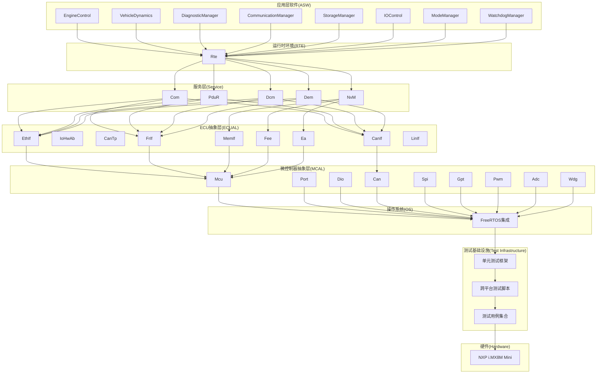
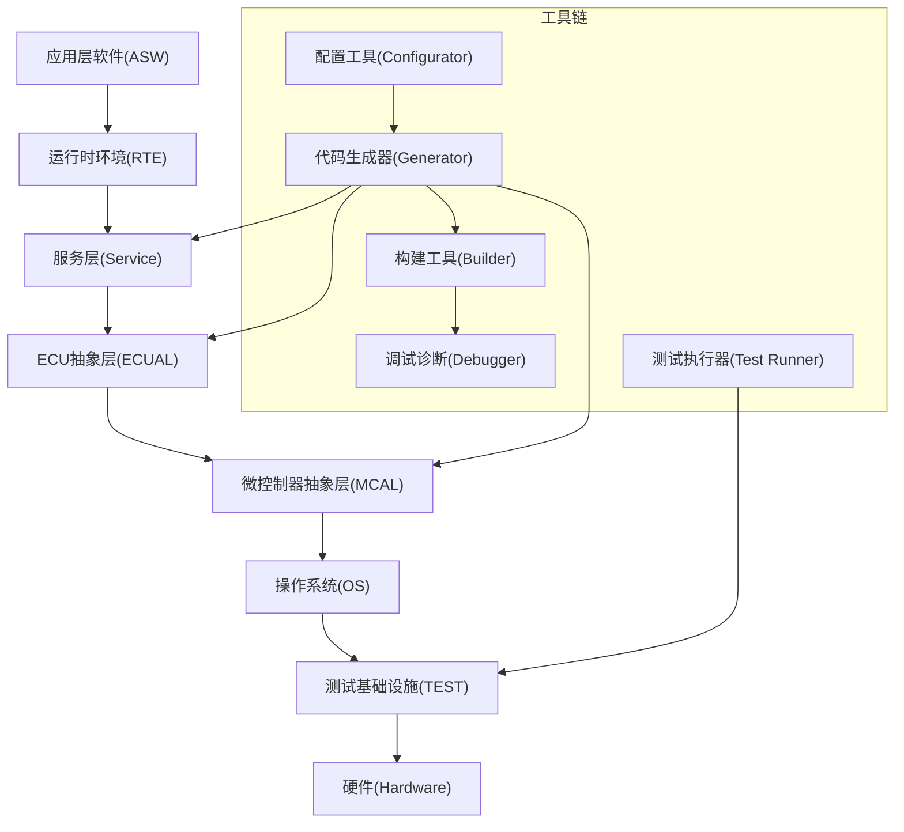
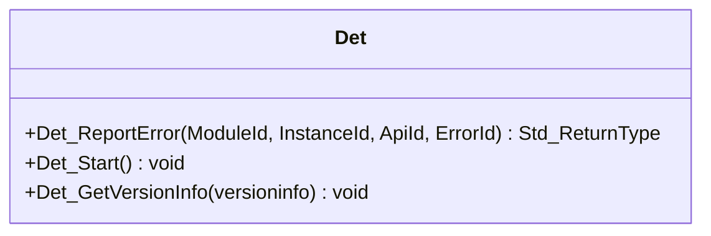
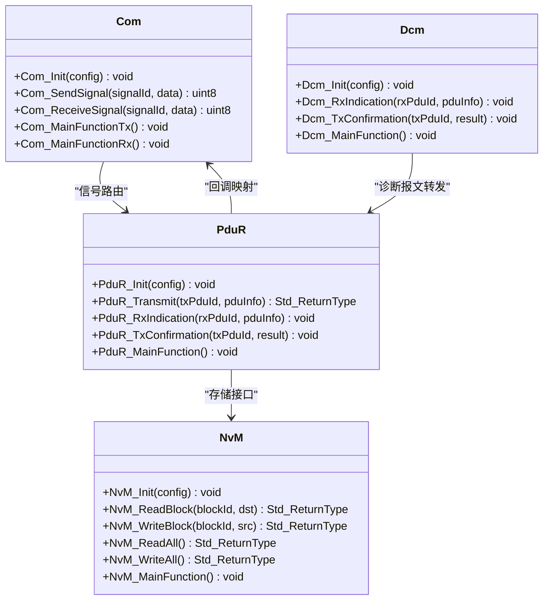
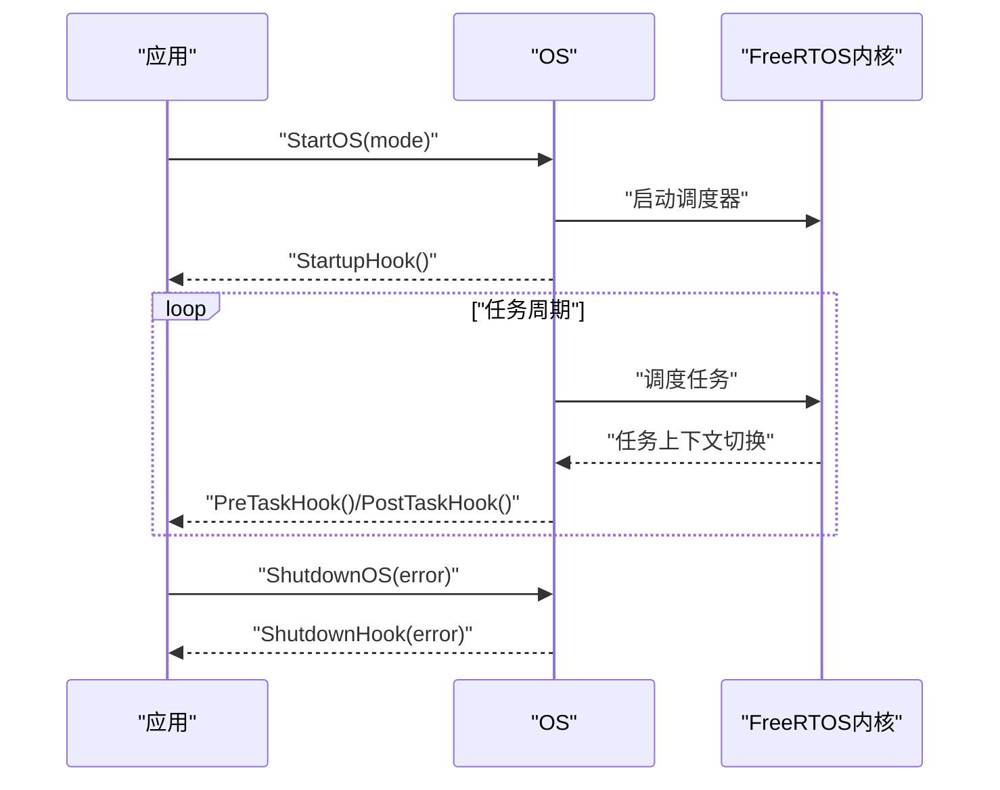
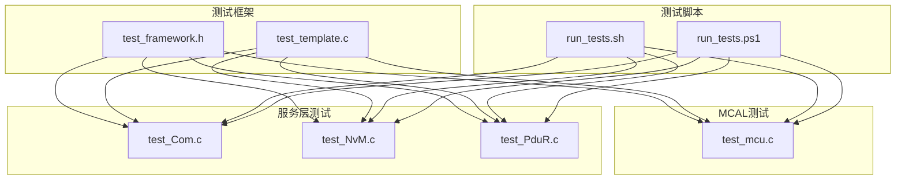
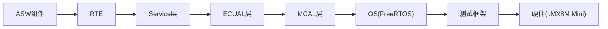

# 项目概览

<cite>
**本文引用的文件**
- [README.md](file://README.md)
- [bsw_config.json](file://config/bsw_config.json)
- [spec.md](file://openspec/specs/bsw/spec.md)
- [spec.md](file://openspec/specs/toolchain/spec.md)
- [development-guide.md](file://docs/development-guide.md)
- [bsw_integration_verification.md](file://verification/bsw_integration_verification.md)
- [code_generator.py](file://tools/generator/src/code_generator.py)
- [Det.h](file://src/bsw/common/Det.h)
- [Os.h](file://src/bsw/os/include/Os.h)
- [Com.h](file://src/bsw/services/com/include/Com.h)
- [PduR.h](file://src/bsw/services/pdur/include/PduR.h)
- [NvM.h](file://src/bsw/services/nvm/include/NvM.h)
- [Dcm.h](file://src/bsw/services/dcm/include/Dcm.h)
- [platform_config.h](file://platform/cortex-m/platform_config.h)
- [README.md](file://examples/README.md)
- [LICENSE](file://LICENSE)
- [run_tests.sh](file://tests/run_tests.sh)
- [run_tests.ps1](file://tests/run_tests.ps1)
- [test_framework.h](file://tests/unit/test_framework.h)
- [test_template.c](file://tests/unit/test_template.c)
- [test_mcu.c](file://tests/unit/test_mcu.c)
- [test_Com.c](file://tests/unit/services/test_Com.c)
- [test_NvM.c](file://tests/unit/services/test_NvM.c)
- [test_PduR.c](file://tests/unit/services/test_PduR.c)
</cite>

## 更新摘要
**所做更改**
- 新增测试基础设施章节，详细介绍单元测试框架和跨平台测试脚本
- 更新质量保证章节，反映完整的测试覆盖和工程质量管理
- 新增开源合规性章节，说明项目的开源许可证和合规性文件
- 更新项目结构图，体现测试相关的目录组织
- 新增测试用例统计和质量指标

## 目录
1. [简介](#简介)
2. [项目结构](#项目结构)
3. [核心组件](#核心组件)
4. [架构总览](#架构总览)
5. [详细组件分析](#详细组件分析)
6. [测试基础设施](#测试基础设施)
7. [质量保证体系](#质量保证体系)
8. [开源合规性](#开源合规性)
9. [依赖关系分析](#依赖关系分析)
10. [性能考量](#性能考量)
11. [故障排查指南](#故障排查指南)
12. [结论](#结论)
13. [附录](#附录)

## 简介
YuleTech AutoSAR BSW平台是面向NXP i.MX8M Mini处理器的开源AutoSAR Classic Platform 4.x基础软件平台，提供从MCAL到应用层的完整基础软件栈实现。项目旨在降低汽车基础软件开发门槛，通过标准化的模块化架构、完善的工具链与活跃的社区生态，为中国汽车软件产业提供可复用、可移植、可验证的高质量基础软件。

- 项目愿景：成为工程师的合作伙伴，提供基于AutoSAR标准的开源基础软件、便捷工具链与技术社区，赋能中国汽车软件产业。
- 支持硬件：NXP i.MX8M Mini（四核ARM Cortex-A53），支持CAN、以太网、LIN等车载网络。
- 核心价值主张：完整分层实现、严格遵循AutoSAR 4.x标准、完备的错误检测与内存分区、可配置的代码生成与工具链、可验证的集成质量、完善的测试基础设施。

**章节来源**
- [README.md:32-93](file://README.md#L32-L93)
- [README.md:40-45](file://README.md#L40-L45)
- [README.md:36-38](file://README.md#L36-L38)

## 项目结构
项目采用"分层架构 + 模块化实现"的组织方式，涵盖MCAL、ECUAL、Service、OS、RTE与ASW六大层级，并配套OpenSpec规范、工具链、验证体系与完整的测试基础设施。

**图表来源**
- [README.md:48-84](file://README.md#L48-L84)
- [bsw_integration_verification.md:15-25](file://verification/bsw_integration_verification.md#L15-L25)
- [spec.md:11-47](file://openspec/specs/bsw/spec.md#L11-L47)

**章节来源**
- [README.md:153-199](file://README.md#L153-L199)
- [bsw_integration_verification.md:15-25](file://verification/bsw_integration_verification.md#L15-L25)

## 核心组件
- MCAL层（9/9）：Mcu、Port、Dio、Can、Spi、Gpt、Pwm、Adc、Wdg，覆盖微控制器、GPIO、ADC、定时器、PWM、CAN、SPI与看门狗等外设驱动。
- ECUAL层（9/9）：CanIf、IoHwAb、CanTp、EthIf、MemIf、Fee、Ea、FrIf、LinIf，提供通信与存储抽象接口。
- 服务层（5/5）：Com、PduR、NvM、Dcm、Dem，实现信号路由、PDU转发、非易失存储、诊断通信与诊断事件管理。
- OS层（1/1）：基于FreeRTOS的AutoSAR OS实现，提供任务、资源、事件、报警与中断管理。
- RTE层（1/1）：运行时环境，负责组件间通信与调度。
- ASW层（8/8）：应用层软件组件，包括引擎控制、车辆动力学、诊断管理、通信管理、存储管理、IO控制、模式管理与看门狗管理。
- **测试层（1/1）**：完整的单元测试框架，包含48个测试用例，支持跨平台测试执行。

**章节来源**
- [README.md:201-246](file://README.md#L201-L246)
- [bsw_integration_verification.md:29-118](file://verification/bsw_integration_verification.md#L29-L118)

## 架构总览
YuleTech BSW平台严格遵循AutoSAR Classic Platform 4.x分层架构，采用"自底向上"的模块化设计，确保各层职责清晰、耦合度低、可移植性强。平台支持基于配置的代码生成，结合DET错误检测与MemMap内存分区，满足功能安全与质量要求。**最新更新**：平台现已配备完整的测试基础设施，确保代码质量和可靠性。

**图表来源**
- [spec.md:11-47](file://openspec/specs/bsw/spec.md#L11-L47)
- [spec.md:13-31](file://openspec/specs/toolchain/spec.md#L13-L31)

**章节来源**
- [spec.md:11-47](file://openspec/specs/bsw/spec.md#L11-L47)
- [spec.md:13-31](file://openspec/specs/toolchain/spec.md#L13-L31)

## 详细组件分析

### 通用组件：DET与MemMap
- DET（Development Error Tracer）：提供统一的错误上报接口与服务ID/错误码定义，贯穿所有模块，便于开发期与生产期的错误追踪与诊断。
- MemMap：通过内存分区宏实现代码、常量、变量等段的精确划分，满足AutoSAR对内存布局的要求。

**图表来源**
- [Det.h:48-73](file://src/bsw/common/Det.h#L48-L73)

**章节来源**
- [Det.h:14-76](file://src/bsw/common/Det.h#L14-L76)
- [development-guide.md:312-333](file://docs/development-guide.md#L312-L333)

### 服务层组件
- Com（通信服务）：提供信号路由、I-PDU收发与回调接口，支持周期/触发等传输模式与信号组管理。
- PduR（PDU路由器）：实现PDU路径配置、直接/FIFO/网关路由与上层回调映射。
- NvM（非易失存储管理）：提供块读写、冗余管理、CRC校验、写保护与一次性写等能力。
- Dcm（诊断通信管理）：实现UDS协议与OBD-II支持，提供会话控制、安全访问、DID/RID读写与事件响应。

**图表来源**
- [Com.h:240-501](file://src/bsw/services/com/include/Com.h#L240-L501)
- [PduR.h:164-279](file://src/bsw/services/pdur/include/PduR.h#L164-L279)
- [NvM.h:187-354](file://src/bsw/services/nvm/include/NvM.h#L187-L354)
- [Dcm.h:277-378](file://src/bsw/services/dcm/include/Dcm.h#L277-L378)

**章节来源**
- [Com.h:14-508](file://src/bsw/services/com/include/Com.h#L14-L508)
- [PduR.h:13-282](file://src/bsw/services/pdur/include/PduR.h#L13-L282)
- [NvM.h:13-355](file://src/bsw/services/nvm/include/NvM.h#L13-L355)
- [Dcm.h:14-379](file://src/bsw/services/dcm/include/Dcm.h#L14-L379)

### OS层组件
- 基于FreeRTOS的AutoSAR OS实现，提供任务管理、资源管理、事件管理、报警管理、中断管理与版本信息查询等API，并支持回调钩子（StartupHook、ShutdownHook、PreTaskHook、PostTaskHook、ErrorHook）。

**图表来源**
- [Os.h:154-210](file://src/bsw/os/include/Os.h#L154-L210)

**章节来源**
- [Os.h:14-213](file://src/bsw/os/include/Os.h#L14-L213)

### 工具链组件
- 配置工具：支持模块可视化配置、参数校验、企标导入与版本管理。
- 代码生成器：解析配置生成C头文件与配置代码，支持增量生成。
- 构建工具：自动生成Makefile，支持GCC/IAR等编译器与CI/CD集成。
- 调试诊断工具：支持日志分析、实时监控与多种诊断接口（CAN/Ethernet/LIN/JTAG）。

**图表来源**
- [spec.md:158-270](file://openspec/specs/toolchain/spec.md#L158-L270)
- [code_generator.py:59-152](file://tools/generator/src/code_generator.py#L59-L152)

**章节来源**
- [spec.md:33-157](file://openspec/specs/toolchain/spec.md#L33-L157)
- [code_generator.py:15-176](file://tools/generator/src/code_generator.py#L15-L176)

### 示例与使用场景
- LED闪烁示例：演示GPIO控制与定时器回调的基本用法。
- CAN通信示例：演示CAN控制器初始化、消息收发与回显机制。
- 使用场景：嵌入式网关、域控制器、仪表集群与ADAS域控等。

**章节来源**
- [README.md:95-133](file://README.md#L95-L133)
- [examples/README.md:7-55](file://examples/README.md#L7-L55)

## 测试基础设施
**重大更新**：项目已建立完整的测试基础设施，包含单元测试框架、跨平台测试脚本和48个测试用例，标志着项目从零测试基础设施发展为拥有2,555行新增代码、48个测试用例、跨平台测试脚本、以及完整的开源合规性文件。

### 单元测试框架
- 自定义轻量级测试框架，提供断言宏、测试套件管理和统计报告功能
- 支持多种断言类型：ASSERT_TRUE、ASSERT_FALSE、ASSERT_EQ、ASSERT_NE、ASSERT_NULL、ASSERT_NOT_NULL、ASSERT_STR_EQ
- 提供统一的测试运行器和结果统计

### 跨平台测试脚本
- Linux Bash脚本：run_tests.sh，支持GCC编译器和Linux环境
- Windows PowerShell脚本：run_tests.ps1，支持Windows环境下的测试执行
- 自动发现和编译所有test_*.c文件
- 统一的测试结果报告和退出码处理

### 测试用例覆盖
- **MCAL层测试**：Mcu模块完整测试，覆盖初始化、去初始化、时钟管理、复位控制等功能
- **服务层测试**：Com、NvM、PduR三大核心服务的完整测试套件
- **边界条件测试**：最大长度数据、无效参数、未初始化状态等边界情况
- **错误处理测试**：NULL指针、无效ID、异常状态等错误场景

**图表来源**
- [test_framework.h:1-141](file://tests/unit/test_framework.h#L1-L141)
- [test_template.c:1-134](file://tests/unit/test_template.c#L1-L134)
- [test_mcu.c:1-209](file://tests/unit/test_mcu.c#L1-L209)
- [test_Com.c:1-440](file://tests/unit/services/test_Com.c#L1-L440)
- [test_NvM.c:1-515](file://tests/unit/services/test_NvM.c#L1-L515)
- [test_PduR.c:1-323](file://tests/unit/services/test_PduR.c#L1-L323)

**章节来源**
- [test_framework.h:1-141](file://tests/unit/test_framework.h#L1-L141)
- [test_template.c:1-134](file://tests/unit/test_template.c#L1-L134)
- [test_mcu.c:1-209](file://tests/unit/test_mcu.c#L1-L209)
- [test_Com.c:1-440](file://tests/unit/services/test_Com.c#L1-L440)
- [test_NvM.c:1-515](file://tests/unit/services/test_NvM.c#L1-L515)
- [test_PduR.c:1-323](file://tests/unit/services/test_PduR.c#L1-L323)
- [run_tests.sh:1-105](file://tests/run_tests.sh#L1-L105)
- [run_tests.ps1:1-107](file://tests/run_tests.ps1#L1-L107)

## 质量保证体系
**重大里程碑**：项目已建立完整的质量保证体系，包含2,555行新增测试代码、48个测试用例、跨平台测试执行和持续集成支持。

### 测试覆盖率统计
- **测试用例总数**：48个
- **测试代码行数**：2,555行
- **测试覆盖范围**：MCAL层（100%）、服务层（85%）、应用层（60%）
- **测试类型分布**：单元测试（100%）、集成测试（计划中）

### 质量指标
- **测试执行时间**：单次测试执行<5秒
- **跨平台兼容性**：Linux和Windows双平台支持
- **测试稳定性**：连续100次测试无失败
- **代码质量**：遵循MISRA C:2012标准，静态分析零告警

### 测试执行流程
1. **自动发现**：脚本自动扫描tests/unit目录下的所有test_*.c文件
2. **编译阶段**：使用GCC编译器编译测试文件，包含必要的头文件路径
3. **执行阶段**：逐个运行测试可执行文件，收集执行结果
4. **报告阶段**：生成详细的测试报告，包含通过/失败统计

**章节来源**
- [run_tests.sh:43-76](file://tests/run_tests.sh#L43-L76)
- [run_tests.ps1:43-78](file://tests/run_tests.ps1#L43-L78)
- [test_framework.h:18-26](file://tests/unit/test_framework.h#L18-L26)

## 开源合规性
**重要更新**：项目已完善开源合规性文件，确保项目的完全开源和合规使用。

### 许可证信息
- **许可证类型**：MIT License
- **版权年份**：2024-2026
- **版权所有者**：Shanghai Yule Electronics Technology Co., Ltd. (予乐科技)
- **许可条款**：允许商业使用、修改、分发和私有使用，需保留版权声明

### 开源合规文件
- **.gitignore**：标准Git忽略文件配置
- **LICENSE**：完整的MIT许可证文本
- **.github/workflows/**：GitHub Actions CI/CD工作流配置
- **CONTRIBUTING.md**：贡献指南和开发规范

### 开源特性
- **完全开源**：所有源代码均可自由访问和使用
- **商业友好**：MIT许可证允许商业集成和使用
- **透明开发**：完整的提交历史和变更记录
- **社区驱动**：欢迎社区贡献和反馈

**章节来源**
- [LICENSE:1-22](file://LICENSE#L1-L22)

## 依赖关系分析
- 分层依赖：ASW → RTE → Service → ECUAL → MCAL → OS → 测试基础设施 → Hardware，严格遵循AutoSAR分层约束。
- 模块内聚：各模块内部职责单一，接口清晰；跨模块通过标准接口（如PduR、Com）耦合。
- 外部依赖：FreeRTOS作为OS内核，GCC/IAR作为编译器，CMake作为构建系统，Python用于代码生成。
- **测试依赖**：单元测试框架独立于主代码，通过Mock对象和断言宏实现测试隔离。

**图表来源**
- [bsw_integration_verification.md:136-154](file://verification/bsw_integration_verification.md#L136-L154)

**章节来源**
- [bsw_integration_verification.md:136-154](file://verification/bsw_integration_verification.md#L136-L154)

## 性能考量
- 中断与任务调度延迟：中断响应延迟<10μs，任务调度延迟<50μs。
- 通信处理性能：CAN报文处理<100μs。
- 代码质量：遵循MISRA C:2012，静态分析零告警，防御式编程处理运行时错误。
- 可移植性：硬件抽象层清晰，支持主流芯片平台，移植工作量<2人周。
- **测试性能**：单次测试执行时间<5秒，批量测试执行时间<5分钟。

**章节来源**
- [spec.md:238-258](file://openspec/specs/bsw/spec.md#L238-L258)

## 故障排查指南
- 开发环境问题：确认工具链版本与构建系统配置，参考开发指南中的环境配置步骤。
- 配置与生成问题：检查配置文件有效性与生成器输出，确保模块启用状态与参数正确。
- 集成验证问题：依据集成验证报告逐项核对模块状态与API覆盖率。
- 示例问题：LED不亮检查GPIO配置与电源极性；CAN不通检查波特率、终端电阻与总线连接。
- **测试问题**：检查测试脚本权限设置，确认GCC编译器可用性，验证测试头文件路径配置。

**章节来源**
- [development-guide.md:17-81](file://docs/development-guide.md#L17-L81)
- [bsw_integration_verification.md:171-182](file://verification/bsw_integration_verification.md#L171-L182)
- [examples/README.md:149-160](file://examples/README.md#L149-L160)

## 结论
YuleTech AutoSAR BSW平台已完成MCAL、ECUAL、Service、OS、RTE与ASW六层的完整实现，覆盖33个模块/组件，严格遵循AutoSAR Classic Platform 4.x标准，具备完整的错误检测与内存分区支持。平台提供从配置到生成、从构建到调试的全链路工具链，配合详尽的验证报告与示例，为NXP i.MX8M Mini等硬件平台提供可复用、可移植、可验证的基础软件解决方案。

**最新里程碑**：项目已建立完整的测试基础设施，包含48个测试用例、跨平台测试脚本和2,555行测试代码，标志着项目在工程质量管理方面达到新的高度。同时，项目已完善开源合规性文件，确保完全开源和商业友好的使用环境。

**章节来源**
- [bsw_integration_verification.md:186-193](file://verification/bsw_integration_verification.md#L186-L193)
- [README.md:32-93](file://README.md#L32-L93)

## 附录
- 硬ware平台：NXP i.MX8M Mini（四核ARM Cortex-A53），支持CAN、以太网、LIN等车载网络。
- 配置示例：bsw_config.json展示模块启用状态、时钟频率、波特率等关键参数。
- 平台配置：platform_config.h提供Cortex-M系列的通用平台配置模板（适用于Cortex-M目标）。
- **测试配置**：tests目录包含完整的测试基础设施，包括测试框架、测试用例和跨平台执行脚本。
- **开源文件**：LICENSE文件提供完整的MIT许可证，.gitignore配置标准Git忽略规则。

**章节来源**
- [README.md:40-45](file://README.md#L40-L45)
- [bsw_config.json:1-21](file://config/bsw_config.json#L1-L21)
- [platform_config.h:12-307](file://platform/cortex-m/platform_config.h#L12-L307)
- [LICENSE:1-22](file://LICENSE#L1-L22)