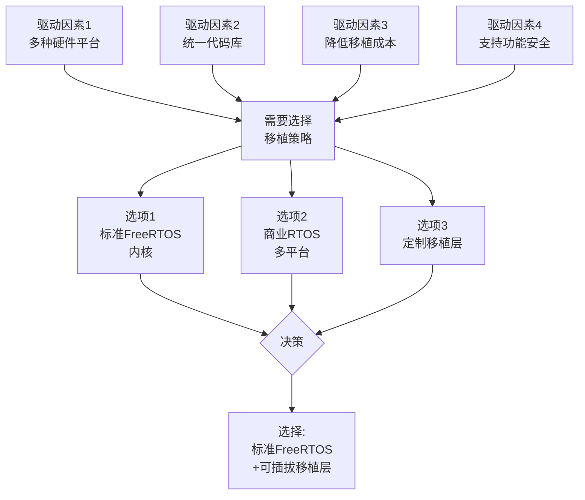
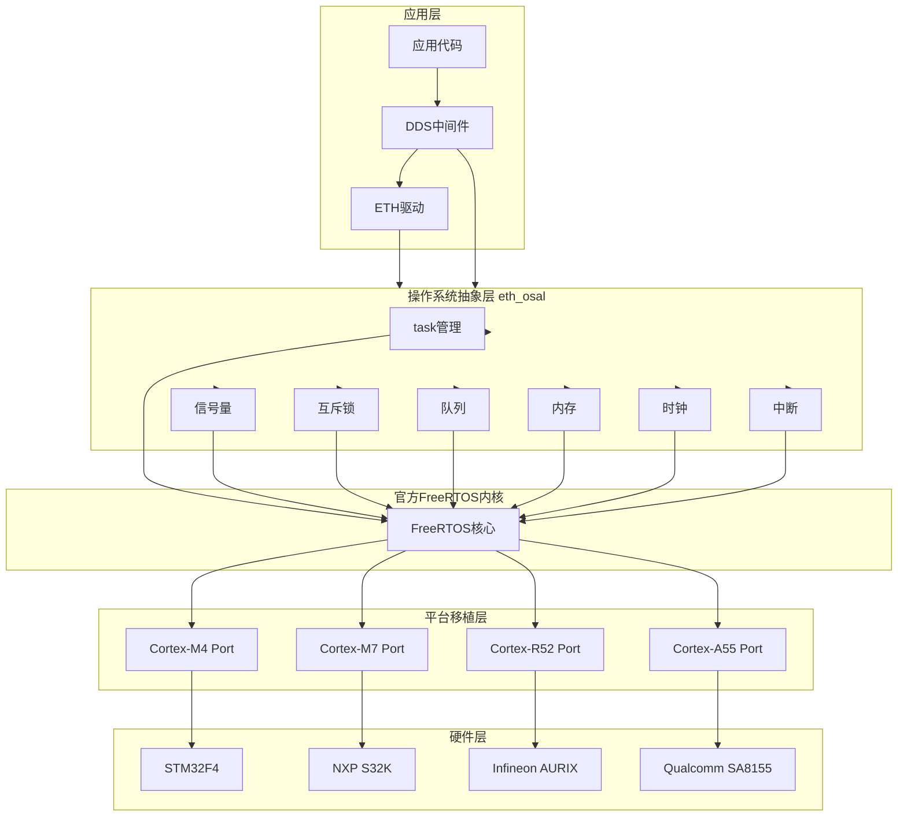

# ADR-001: FreeRTOS多架构支持选择

|Document Status|
|:--|
|Accepted - v1.0.0|

---

## 管理信息

| 项目 | 内容 |
|------|------|
| ADR编号 | ADR-001 |
| 标题 | FreeRTOS多架构支持选择 |
| 提案人 | 架构组 |
| 日期 | 2026-04-10 |
| 状态 | Accepted |
| 关键词 | FreeRTOS, ARM, 多架构, 可移植性 |

---

## 背景

ETH-DDS集成项目需要支援多种车载MCU架构，包括:

- 感知域: ARM Cortex-M4/M7 (低功耗、硬实时)
- 决策域: ARM Cortex-A55 (高性能、Linux/FreeRTOS双系统)
- 执行域: ARM Cortex-R52 (功能安全级别ASIL-D)

需要选择一种统一的FreeRTOS移植策略。

---

## 决策驱动因素

---

## 考虑的选项

### 选项A: 标准FreeRTOS内核

**描述**:
使用官方FreeRTOS内核，依赖各平台自带的port层。

**优点**:
- 社区活跃，文档丰富
- 语习广泛，开发者易上手
- 官方认证支持 (FreeRTOS Qualification Kit)
- 零许可费用

**缺点**:
- 部分平台port质量参差不齐
- 高级功能需要额外组件
- 功能安全支持需另行评估

**适用场景**:
- Cortex-M系列 MCU
- 非功能安全相关组件

### 选项B: 商业RTOS (如SafeRTOS)

**描述**:
采用经过认证的商业实时操作系统。

**优点**:
- 内置功能安全认证
- 单一供应商支持
- 统一的移植层

**缺点**:
- 许可费用高 (>$50K/项目)
- 业界接受度不如FreeRTOS
- 与开源生态系整合性差

**适用场景**:
- ASIL-D等级安全关键组件
- 资金充足的项目

### 选项C: 自定义移植抽象层

**描述**:
在FreeRTOS基础上，构建一层统一的移植抽象接口。

**优点**:
- 最大的灵活性
- 可针对性能优化
- 统一的错误处理

**缺点**:
- 高开发维护成本
- 需要完善的移植策略
- 可能引入性能开销

---

## 决策结果

### 选择: 标准FreeRTOS + 可插拔移植层

**详细说明**:
1. 使用官方FreeRTOS内核作为基础
2. 构建「eth_osal」统一移植抽象层
3. 移植层封装各平台特殊性
4. 关键代码路径透明

### 架构图

---

## 后果

### 积极后果

| 方面 | 说明 |
|------|------|
| 成本 | 无额外许可费用，降低总拥有成本 |
| 生态 | 充分利用开源生态和文档 |
| 人力 | 开发者队伍易于招募和培养 |
| 可维护性 | 移植层隔离，平台特定代码局限在port层 |
| 扩展性 | 新平台支持仅需实现port层 |

### 消极后果

| 方面 | 说明 |
|------|------|
| 工程量 | 需要维护eth_osal抽象层 |
| 认证 | 功能安全等级需要额外工作 |
| 性能 | 抽象层可能引入微小开销 |

### 风险缓解

| 风险 | 缓解措施 |
|------|----------|
| 不同port行为不一致 | 制定移植层编程约束，统一测试用例 |
| 抽象层影响性能 | 关键路径内联优化，非关键路径可跳过 |
| 认证复杂性 | ASIL组件单独评估，非ASIL组件使用标准内核 |

---

## 相关文档

- [domain-model.md](../domain-model.md) - 领域模型
- [overview.md](../overview.md) - 架构总览
- [../../developer_guide.md](../../developer_guide.md) - 开发者指南

---

## 历史记录

| 版本 | 日期 | 修改内容 | 作者 |
|------|------|----------|------|
| 0.1.0 | 2026-04-05 | 初稿创建 | 架构组 |
| 0.2.0 | 2026-04-08 | 增加风险缓解章节 | 架构组 |
| 1.0.0 | 2026-04-10 | 正式接受 | 技术委员会 |

---

*最后更新: 2026-04-25*
