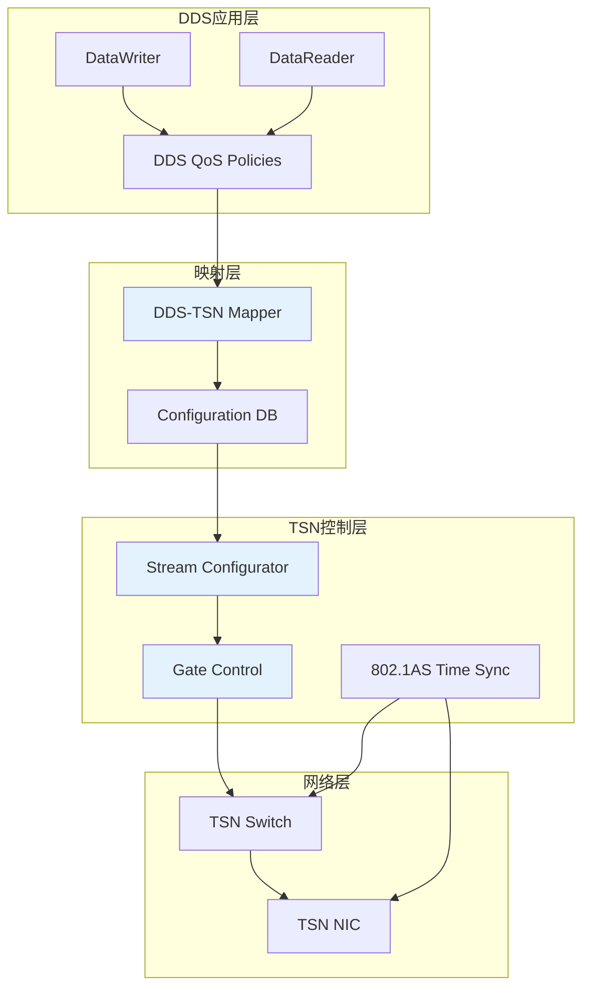

# ADR-002: DDS与TSN集成方案

|Document Status|
|:--|
|Accepted - v1.0.0|

---

## 管理信息

| 项目 | 内容 |
|------|------|
| ADR编号 | ADR-002 |
| 标题 | DDS与TSN集成方案 |
| 提案人 | 网络架构组 |
| 日期 | 2026-04-12 |
| 状态 | Accepted |
| 关键词 | TSN, DDS, QoS, 时间敏感网络, 802.1 |

---

## 背景

汽车电子电气架枴正在向以太网化演进。

DDS作为数据分发中间件提供了丰富的QoS策略，但缺乏底层网络的时间确定性保证。

TSN (Time-Sensitive Networking) 提供了IEEE 802.1标准的时间敏感网络能力，但需要与DDS应用层映射。

---

## 决策驱动因素

| 驱动因素 | 严重程度 | 说明 |
|----------|----------|------|
| 控制信号低延迟要求 | 高 | 制动、转向等安全关键信号需要 < 1ms 端到端 |
| 感知数据同步 | 高 | 多传感器数据需要时间同步 |
| 带宽保障 | 中 | 确保关键流有足够带宽 |
| 标准化 | 中 | 避免专有方案，提高互操作性 |

---

## 考虑的选项

### 选项A: DDS-TSN直接映射

**描述**:
DDS QoS直接映射到TSN配置，DDS层通知TSN层调度需求。

```
DDS Application
      |
      v
DDS QoS Layer
      | (direct mapping)
      v
TSN Configuration Layer
      |
      v
  Network Stack
```

**优点**:
- 简单直观
- 开发周期短

**缺点**:
- 跨层耦合强
- 网络层修改影响应用层
- 灵活性差

### 选项B: 底层透明 (Transparent TSN)

**描述**:
TSN配置对DDS层完全透明，由系统管理员单独配置。

**优点**:
- 应用层无需修改
- 解耦彻底

**缺点**:
- 缺乏协同优化
- QoS与TSN可能不匹配
- 调试困难

### 选项C: DDS-TSN协同框架 (Coordinated)

**描述**:
建立DDS与TSN的协同配置框架，双向信息交互。

```
                    DDS Application
                          |
          +---------------+---------------+
          |                               |
          v                               v
    DDS QoS Layer                  TSN Aware Layer
          |                               |
          v                               v
    QoS Translation Layer <-------------> TSN Scheduler
          |                               |
          +---------------+---------------+
                          |
                          v
                   Configuration DB
```

**优点**:
- 平衡灵活性与性能
- 支持逐步部署
- 支持监控和调优

**缺点**:
- 架构复杂
- 需要更多开发工作

---

## 决策结果

### 选择: 选项C - DDS-TSN协同框架

**详细设计**:



### 映射规则

| DDS QoS | TSN 映射 | 说明 |
|---------|----------|------|
| Deadline.period | Stream Reservation | 确保时间触发 |
| LatencyBudget.duration | Max Latency | 端到端延迟约束 |
| Reliability.kind | Stream Type | RELIABLE → 硬实时流 |
| TransportPriority.value | Traffic Class | 优先级映射 |
| Ownership.kind | Stream Isolation | EXCLUSIVE → 独立流 |

### TSN启用特性

| IEEE标准 | 功能 | 应用场景 |
|----------|------|----------|
| 802.1Qbv | 增量门控列表 | 硬实时数据传输 |
| 802.1Qbu | 帧预先化 | 降低延迟波动 |
| 802.1CB | 帧复制和消除 | 关键数据可靠传输 |
| 802.1AS | gPTP时间同步 | 多节点时间同步 |
| 802.1Qcc | 流预留协议 | 动态流配置 |

---

## 后果

### 积极后果

- **低延迟保证**: 硬实时流可保证 < 100μs 网络延迟
- **时间同步**: 支持μs级时间同步精度
- **带宽保障**: 关键流有硬性带宽保障
- **渐进部署**: 可从标准以太网平滑升级到TSN

### 消极后果

- **硬件要求**: 需要TSN支持的交换机和NIC
- **配置复杂度**: 需要协调DDS和TSN配置
- **成本**: TSN硬件成本高于标准以太网

### 影响范围

```
┌────────────────────────────────────────────────────────┐
│  组件                │  影响级别  │  需要工作                  │
├────────────────────────────────────────────────────────┤
│  DDS中间件         │  中          │  QoS扩展属性               │
│  配置工具           │  高          │  增加TSN配置管理            │
│  ETH驱动           │  高          │  支持TSN硬件特性          │
│  运行时库          │  中          │  时间同步接口               │
│  系统配置          │  低          │  网络拓扑协调             │
└────────────────────────────────────────────────────────┘
```

---

## 实施计划

### 阶段一: TSN就绪评估
- 确认目标硬件TSN功能支持度
- 基准测试: 纯以太网 vs TSN模式

### 阶段二: 映射层开发
- 实现DDS QoS → TSN配置的翻译
- 配置验证工具

### 阶段三: 整合验证
- 端到端时延测试
- 压力测试和可靠性验证

---

## 相关文档

- [overview.md](../overview.md) - 架构总览
- [ADR-001](./ADR-001-freertos-multi-architecture.md) - FreeRTOS多架构
- [../../FEATURES.md](../../FEATURES.md) - 功能特性

---

*最后更新: 2026-04-25*
