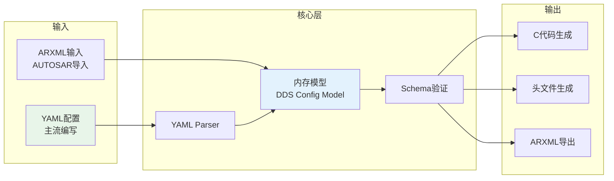

# ADR-003: 配置工具架构 (YAML vs ARXML)

|Document Status|
|:--|
|Accepted - v1.0.0|

---

## 管理信息

| 项目 | 内容 |
|------|------|
| ADR编号 | ADR-003 |
| 标题 | 配置工具架构 (YAML vs ARXML) |
| 提案人 | 工具链组 |
| 日期 | 2026-04-14 |
| 状态 | Accepted |
| 关键词 | 配置工具, YAML, ARXML, AUTOSAR, 代码生成 |

---

## 背景

ETH-DDS项目需要一套配置工具来管理:
- DDS实体配置 (DomainParticipant, Topic, QoS)
- 网络配置 (Transport, TSN参数)
- 安全配置 (证书、策略)
- AUTOSAR集成配置

需要选择配置文件格式和工具架构。

---

## 决策驱动因素

| 驱动因素 | 严重程度 | 说明 |
|----------|----------|------|
| AUTOSAR兼容性 | 高 | 需要支持AUTOSAR工具链集成 |
| 开发体验 | 高 | 配置文件需要易于编写和维护 |
| 工具复杂度 | 中 | 解析工具实现难度 |
| 生态系统成 | 中 | 与现有工具的兼容性 |

---

## 考虑的选项

### 选项A: 纯YAML方案

**描述**:
全部配置使用YAML格式，不支持ARXML。

**优点**:
- 人类友好，易读写
- 工具实现简单
- 现代化，符合DevOps流程

**缺点**:
- 与AUTOSAR工具链断裂
- 需要手动同步ARXML配置
- 不符合汽车行业标准

### 选项B: 纯ARXML方案

**描述**:
全部配置使用AUTOSAR ARXML格式。

**优点**:
- 完全AUTOSAR兼容
- 直接支持现有工具链
- 行业标准

**缺点**:
- ARXML繁琐难读
- 编辑工具依赖专业软件
- 难以版本控制

### 选项C: 双模式 (YAML主导 + ARXML导入导出)

**描述**:
内部使用YAML，支持ARXML导入导出与AUTOSAR工具集成。

**优点**:
- 开发者体验好
- 自动化同步ARXML
- 兼顾标准与效率

**缺点**:
- 需要双向转换工具
- 概念映射复杂

---

## 决策结果

### 选择: 选项C - 双模式架构

**详细设计**:



### 工具链架构

```
┌───────────────────────────────────────────────────────────────┐
│                    DDS Config Tool Architecture                    │
├───────────────────────────────────────────────────────────────┤
│                                                                     │
│  CLI Tool          Web UI            Python API                      │
│     |                 |                  |                           │
│     +-----------------+------------------+                           │
│                     |                                                 │
│                     v                                                 │
│       ┌───────────────────────────────────────────────┐                      │
│       │              Core Engine                       │                      │
│       │  ┌──────────────┐  ┌──────────────┐  ┌──────────────┐  │                      │
│       │  │  Parser   │  │  Validator│  │ Generator│  │                      │
│       │  │ (YAML/│  │  (Schema/│  │ (C/ARXML)│  │                      │
│       │  │ ARXML) │  │  Constraint)│  │          │  │                      │
│       │  └──────────────┘  └──────────────┘  └──────────────┘  │                      │
│       └───────────────────────────────────────────────┘                      │
│                                                                     │
│       ┌───────────────────────────────────────────────┐                      │
│       │              Config Database                 │                      │
│       │         (Version Control Friendly)          │                      │
│       └───────────────────────────────────────────────┘                      │
│                                                                     │
└───────────────────────────────────────────────────────────────┘
```

### YAML配置示例

```yaml
# dds_config.yaml
system:
  name: "ADAS_Sensor_Fusion"
  version: "1.2.0"

domains:
  - id: 1
    name: "PerceptionDomain"
    participants:
      - name: "CameraECU"
        qos_profile: "sensor_high_reliability"
        publishers:
          - topic: "CameraObjectDetection"
            type: "ObjectDetectionData"
            qos:
              reliability: RELIABLE
              deadline: {sec: 0, nanosec: 33000000}  # 30Hz
              history: {kind: KEEP_LAST, depth: 1}

  - id: 2
    name: "ControlDomain"
    participants:
      - name: "PlanningECU"
        qos_profile: "control_realtime"
        subscribers:
          - topic: "CameraObjectDetection"
            type: "ObjectDetectionData"

transport:
  kind: UDP
  interface: "eth0"
  multicast_address: "239.255.0.1"
  port_base: 7400

tsn:
  enabled: true
  streams:
    - name: "CameraStream"
      priority: 7
      bandwidth: 10000000  # 10Mbps
      max_latency: 100000  # 100us
```

---

## 后果

### 积极后果

| 方面 | 说明 |
|------|------|
| 开发效率 | YAML易于手写和调试 |
| 工具链集成 | 保持与AUTOSAR兼容 |
| 版本控制 | YAML适合Git管理 |
| 自动化 | 支持CI/CD集成 |

### 消极后果

| 方面 | 说明 |
|------|------|
| 工具开发 | 需要双向转换工具 |
| 概念映射 | 需维护YAML到ARXML的映射关系 |
| 验证 | 需要额外的一致性检查 |

---

## 相关文档

- [overview.md](../overview.md) - 架构总览
- [../../dds-config-tool/dds_config_tool_design.md](../../dds-config-tool/dds_config_tool_design.md) - 工具设计

---

*最后更新: 2026-04-25*
