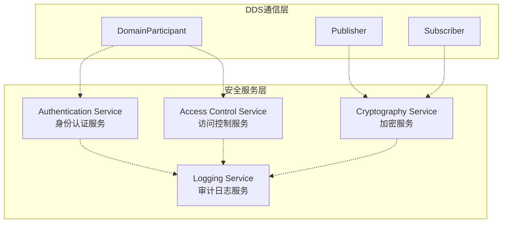
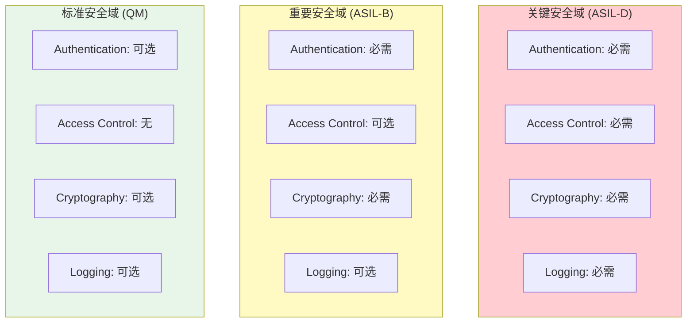
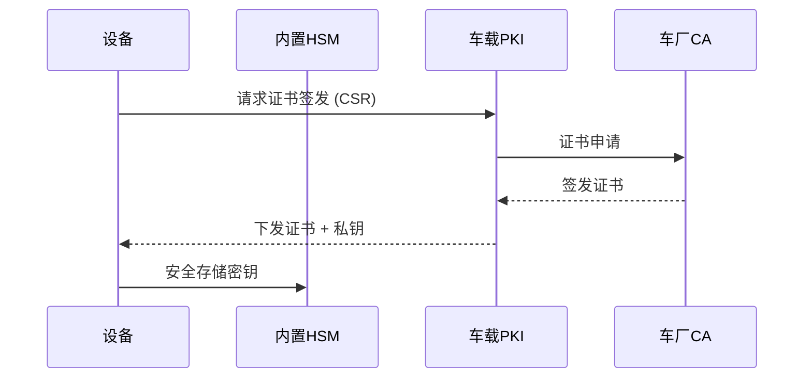

# ADR-004: DDS-Security安全架构

|Document Status|
|:--|
|Proposed - v0.9.0|

---

## 管理信息

| 项目 | 内容 |
|------|------|
| ADR编号 | ADR-004 |
| 标题 | DDS-Security安全架构 |
| 提案人 | 安全架构组 |
| 日期 | 2026-04-16 |
| 状态 | Proposed |
| 关键词 | DDS-Security, 加密, 认证, 访问控制, 审计 |

---

## 背景

汽车网络安全要求日益严格:
- ISO/SAE 21434 网络安全工程标准
- UNECE WP.29 R155 网络安全法规
- 数据加密传输需求

DDS-Security规范提供了基于标准的安全框架，需要与汽车安全需求结合。

---

## 决策驱动因素

| 驱动因素 | 严重程度 | 说明 |
|----------|----------|------|
| 法规合规 | 高 | 必须满足UNECE和ISO/SAE要求 |
| 数据机密性 | 高 | 关键控制数据不得泄露 |
| 身份验证 | 高 | 确保通信主体合法 |
| 审计追溯 | 中 | 需要完整的安全事件日志 |
| 性能影响 | 中 | 加密不得显著影响实时性能 |

---

## DDS-Security概览

### 核心服务

### 安全服务说明

| 服务 | 功能 | 标准 | 实现方式 |
|------|------|------|---------|
| Authentication | 节点身份验证 | DDS-Security 1.1 | X.509证书 + DH协商 |
| Access Control | 话题访问控制 | DDS-Security 1.1 | XML策略 + 签名 |
| Cryptography | 数据加密 | DDS-Security 1.1 | AES-GCM-GMAC |
| Logging | 安全事件记录 | DDS-Security 1.1 | 本地日志 + 远程上报 |

---

## 考虑的选项

### 选项A: 完全DDS-Security

**描述**:
5个安全服务全部启用。

**优点**:
- 最完善的安全保护
- 符合规范要求

**缺点**:
- 性能开销最大
- 配置复杂
- 密钥管理成本高

### 选项B: 分层安全

**描述**:
根据数据敏感级别选择性启用安全服务。

**优点**:
- 性能与安全平衡
- 灵活配置
- 成本可控

**缺点**:
- 需要分类评估数据敏感性
- 增加配置复杂度

### 选项C: 轻量级安全

**描述**:仅实施认证和基础加密。

**优点**:
- 开销最小
- 实施简单

**缺点**:
- 不满足高等级安全要求

---

## 决策结果

### 选择: 选项B - 分层安全架构

**分层模型**:

### 安全分层定义

| 安全等级 | 数据类型示例 | 必需服务 | 加密算法 |
|---------|-------------|----------|---------|
| Critical | 制动指令、转向信号 | Auth + AC + Crypto + Log | AES-256-GCM |
| Important | 感知数据、车速 | Auth + Crypto | AES-128-GCM |
| Standard | 诊断数据、日志 | Auth (可选) | 无或AES-128 |

### 密钥管理

---

## 后果

### 积极后果

| 方面 | 说明 |
|------|------|
| 合规性 | 满足UNECE和ISO/SAE 21434 |
| 灵活性 | 根据实际需求选择安全等级 |
| 性能 | 关键路径可优化，非关键不开启加密 |
| 成本 | 按需购买HSM等硬件 |

### 消极后果

| 方面 | 说明 |
|------|------|
| 开发复杂度 | 需要支持多种配置组合 |
| 测试覆盖 | 需要验证各种配置组合 |
| 证书管理 | 需要PKI基础设施支持 |

### 性能影响

| 操作 | 开销估算 |
|------|----------|
| 认证协商 | ~10-50ms (一次性) |
| AES-128加密 | ~50μs/1KB |
| AES-256加密 | ~100μs/1KB |
| 签名验证 | ~5ms |

---

## 实施计划

### 阶段一: 基础安全
- Authentication服务
- 基于软件的加密 (AES-128)

### 阶段二: 完整框架
- Access Control和Logging
- 硬件加密支持 (HSM)

### 阶段三: 认证
- 渗透测试
- 安全认证准备

---

## 相关文档

- [overview.md](../overview.md) - 架构总览
- [../../src/dds/security/README.md](../../src/dds/security/README.md) - 安全模块设计
- [../../FEATURES.md](../../FEATURES.md) - 功能特性

---

*最后更新: 2026-04-25*
