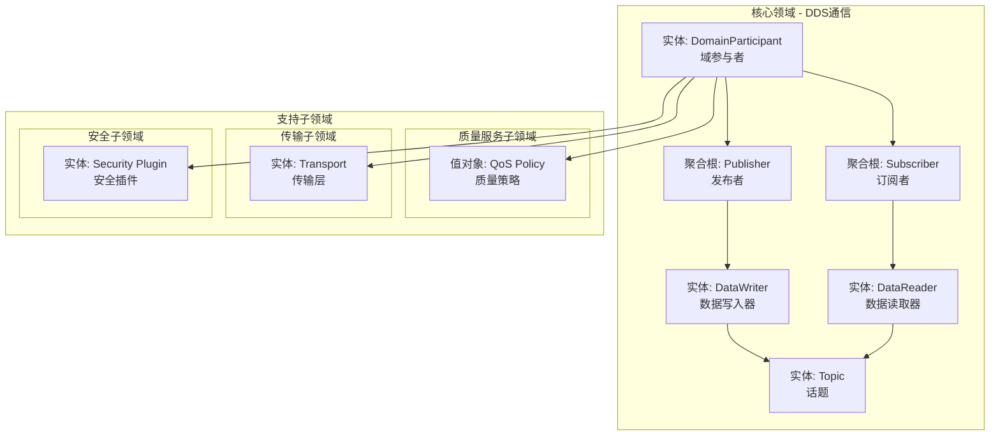
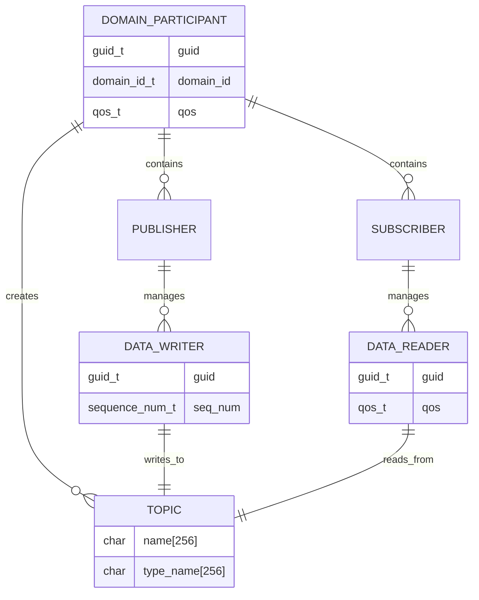
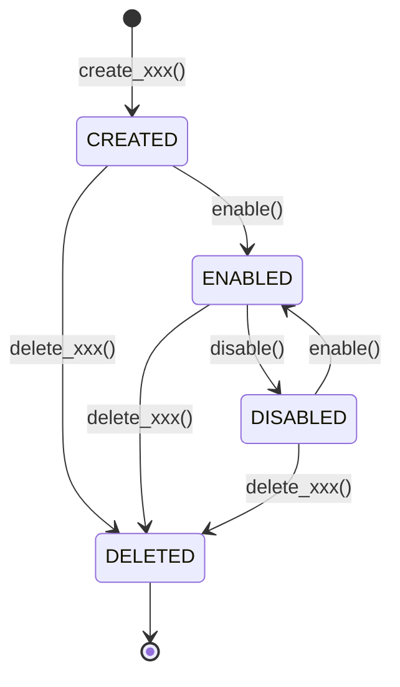

# 领域模型与术语定义

|Document Status|
|:--|
|Draft - v0.1.0|

---

## 1. DDD 领域模型

### 1.1 领域地图

### 1.2 实体关系图

---

## 2. 业务术语映射表

### 2.1 汽车行业术语

| 业务术语 | 技术术语 | DDS概念 |
|---------|----------|---------|
| 传感器数据流 | Sensor Data Stream | Topic |
| ECU节点 | ECU Node | DomainParticipant |
| 数据发布 | Data Publication | Publisher + DataWriter |
| 数据订阅 | Data Subscription | Subscriber + DataReader |
| QoS策略 | Quality Policy | QoS |
| 可靠级别 | Reliability Level | ReliabilityQosPolicy |
| 实时性要求 | Real-time Constraint | DeadlineQosPolicy |

### 2.2 AUTOSAR映射

| AUTOSAR概念 | DDS概念 |
|-------------|---------|
| ServiceInterface | Topic |
| ServiceProvider | Publisher |
| ServiceConsumer | Subscriber |
| ara::com::Proxy | DataReader |
| ara::com::Skeleton | DataWriter |
| Event | Topic (PUB/SUB) |
| Method | Request/Reply Topic |
| Field | Topic + QoS |

---

## 3. 实体详细定义

### 3.1 核心实体

#### DomainParticipant (域参与者)

| 属性 | 类型 | 描述 |
|------|------|------|
| guid | GUID_t | 全局唯一标识 (16字节) |
| domain_id | DomainId_t | 域标识 (0-232) |
| qos | DomainParticipantQos | 质量策略集合 |
| publishers | List<Publisher> | 发布者列表 |
| subscribers | List<Subscriber> | 订阅者列表 |
| topics | List<Topic> | 话题列表 |

#### DataWriter (数据写入器)

| 属性 | 类型 | 描述 |
|------|------|------|
| guid | GUID_t | 唯一标识 |
| parent | Publisher* | 父发布者 |
| topic | Topic* | 关联话题 |
| qos | DataWriterQos | 质量策略 |
| sequence_number | SequenceNumber_t | 当前序列号 |

#### DataReader (数据读取器)

| 属性 | 类型 | 描述 |
|------|------|------|
| guid | GUID_t | 唯一标识 |
| parent | Subscriber* | 父订阅者 |
| topic | Topic* | 关联话题 |
| qos | DataReaderQos | 质量策略 |

#### Topic (话题)

| 属性 | 类型 | 描述 |
|------|------|------|
| name | string | 话题名称，唯一标识数据流 |
| type_name | string | 数据类型名称 |
| qos | TopicQos | 话题级别质量策略 |

### 3.2 质量策略实体

| 策略名称 | 描述 | 关键属性 |
|----------|------|----------|
| ReliabilityQosPolicy | 可靠性策略 | kind: BEST_EFFORT/RELIABLE |
| HistoryQosPolicy | 历史策略 | kind: KEEP_LAST/KEEP_ALL, depth |
| DeadlineQosPolicy | 截止时间策略 | period: Duration_t |
| LatencyBudgetQosPolicy | 延迟预算策略 | duration: Duration_t |

### 3.3 安全实体

| 实体 | 职责 | 标准 |
|------|------|------|
| SecurityPlugin | 安全插件管理 | DDS-Security 1.1 |
| Identity | 身份认证 | X.509证书 + DH协商 |
| AccessControl | 访问控制 | XML策略 + 签名 |
| Cryptography | 加密服务 | AES-GCM-GMAC |

---

## 4. 值对象与实体关系

### 4.1 值对象定义

| 值对象 | 定义 | 用途 |
|--------|------|------|
| GUID_t | 16字节结构体 | 全局唯一标识实体 |
| Duration_t | sec + nanosec | 时间间隔表示 |
| Timestamp_t | sec + nanosec | 绝对时间戳 |
| SequenceNumber_t | high + low | RTPS序列号 |
| Locator_t | kind + port + address | 网络地址定位符 |

### 4.2 实体生命周期

---

## 5. 术语字典

### 排序索引

| 术语 | 类型 | 摘要定义 |
|------|------|----------|
| DomainParticipant | 实体 | 域参与者，DDS入口类 |
| DataWriter | 实体 | 数据写入器 |
| DataReader | 实体 | 数据读取器 |
| Publisher | 实体 | 发布者聚合根 |
| Subscriber | 实体 | 订阅者聚合根 |
| Topic | 实体 | 数据流逻辑通道 |
| QoS | 值对象 | 质量服务策略 |
| GUID | 值对象 | 全局唯一标识符 |
| RTPS | 协议 | DDS网络交互协议 |

---

*最后更新: 2026-04-25*
