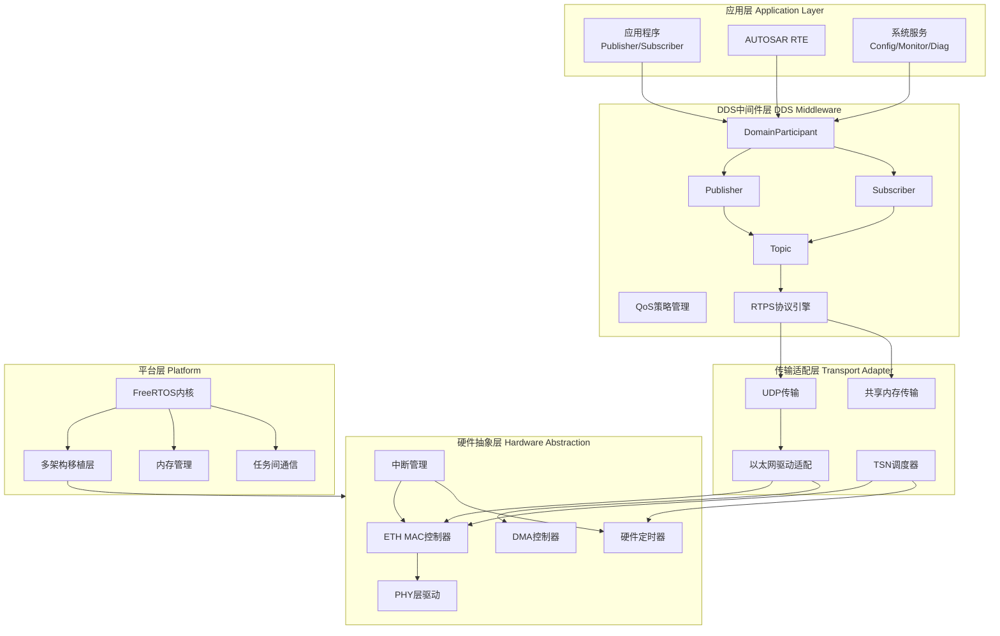
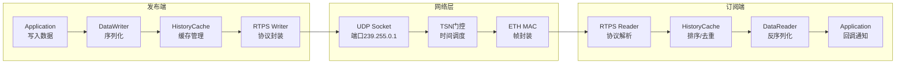
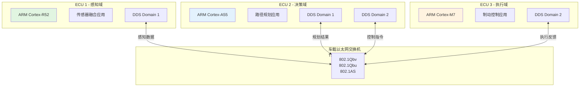

# 系统架构总览

|Document Status|
|:--|
|Draft - v0.1.0|

---

## 1. 设计目标

### 1.1 功能需求

| 需求ID | 需求描述 | 优先级 | 验收标准 |
|--------|----------|--------|----------|
| FR-001 | DDS数据分发服务 | P0 | 支持Pub/Sub模式，延迟<1ms |
| FR-002 | 实时以太网传输 | P0 | 支持TSN时间敏感网络特性 |
| FR-003 | 多平台FreeRTOS支持 | P0 | 支持ARM Cortex-M/R/A系列 |
| FR-004 | 动态配置管理 | P1 | YAML/ARXML配置，热重载 |
| FR-005 | DDS-Security安全框架 | P1 | 身份认证、加密、访问控制 |
| FR-006 | AUTOSAR RTE集成 | P1 | 符合AUTOSAR Adaptive规范 |
| FR-007 | 诊断与监控 | P2 | 实时性能监控、故障诊断 |
| FR-008 | 网络时间同步 | P2 | gPTP/IEEE 802.1AS支持 |

### 1.2 非功能需求

| 类别 | 需求 | 目标值 | 验证方法 |
|------|------|--------|----------|
| 性能 | 端到端延迟 | < 500μs (控制域) | 示波器测量 |
| 性能 | 吞吐量 | > 100Mbps | iperf测试 |
| 性能 | 抖动 | < 50μs (99th percentile) | 统计测量 |
| 可靠性 | 消息可靠性 | 99.999% | 长时间压力测试 |
| 可靠性 | 故障恢复时间 | < 100ms | 故障注入测试 |
| 安全 | ASIL等级 | ASIL-B/D (可选) | ISO 26262认证 |
| 安全 | 信息安全 | 符合ISO/SAE 21434 | 渗透测试 |
| 资源 | 内存占用 | < 512KB (MCU) | 静态分析 |
| 资源 | 代码大小 | < 256KB Flash | 编译统计 |
| 可移植性 | 平台适配周期 | < 2周 | 实际移植案例 |

---

## 2. 系统架构图

### 2.1 分层架构



### 2.2 数据流架构



### 2.3 部署视图



---

## 3. 组件职责

### 3.1 核心组件表

| 组件 | 职责 | 接口 | 依赖 | 实现文件 |
|------|------|------|------|----------|
| DomainParticipant | DDS域参与者管理，资源生命周期 | `create_participant()`<br/>`delete_participant()` | 网络工厂<br/>QoS策略 | `dds/domain_participant.c` |
| Publisher | 发布者组管理，批量发送 | `create_publisher()`<br/>`write()` | DataWriter<br/>DomainParticipant | `dds/publisher.c` |
| Subscriber | 订阅者组管理，监听器分发 | `create_subscriber()`<br/>`read()`<br/>`take()` | DataReader<br/>DomainParticipant | `dds/subscriber.c` |
| DataWriter | 数据序列化，可靠性管理 | `write()`<br/>`wait_for_ack()` | Topic<br/>RTPS Writer | `dds/data_writer.c` |
| DataReader | 数据反序列化，接收缓存 | `read()`<br/>`take()`<br/>`set_listener()` | Topic<br/>RTPS Reader | `dds/data_reader.c` |
| Topic | 数据类型定义，匹配检查 | `create_topic()`<br/>`get_type_name()` | TypeSupport | `dds/topic.c` |
| RTPS Writer | RTPS协议发送引擎 | `new_change()`<br/>`unsent_changes()` | UDP Transport | `rtps/rtps_writer.c` |
| RTPS Reader | RTPS协议接收引擎 | `add_change()`<br/>`next_unread()` | UDP Transport | `rtps/rtps_reader.c` |
| UDP Transport | UDP套接字管理，多播支持 | `send()`<br/>`receive()`<br/>`open()` | Socket API | `transport/udp.c` |
| TSN Scheduler | 时间触发调度，门控配置 | `schedule()`<br/>`config_gate()` | HW Timer<br/>ETH MAC | `tsn/tsn_scheduler.c` |
| QoS Manager | QoS策略解析，合规检查 | `set_qos()`<br/>`check_compatibility()` | XML/YAML Parser | `dds/qos.c` |

### 3.2 平台适配组件

| 组件 | 职责 | 适配接口 | 支持平台 |
|------|------|----------|----------|
| FreeRTOS Port | 内核移植层 | `portYIELD()`<br/>`vTaskDelay()` | ARM CM0/3/4/7/R4/R5/R52/A5/A7/A9/A53/A55 |
| ETH Driver | MAC控制器驱动 | `eth_send()`<br/>`eth_receive()` | STM32 ETH<br/>NXP S32K ETH<br>Renesas RH850 ETH |
| PHY Driver | PHY芯片控制 | `phy_init()`<br/>`phy_link_status()` | DP83848<br/>KSZ8081<br/>LAN8742 |
| Timer Driver | 硬件定时器 | `timer_start()`<br/>`timer_set_callback()` | SysTick<br/>GPT<br/>PIT |
| DMA Driver | DMA控制器 | `dma_transfer()`<br/>`dma_isr()` | Generic DMA |

---

## 4. 子文档导航

### 4.1 架构设计

| 文档 | 描述 | 路径 |
|------|------|------|
| **领域模型** | DDD领域模型，术语定义 | [domain-model.md](./domain-model.md) |
| 数据流设计 | 端到端数据流详细设计 | ../../02-data-flow-design.md |
| 配置同步机制 | 动态配置更新机制 | ../../03-config-sync-mechanism.md |
| 部署架构 | 部署拓扑与网络规划 | ../../04-deployment-architecture.md |
| AUTOSAR RTE集成 | RTE适配层设计 | ../AUTOSAR_RTE_Integration.md |

### 4.2 架构决策记录 (ADR)

| 编号 | 标题 | 路径 |
|------|------|------|
| ADR-001 | FreeRTOS多架构支持选择 | [adr/ADR-001-freertos-multi-architecture.md](./adr/ADR-001-freertos-multi-architecture.md) |
| ADR-002 | DDS与TSN集成方案 | [adr/ADR-002-dds-tsn-integration.md](./adr/ADR-002-dds-tsn-integration.md) |
| ADR-003 | 配置工具架构 (YAML vs ARXML) | [adr/ADR-003-config-tool-architecture.md](./adr/ADR-003-config-tool-architecture.md) |
| ADR-004 | DDS-Security安全架构 | [adr/ADR-004-security-architecture.md](./adr/ADR-004-security-architecture.md) |

### 4.3 开发与测试

| 文档 | 描述 | 路径 |
|------|------|------|
| 开发者指南 | 开发环境搭建与编码规范 | ../developer_guide.md |
| API文档 | 公共API参考手册 | ../api.md |
| 测试策略 | L1-L4测试分层策略 | ../testing/strategy.md |
| 集成指南 | 系统集成步骤 | ../INTEGRATION_GUIDE.md |

### 4.4 产品需求

| 文档 | 描述 | 路径 |
|------|------|------|
| 功能特性 | 功能规格说明 | ../FEATURES.md |
| 用户故事 | 汽车行业DDS场景 | [../product/user-stories/automotive-dds.md](../product/user-stories/automotive-dds.md) |

---

## 5. 架构约束

### 5.1 技术约束

```
┌─────────────────────────────────────────────────────────────┐
│  约束项               │  约束值            │  影响范围       │
├─────────────────────────────────────────────────────────────┤
│  编程语言             │  C11 (Embedded)    │  全部代码       │
│  实时操作系统         │  FreeRTOS 10.5+    │  平台层         │
│  网络协议             │  UDP/IP + RTPS 2.5 │  传输层         │
│  数据序列化           │  CDR/IDL 4.2       │  DDS层          │
│  安全标准             │  DDS-Security 1.1  │  安全模块       │
│  功能安全             │  ISO 26262 ASIL-B  │  安全关键代码   │
│  信息安全             │  ISO/SAE 21434     │  全部组件       │
└─────────────────────────────────────────────────────────────┘
```

### 5.2 资源约束

- **Flash**: 最小 256KB，推荐 512KB+
- **RAM**: 最小 128KB，推荐 256KB+
- **CPU**: ARM Cortex-M4 @ 80MHz 或更高
- **网络**: 100Mbps 以太网，支持TSN可选

---

## 6. 关键指标与监控

### 6.1 性能指标

| 指标 | 目标值 | 监控方式 |
|------|--------|----------|
| 发布延迟 | < 100μs | 内部时间戳 |
| 传输延迟 | < 200μs | 网络分析仪 |
| 端到端延迟 | < 500μs | 环路测试 |
| 消息吞吐 | > 10K msg/s | 统计计数 |
| 内存碎片 | < 5% | 堆分析器 |
| CPU占用 | < 30% | 任务统计 |

---

*最后更新: 2026-04-25*
