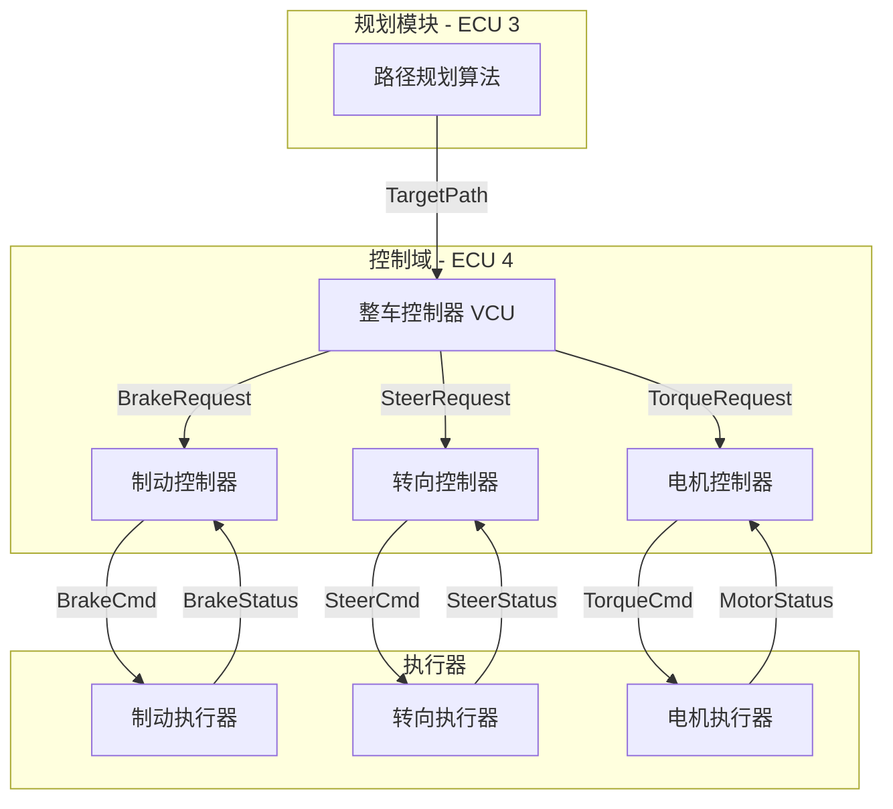
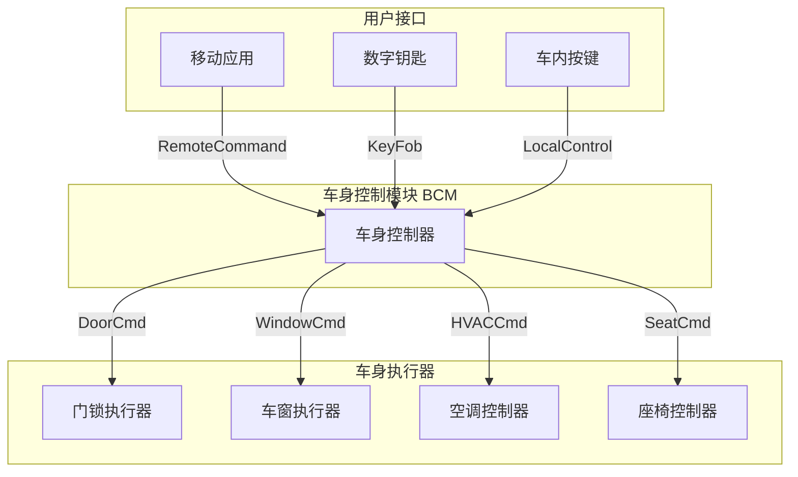
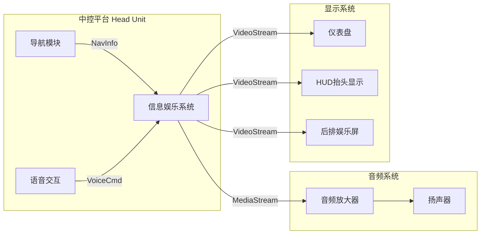

# 汽车行业DDS应用场景

|Document Status|
|:--|
|Draft - v0.1.0|

---

## 1. ADAS感知数据分发场景

### 1.1 场景概述

多个感知传感器(摄像头、激光雷达、波达) 实时生成环境感知数据，需要低延迟、高可靠性地分发给决策算法模块。

### 1.2 系统架构

```mermaid
graph LR
    subgraph Sensors["感知域 - ECU 1"]
        CAM[摄像头模块<br/>1920x1080@30fps]
        LIDAR[激光雷达<br/>64线@10fps]
        RADAR[波达<br/>目标列表@20fps]
    end

    subgraph Perception["感知融合 - ECU 2"]
        FUSION[多传感器融合]
        TRACK[目标跟踪]
    end

    subgraph Decision["决策规划 - ECU 3"]
        PLAN[路径规划]
        DECIDE[行为决策]
    end

    CAM -->|CameraFrame| FUSION
    LIDAR -->|PointCloud| FUSION
    RADAR -->|RadarObjects| FUSION
    FUSION -->|FusedObjects| TRACK
    TRACK -->|TrackedObjects| PLAN
    PLAN -->|PlannedPath| DECIDE
```

### 1.3 DDS Topic设计

| Topic名称 | 数据类型 | 发布频率 | QoS要求 |
|-----------|----------|----------|---------|
| CameraFrame | Image (1920x1080x3) | 30Hz | RELIABLE, DEADLINE=33ms |
| PointCloud | PointCloud2 | 10Hz | RELIABLE, DEADLINE=100ms |
| RadarObjects | ObjectArray | 20Hz | BEST_EFFORT, DEADLINE=50ms |
| FusedObjects | ObjectList | 30Hz | RELIABLE, DEADLINE=33ms |
| TrackedObjects | TrackedObjectList | 30Hz | RELIABLE, DEADLINE=33ms |
| PlannedPath | Path | 20Hz | RELIABLE, DEADLINE=50ms |

### 1.4 用户故事

**US-ADAS-001: 摄像头帧发布**
```gherkin
功能: 摄像头模块发布图像帧
  作为一个感知系统
  我需要30fps的带时间戳的图像帧
  以便后续的感知融合算法处理

  场景: 正常发布
    给定 摄像头已初始化并且DDS DomainParticipant已启动
    当 新的图像帧捕获完成
    那么 应在33ms内将帧数据发布到CameraFrame Topic
    并且 延迟需要小于5ms

  场景: 网络拥塞
    给定 网络出现临时拥塞
    当 下一个发布周期到来
    那么 应考断过期帧，保持最新帧发布 (KEEP_LAST=1)
    并且 不影响后续发布
```

**US-ADAS-002: 多传感器数据同步**
```gherkin
功能: 多传感器数据时间同步
  作为一个感知融合算法
  我需要知道各传感器数据的准确时间戳
  以便正确关联同一时刻的多模态数据

  场景: gPTP时钟同步
    给定 所有ECU已通过802.1AS时间同步
    当 接收到多个传感器数据
    那么 时间戳误差应小于100μs
    并且 可以正确匹配同一时刻的数据
```

---

## 2. 动力域控制场景

### 2.1 场景概述

制动、转向、驱动系统的实时控制信号传输，要求极低延迟、高确定性、功能安全等级ASIL-D。

### 2.2 系统架构



### 2.3 关键要求

| 要求 | 目标值 | 理由 |
|------|--------|------|
| 端到端延迟 | < 10ms | 安全关键控制回路 |
| 消息可靠性 | 99.999% | 不能丢失制动命令 |
| 功能安全 | ASIL-D | ISO 26262要求 |
| 故障响应 | < 50ms | 故障安全状态切换 |

### 2.4 用户故事

**US-PWR-001: 紧急制动**
```gherkin
功能: 紧急制动命令发送
  作为一个安全系统
  我需要确保制动命令在最短时间内传达
  以避免碰撞事故

  场景: AEB触发
    给定 前方检测到碰撞风险
    当 规划算法计算出紧急制动需求
    那么 应在5ms内将制动命令发送到制动执行器
    并且 命令需要带安全验证码 (E2E)

  场景: 可靠性保证
    给定 网络出现丢包
    当 制动命令未被确认
    那么 应重发命令，直到确认或超时
    并且 应轮询后备通信路径
```

**US-PWR-002: 执行器状态反馈**
```gherkin
功能: 实时获取执行器状态
  作为一个控制算法
  我需要每10ms获取执行器实际状态
  以便进行闭环控制

  场景: 状态上报
    给定 执行器以100Hz频率工作
    当 新状态数据可用
    那么 应在10ms内传输到控制器
    并且 包含精确的时间戳以便估算延迟
```

---

## 3. 车身域场景

### 3.1 场景概述
车身控制包括门锁、车窗、空调、座椅等辈车舒适性功能，对实时性要求较低，但要求高可靠性和功能安全。

### 3.2 系统架构



### 3.3 DDS Topic设计

| Topic名称 | 数据类型 | 发布频率 | QoS要求 |
|-----------|----------|----------|---------|
| RemoteCommand | Command | 事件触发 | RELIABLE, VOLATILE |
| DoorStatus | DoorState | 1Hz | BEST_EFFORT, TRANSIENT_LOCAL |
| WindowStatus | WindowState | 1Hz | BEST_EFFORT, TRANSIENT_LOCAL |
| ClimateStatus | ClimateState | 1Hz | BEST_EFFORT, TRANSIENT_LOCAL |

### 3.4 用户故事

**US-BODY-001: 远程锁车**
```gherkin
功能: 手机应用远程控制门锁
  作为一个车主
  我需要通过手机应用远程锁止车辆
  以确保车辆安全

  场景: 远程锁车
    给定 手机应用已认证
    当 用户点击"锁车"按钮
    那么 命令应经由T-Box传输到车身控制器
    并且 执行确认应在3秒内返回
    并且 通信需要加密保护
```

**US-BODY-002: 状态同步**
```gherkin
功能: 车身状态定期同步
  作为一个车辆健康监控系统
  我需要获取车身各部件状态
  以便提供用户反馈和诊断

  场景: 状态定期上报
    给定 车身系统正常工作
    当 状态变化或定时器触发
    那么 应发布更新后的状态
    并且 保持最新状态可查询 (TRANSIENT_LOCAL)
```

---

## 4. 信息娱乐场景

### 4.1 场景概述
信息娱乐系统需要高带宽数据传输，包括娱乐媒体、导航地图、语音交互等。

### 4.2 系统架构



### 4.3 DDS Topic设计

| Topic名称 | 数据类型 | 带宽 | QoS要求 |
|-----------|----------|-------|---------|
| MediaStream | AudioData | ~1.5Mbps | BEST_EFFORT |
| VideoStream | CompressedVideo | ~5Mbps | BEST_EFFORT |
| NavInfo | NavigationData | 低频率 | RELIABLE |
| VoiceCmd | AudioData | 事件 | RELIABLE |

### 4.4 用户故事

**US-IVI-001: 媒体播放**
```gherkin
功能: 高品质音频播放
  作为一个乘客
  我需要无断点的高品质音乐播放
  以获得优质的驾乘体验

  场景: 无损音频传输
    给定 音频源以48kHz/24bit提供
    当 音频数据发布
    那么 应使用足够带宽的BEST_EFFORT QoS
    并且 允许偶尔丢包而不影响播放流畅性
```

---

## 5. 场景对比

| 场景 | 实时性要求 | 可靠性要求 | 带宽需求 | 功能安全 |
|------|----------|----------|----------|---------|
| ADAS感知 | 高 (<10ms) | 高 | 高 (~50Mbps) | ASIL-B |
| 动力控制 | 极高 (<1ms) | 极高 | 低 (<1Mbps) | ASIL-D |
| 车身控制 | 中 (<100ms) | 高 | 低 (<100Kbps) | ASIL-A |
| 信息娱乐 | 低 (<1s) | 中 | 极高 (~10Mbps) | QM |

---

*最后更新: 2026-04-25*
