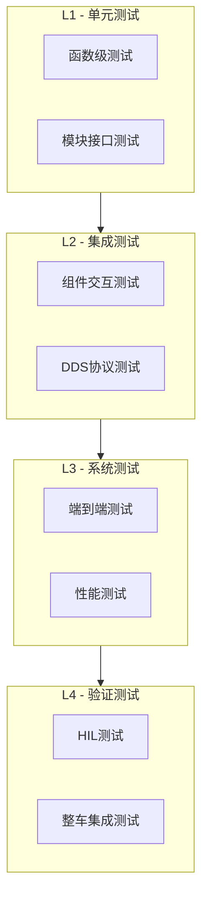
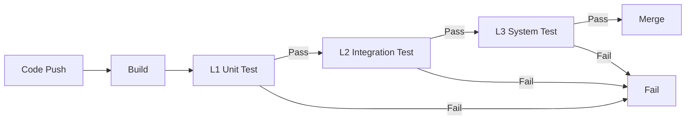

# 测试策略

|Document Status|
|:--|
|Draft - v0.1.0|

---

## 1. 测试分层架构 (L1-L4)



---

## 2. L1: 单元测试

### 2.1 测试范围与目标

| 模块 | 行覆盖率 | 分支覆盖率 |
|------|----------|----------|
| dds/participant | >90% | >80% |
| dds/publisher | >90% | >80% |
| dds/subscriber | >90% | >80% |
| dds/data_writer | >85% | >75% |
| dds/data_reader | >85% | >75% |
| rtps/writer | >80% | >70% |
| 安全关键代码 | >95% | >90% |

### 2.2 测试用例示例

```c
/* tests/unit/test_dds_participant.c */
#include <cmocka.h>
#include "dds/domain_participant.h"

static void test_create_participant_success(void **state) {
    DomainParticipantQos qos;
    dds_participant_qos_default(&qos);
    DomainParticipant *dp = dds_create_participant(0, &qos, NULL, 0);
    assert_non_null(dp);
    assert_int_equal(dp->domain_id, 0);
    dds_delete_participant(dp);
}

static void test_create_participant_invalid_domain(void **state) {
    DomainParticipantQos qos;
    dds_participant_qos_default(&qos);
    DomainParticipant *dp = dds_create_participant(233, &qos, NULL, 0);
    assert_null(dp);
    assert_int_equal(dds_get_error(), DDS_RETCODE_BAD_PARAMETER);
}
```

---

## 3. L2: 集成测试

### 3.1 测试类型

| 测试类型 | 描述 | 执行环境 |
|----------|------|----------|
| 组件交互 | 多组件协同验证 | x86 Linux |
| DDS协议 | RTPS交互一致性 | x86 Linux |
| 网络适配 | UDP/TSN传输验证 | x86 Linux |

### 3.2 DDS协议一致性测试

```python
def test_rtps_discovery():
    """验证两个DDS节点能够正确发现彼此"""
    pub_proc = subprocess.Popen(['./test_publisher', '--domain', '1'])
    time.sleep(1)
    sub_proc = subprocess.Popen(['./test_subscriber', '--domain', '1'])
    time.sleep(2)
    assert sub_proc.returncode is None
    pub_proc.terminate()
    sub_proc.terminate()
```

---

## 4. L3: 系统测试

### 4.1 性能测试指标

| 测试项 | 目标 | 测试方法 |
|--------|------|----------|
| 端到端延迟 | < 500μs | 环路测试 |
| 吞吐量 | > 100Mbps | 压力测试 |
| 抖动 | < 50μs | 统计分析 |
| 可靠性 | 99.999% | 24小时连续运行 |

### 4.2 延迟测试示例

```c
void measure_end_to_end_latency(void) {
    const int SAMPLE_COUNT = 10000;
    uint64_t latencies[SAMPLE_COUNT];

    for (int i = 0; i < SAMPLE_COUNT; i++) {
        LatencyData data;
        data.timestamp = get_hw_timestamp_ns();
        dds_write(writer, &data);
        dds_take(reader, &recv_data, 1, NULL);
        latencies[i] = get_hw_timestamp_ns() - recv_data.timestamp;
    }

    double p99 = calculate_percentile(latencies, SAMPLE_COUNT, 99);
    assert_true(p99 < 1000000); // < 1ms
}
```

---

## 5. L4: 验证测试

### 5.1 HIL测试架构

```
┌──────────────────────────────────────────────────────────────┐
│  测试PC (Linux)              │  Ethernet/CAN-FD  │  目标硬件 (ECU)  │
│  ┌────────────────┐           │  <=============>  │  ┌────────────────┐  │
│  │ Test Runner  │           │                  │  │   ETH-DDS    │  │
│  │   (Python)   │           │                  │  │   协议栈   │  │
│  └────────────────┘           │                  │  └────────────────┘  │
└──────────────────────────────────────────────────────────────┘
```

### 5.2 整车测试场景

| 测试场景 | 验证目标 |
|----------|----------|
| 城市道路 | 数据流连续性 |
| 高速公路 | 延迟稳定性 |
| 紧急制动 | 关键信号传输可靠性 |
| 多ECU协同 | 端到端延迟达标 |

---

## 6. CI/CD 集成方案

### 6.1 测试流水线



### 6.2 GitHub Actions配置

```yaml
name: Test Pipeline
on:
  push:
    branches: [main, develop]
  pull_request:
    branches: [main]

jobs:
  unit-test:
    runs-on: ubuntu-latest
    steps:
      - uses: actions/checkout@v4
      - name: Build and Test
        run: |
          mkdir build && cd build
          cmake .. -DENABLE_TESTING=ON
          make -j4 && ctest --output-on-failure -R unit
      - name: Coverage
        run: make coverage
```

---

## 7. 质量门槛

| 准则 | 要求 |
|------|------|
| 单元测试通过率 | 100% |
| 代码覆盖率 | >80% 行覆盖 |
| 静态分析 | 0严重警告 |
| 编译警告 | 0错误 |
| 代码审查 | 2+ Reviewers |

### 测试通过标准

| 测试类型 | 通过条件 |
|----------|----------|
| L1 | 所有用例通过 |
| L2 | 主要流程通过 |
| L3 | 性能指标达标 |
| L4 | 无严重故障 |

---

*最后更新: 2026-04-25*
