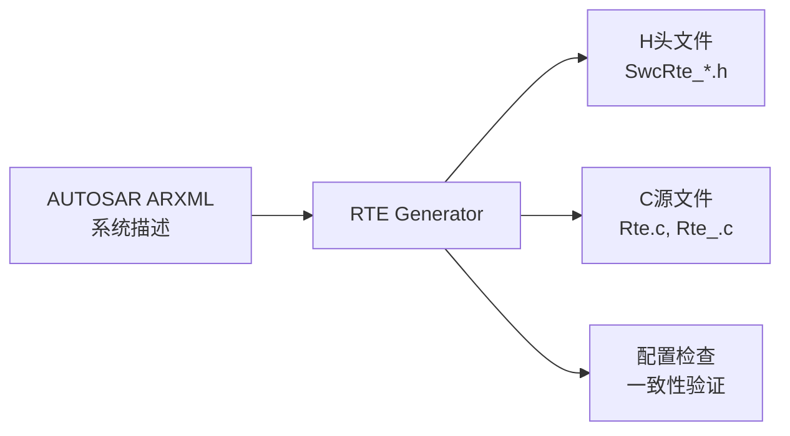

# yuleASR RTE 生成器文档

> **文档**: RTE 生成器使用说明 (RTE Generator Guide)
> **版本**: 1.0 | **日期**: 2026-07-26
> **作者**: 小马 🐴 (质量架构师)
> **状态**: 初稿
> **参考**: AUTOSAR R21-11 SWS_RTE

---

## 1 概述

### 1.1 什么是 RTE 生成器

RTE (Runtime Environment) 生成器负责根据 ARXML (AUTOSAR XML) 描述文件，自动生成 yuleASR 项目中 BSW 模块之间的运行时接口代码，包括：

- 通信接口 (Sender/Receiver 接口)
- 操作接口 (Client/Server 接口)
- 模式声明和管理接口
- 模块间数据路径映射

### 1.2 适用范围



### 1.3 位置

```bash
tools/code_generators/rte/
├── main.py              # 入口：ARXML 解析 + 代码生成
├── parser/              # ARXML 解析器
│   ├── arxml_reader.py  # XML 解析 (xml.etree.ElementTree)
│   ├── swc_type.py      # SWC 类型定义解析
│   └── port_if.py       # Port 接口解析
├── generators/          # 代码生成器
│   ├── rte_header.py    # SwcRte_*.h 生成
│   ├── rte_source.py    # Rte.c 生成
│   └── rte_cfg.py       # RTE 配置验证
├── templates/           # 代码模版
│   ├── rte_h_template.j2
│   └── rte_c_template.j2
└── tests/               # 单元测试
    └── test_rte_gen.py
```

---

## 2 ARXML 输入要求

### 2.1 支持的 AUTOSAR 元模型

| 元素 | 支持 | 说明 |
|------|:----:|------|
| ApplicationSwComponentType | ✅ | 应用 SWC |
| SensorActuatorSwComponentType | ✅ | 传感器/执行器 SWC |
| CompositionSwComponentType | ✅ | 复合组件 |
| SenderReceiverInterface | ✅ | SR 接口 |
| ClientServerInterface | ✅ | CS 接口 |
| ModeSwitchInterface | ✅ | 模式切换接口 |
| VariableDataPrototype | ✅ | 数据元素 |
| OperationPrototype | ✅ | 操作 |
| PortPrototype (PPort/RPort/PRPort) | ✅ | 端口定义 |
| SwcInternalBehavior | ✅ | SWC 内部行为 |
| RunnableEntity | ✅ | 运行实体 (Runnable) |
| TimingEvent | ✅ | 定时触发事件 |
| DataReceivedEvent | ✅ | 数据接收事件 |
| OperationInvokedEvent | ✅ | 操作调用事件 |
| ModeSwitchEvent | ✅ | 模式切换事件 |
| DataTypeMappingSet | ⚠️ 部分 | 仅支持基本类型映射 |
| BswModuleDescription | ⚠️ 部分 | BSW 模块描述解析能力有限 |

### 2.2 文件组织

```yaml
输入:
  arxml/              # ARXML 描述文件
    ├── system.arxml      # 系统描述 (ECU 实例 + 连接)
    ├── swcs/             # SWC 定义
    │   ├── app_swc.arxml      # 应用 SWC
    │   └── composition.arxml  # 复合定义
    └── datatypes/        # 数据类型
        └── base_types.arxml   # 基础类型

输出:
  include/rte/
    ├── Rte.h               # 全局 RTE 头文件
    ├── Rte_SwcType.h       # SWC 类型头文件
    └── Rte_Type.h          # 类型定义
  src/rte/
    └── Rte.c               # RTE 实现
```

---

## 3 使用说明

### 3.1 基本用法

```bash
# 完整生成流程
python tools/code_generators/rte/main.py \
  --arxml-dir autosar/arxml/ \
  --output-dir src/rte/ \
  --ecu-instance EcuInstance_0

# 仅验证 (不生成代码)
python tools/code_generators/rte/main.py \
  --arxml-dir autosar/arxml/ \
  --verify-only

# 生成指定模块
python tools/code_generators/rte/main.py \
  --arxml-dir autosar/arxml/ \
  --modules Com,Dcm,NvM
```

### 3.2 选项说明

| 选项 | 默认值 | 说明 |
|------|--------|------|
| `--arxml-dir` | `autosar/arxml/` | ARXML 文件目录 |
| `--output-dir` | `src/rte/` | 生成代码输出目录 |
| `--ecu-instance` | `EcuInstance_0` | ECU 实例名称 |
| `--verify-only` | `false` | 仅验证不生成 |
| `--modules` | `all` | 逗号分隔的模块列表 |
| `--verbose` | `false` | 详细日志输出 |
| `--template-dir` | `templates/` | Jinja2 模版目录 |

### 3.3 CMake 集成

```cmake
# CMakeLists.txt — RTE 生成步骤
add_custom_command(
  OUTPUT ${CMAKE_CURRENT_SOURCE_DIR}/src/rte/Rte.c
  COMMAND ${Python3_EXECUTABLE}
    tools/code_generators/rte/main.py
    --arxml-dir ${CMAKE_SOURCE_DIR}/autosar/arxml/
    --output-dir ${CMAKE_CURRENT_SOURCE_DIR}/src/rte/
  DEPENDS
    ${CMAKE_SOURCE_DIR}/autosar/arxml/system.arxml
    ${CMAKE_SOURCE_DIR}/tools/code_generators/rte/main.py
  COMMENT "Generating RTE code from ARXML..."
)
```

### 3.4 事件命名前缀配置（BehaviorSettings）

RTE 生成器（`tools/code_generators/rte/rte_generator.py`）提供集中可配的
InternalBehavior **事件命名前缀**层（对齐 cogu/autosar `BehaviorSettings`）：
配置后生成的事件名按 `<前缀>_<RunnableName>` 规范化（如 `TimingEvent_MainRunnable`），
适配不同 OEM 命名规范；未配置时保持 ARXML 原始事件名（输出不变）。

**CLI 入口**（`--behavior-config <json>`）：

```bash
python rte_generator.py -i input.arxml -o generated/ \
  --behavior-config behavior.json
```

`behavior.json` 示例（键 = 前缀属性名，21 项均可配）：

```json
{
  "timing_event_prefix": "TimingEvent",
  "init_event_prefix": "InitEvent",
  "background_event_prefix": "Background",
  "data_receive_event_prefix": "DataReceive",
  "data_receive_error_event_prefix": "DataReceiveError",
  "operation_invoked_event_prefix": "OperationInvoked",
  "swc_mode_switch_event_prefix": "SwcModeSwitch",
  "swc_mode_manager_error_event_prefix": "SwcModeManagerError"
}
```

**API 入口**：`generate_rte(..., behavior_settings=...)` 接受 dict 或
`BehaviorSettings` 实例；`build_rte_ir_from_arxml` / `_parse_arxml_direct`
同样支持。

**效果**：配置后 `Rte_<Swc>.h` 输出 `RUNNABLE EVENT MAPPING` 段，事件名按前缀命名；
8 个 RTE 事件类型（Timing/Init/Background/DataReceive/DataReceiveError/
OperationInvoked/SwcModeSwitch/SwcModeManagerError）接入生成，另 13 项
access-point 前缀（DATA-READ-ACCESS、SERVER-CALL-POINT 等）为后续
access-point 生成预留。

---

## 4 生成文件结构

### 4.1 输出文件

```
src/rte/
├── Rte.c                 # RTE 核心实现
├── Rte.h                 # 全局 RTE 头
├── Rte_Type.h            # 类型定义 (从 ARXML 数据类型映射)
├── Rte_Com.h             # Com 模块 RTE 适配
├── Rte_Dcm.h             # Dcm 模块 RTE 适配
├── Rte_NvM.h             # NvM 模块 RTE 适配
├── Rte_E2E.h             # E2E 模块 RTE 适配
└── Rte_WdgM.h            # WdgM 模块 RTE 适配
```

> 注：类型生成层按**引用备忘录化**（`TypeModel.data_types`，对齐 cogu
> `ImplementationModel`）——同一类型无论经全路径 ref 还是短名引用，只建一次模型，
> 共享类型保持一致。含事件（Timing/Init 等）的 SWC，其 `Rte_<Swc>.h` 含
> `RUNNABLE EVENT MAPPING` 段，事件名受 §3.4 前缀配置控制。

### 4.2 接口生成示例

**Sender/Receiver 接口:**

```c
// Rte_Com.h — 自动生成
// 来自 ARXML: SenderReceiverInterface "ComSignal_IF"
// 数据元素: "VehicleSpeed" (uint16), "EngineRPM" (uint16)

#ifndef RTE_COM_H
#define RTE_COM_H

#include "Rte_Type.h"
#include "Std_Types.h"

/* Sender 端 (应用 → Com) */
extern Std_ReturnType Rte_Write_Com_VehicleSpeed(uint16_t speed);
extern Std_ReturnType Rte_Write_Com_EngineRPM(uint16_t rpm);

/* Receiver 端 (Com → 应用) */
extern Std_ReturnType Rte_Read_Com_VehicleSpeed(uint16_t *speed);
extern Std_ReturnType Rte_Read_Com_EngineRPM(uint16_t *rpm);

#endif /* RTE_COM_H */
```

**Client/Server 接口:**

```c
// Rte_Dcm.h — 自动生成
// 来自 ARXML: ClientServerInterface "DcmService_IF"
// 操作: "ReadDataByIdentifier" (in: DID, out: data, length)

extern Std_ReturnType Rte_Call_Dcm_ReadDataByIdentifier(
    uint16_t did,
    uint8_t *data,
    uint16_t *length
);
```

---

## 5 依赖与前置条件

| 前置条件 | 说明 |
|---------|------|
| Python 3.10+ | 运行生成器 |
| xml.etree.ElementTree | Python 标准库, 无需额外安装 |
| Jinja2 (可选) | 如果使用模版生成 (默认启用) |
| ARXML 文件 | 符合 AUTOSAR R21-11 元模型的 ARXML 描述 |
| 数据类型映射 | ARXML 中的数据类型需映射到 yuleASR 类型体系 |

---

## 6 局限性

| 限制 | 影响 | 缓解 |
|------|------|------|
| 不支持 ModeSwitch 复杂状态机 | 模式转换仅支持简单 2 状态 | 手动补充模式管理代码 |
| 不支持 BswModuleDescription 完全解析 | 无法自动生成 BSW 模块内部 RTE | BSW 模块接口手动编写 |
| 不支持 DataTypeMappingSet 复杂映射 | 仅支持基础类型 | 类型映射表手动维护 |
| 不支持多 ECU 间通信代码生成 | 需要手动配置 CanNm/PduR 路由 | 路由表手动配置 |

---

## 7 版本记录

| 版本 | 日期 | 作者 | 变更 |
|------|------|------|------|
| 1.0 | 2026-07-26 | 小马 🐴 | 初始文档 |
| 1.1 | 2026-08-09 | 小马 🐴 | §3.4 新增 BehaviorSettings 事件命名前缀配置（R4）；类型生成层按 ref 备忘录化（R5） |
